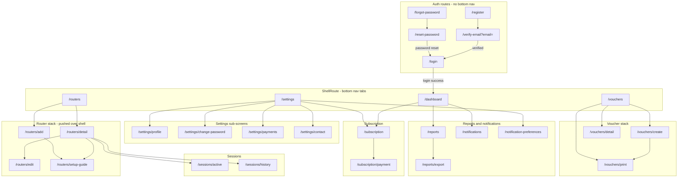
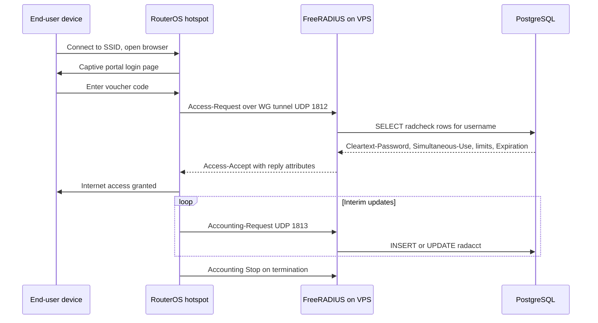

# Wasel — Application Flow Reference

| | |
|---|---|
| **Version** | 1.0 |
| **Date** | 2026-06-12 |
| **Status** | Living document |
| **Audience** | Developers and designers — anyone who needs to know how users move through the product |
| **Related** | [TRD](TRD.md) · [UI/UX Design Brief](UIUX_DESIGN_BRIEF.md) · [Backend Schema](BACKEND_SCHEMA.md) · [Implementation Plan](IMPLEMENTATION_PLAN.md) |

This document maps every user-facing flow in Wasel: the Flutter operator app, the React admin panel, and the hotspot end-user's captive-portal experience. Every route, endpoint, and behavior listed here is sourced from the code referenced inline. All API paths are relative to the versioned prefix `/api/v1` (mounted in `backend/src/routes/index.ts`).

## Table of Contents

1. [Personas](#1-personas)
2. [Mobile Navigation Map](#2-mobile-navigation-map)
3. [Operator Journeys](#3-operator-journeys)
   - 3.1 [Onboarding — register, verify, login](#31-onboarding--register-verify-login)
   - 3.2 [Subscribe and pay](#32-subscribe-and-pay)
   - 3.3 [Add a router](#33-add-a-router)
   - 3.4 [Create vouchers](#34-create-vouchers)
   - 3.5 [Monitor — dashboard, sessions, reports](#35-monitor--dashboard-sessions-reports)
   - 3.6 [Manage vouchers](#36-manage-vouchers)
   - 3.7 [Bandwidth profiles](#37-bandwidth-profiles)
   - 3.8 [Settings](#38-settings)
   - 3.9 [Notifications](#39-notifications)
4. [Admin Journeys](#4-admin-journeys)
5. [Hotspot End-User Flow](#5-hotspot-end-user-flow)
6. [Cross-Cutting Flows](#6-cross-cutting-flows)

---

## 1. Personas

| Persona | Surface | Description |
|---|---|---|
| **Operator** | Flutter mobile app (`mobile/`) | Owns Mikrotik routers and sells Wi-Fi vouchers. Registers, subscribes to a plan, connects routers over WireGuard, creates/prints vouchers, monitors sessions and revenue. The app talks HTTPS-only to `/api/v1` (`mobile/lib/services/api_client.dart`). |
| **Platform admin** | React SPA (`admin/`) | Runs the Wasel platform. Reviews bank-transfer payments, manages users/subscriptions/plans, answers support messages, audits actions. Gated by `role === 'admin'` both client-side (`admin/src/App.tsx`) and server-side (`backend/src/middleware/requireAdmin.ts`). |
| **Hotspot end-user** | RouterOS captive portal only | The person who buys a voucher code. **Never touches the Wasel app.** They connect to the operator's SSID, get the RouterOS hotspot login page, and type the voucher code. Auth is delegated to FreeRADIUS over the WireGuard tunnel (see [Section 5](#5-hotspot-end-user-flow)). |

The three subscription tiers shape what an operator can do (seeded in `backend/src/migrations/sql/008_plans_table.sql`, currency switched to SDG in `019_currency_sdg.sql`):

| Tier | Price (SDG/mo) | Max routers | Vouchers/month | Session monitoring | Allowed durations (months) |
|---|---|---|---|---|---|
| Starter | 5 | 1 | 500 | Active only | 1 |
| Professional | 12 | 3 | 2,000 | Active + history | 1, 2 |
| Enterprise | 25 | 10 | Unlimited (`-1`) | Full + export | 1, 2, 6 |

Session history and reports/export require Professional or Enterprise (`requireTier('professional', 'enterprise')` in `backend/src/routes/session.routes.ts` and `backend/src/routes/report.routes.ts`).

---

## 2. Mobile Navigation Map

All routes are declared in `mobile/lib/navigation/app_router.dart` (GoRouter). The app starts at `/login`; a `redirect` callback bounces unauthenticated users to `/login` and authenticated users away from auth routes to `/dashboard`. Four tab routes live inside a `ShellRoute` that renders the bottom `NavigationBar` (`mobile/lib/navigation/scaffold_with_nav_bar.dart`); every other authenticated route is pushed on the root navigator (`parentNavigatorKey: appNavigatorKey`) so it covers the bottom bar like a modal.

Route parameter conventions (all from `app_router.dart`):

| Route | Parameters | Carried via |
|---|---|---|
| `/verify-email` | `email` | query parameter |
| `/reset-password` | `email` | `state.extra` map |
| `/routers/detail`, `/routers/edit`, `/vouchers/create`, `/sessions/active`, `/sessions/history` | `routerId` | `state.extra` string |
| `/routers/setup-guide` | `routerId`, optional `initialStep` | `state.extra` map or string |
| `/vouchers/detail` | `routerId`, `voucherId` | `state.extra` map |
| `/vouchers/print` | `vouchers` (List of Voucher), `routerName` | `state.extra` map |
| `/reports/export` | `reportType`, `exportData` | `state.extra` map |

Tab screens use `NoTransitionPage` so switching tabs does not animate; pushed routes use the default platform transition.

---

## 3. Operator Journeys

### 3.1 Onboarding — register, verify, login

Code: `mobile/lib/screens/auth/*`, `backend/src/routes/auth.routes.ts`, `backend/src/services/auth.service.ts`, `backend/src/services/token.service.ts`.

| Step | Screen | User action | API call | Result |
|---|---|---|---|---|
| 1 | `/register` (`register_screen.dart`) | Enter name, email, password | `POST /auth/register` | Account created (unverified), a 6-digit OTP is emailed (`createVerificationOtp`, 24 h TTL in Redis). App pushes `/verify-email?email=…` (`register_screen.dart:58`). |
| 2 | `/verify-email` (`verify_email_screen.dart`) | Enter OTP from email | `POST /auth/verify-email` | Email marked verified. A resend countdown timer runs on-screen; resending calls `POST /auth/resend-verification`. Invalid/expired code → `OTP_INVALID`. |
| 3 | `/login` (`login_screen.dart`) | Enter credentials | `POST /auth/login` | Backend returns access (15 m) + refresh (7 d) JWT pair; refresh JTI stored in Redis (`refresh:{userId}:{jti}`). Tokens persisted in `flutter_secure_storage` (`mobile/lib/services/secure_storage.dart`). GoRouter redirect lands on `/dashboard`. `auth_provider.dart` fire-and-forgets `_loadUserScopedProviders()` so subscription state is warm before any tab reads it. |
| 4 | — | (forgot password) | `POST /auth/forgot-password` → `POST /auth/reset-password` | `/forgot-password` sends a reset OTP (15 m TTL); `/reset-password` receives the email via `extra` and submits OTP + new password. |

Guard rails (verified in `auth.service.ts` and `backend/src/middleware/rateLimiter.ts`):

- **Lockout** — 5 failed logins (`MAX_LOGIN_ATTEMPTS = 5`) locks the account for 15 minutes (`LOCKOUT_MINUTES = 15`); reset on successful login.
- **Rate limits** — Redis-backed: 100 req/min general, 10 req/min on all `/auth/*` endpoints (`authLimiter`).
- **Unverified purge** — accounts not verified within 72 h are deleted by the hourly `purgeUnverified` job (`backend/src/jobs/purgeUnverified.ts`).

### 3.2 Subscribe and pay

Code: `mobile/lib/screens/subscription/*`, `backend/src/routes/subscription.routes.ts`, `backend/src/controllers/subscription.controller.ts`, admin side `backend/src/services/admin.service.ts` (`reviewPayment`).

Payments are **manual bank transfers** verified by a platform admin — there is no payment gateway.

| Step | Screen | User action | API call | Result |
|---|---|---|---|---|
| 1 | `/subscription` (`subscription_status_screen.dart`) | View status + plan cards | `GET /subscription` + `GET /subscription/plans` | Shows current subscription (or "no active subscription" header) and plan cards with a duration selector driven by each plan's `allowed_durations`. `GET /subscription/plans` is the only public subscription endpoint. |
| 2 | `/subscription` | Tap a plan's subscribe button | `POST /subscription/request` `{planTier, durationMonths}` | Creates a `pending` subscription and a `pending` payment row. |
| 3 | `/subscription/payment` (`payment_screen.dart`) | Read transfer instructions | `GET /subscription/bank-info` | Bank account details shown. Screen is screenshot-protected: `FLAG_SECURE` on Android (`SecureWindow.enable()`), blur overlay in the iOS app switcher. |
| 4 | `/subscription/payment` | Pick receipt photo (camera/gallery) and upload | `POST /subscription/receipt` (multipart field `receipt` + `paymentId`) | Receipt stored after magic-byte validation (`verifyUploadMagicBytes` in `backend/src/middleware/upload.ts`). Payment now awaits admin review. A poller starts: re-fetch `GET /subscription` every 15 s, capped at 5 min (`_kPollInterval` / `_kPollTimeout`). |
| 5 | (admin panel) | Admin approves | `PUT /admin/payments/:id` `{decision: 'approved'}` | Subscription flips to `active` with `start_date = NOW()`; `payment_confirmed` push fires. |
| 6 | `/subscription/payment` | — | poller sees `subscription.isActive` | Success snackbar ("subscription activated"), then `context.go('/dashboard')`. If the 5-min poll cap is hit first, the screen shows a timed-out state — activation still lands via push/next refresh. |

**Rejection path** — admin sends `{decision: 'rejected', rejection_reason}` (reason is mandatory: `reviewPaymentBodySchema` in `backend/src/validators/admin.validators.ts`). The reason is persisted on the payment row and visible to the operator in `/settings/payments` (`GET /subscription/payments`), who can fix the issue and re-upload.

**Cancel path** — the operator can abandon a pending payment with `DELETE /subscription/payments/:id` (`cancelPayment`).

**Plan change path** — `POST /subscription/change` creates a `pending_change` subscription; on payment approval `reviewPayment` cancels the old active subscription and activates the new one inside a single transaction (`admin.service.ts:588-682`).

### 3.3 Add a router

Code: `mobile/lib/screens/routers/add_router_screen.dart` + `setup_guide_screen.dart`, `backend/src/routes/router.routes.ts`, `backend/src/services/wireguardConfig.ts`, `backend/src/utils/ipAllocation.ts`.

Every router endpoint sits behind `authenticate + requireSubscription` — with no active subscription the API returns 403 `SUBSCRIPTION_REQUIRED` and the mobile paywall interceptor redirects to `/subscription` (see [6.5](#65-403-paywall-redirect)). Creating a router past the plan's `max_routers` returns 403 `ROUTER_LIMIT_REACHED` (`backend/src/services/router.service.ts:107`).

| Step | Screen | User action | API call | Result |
|---|---|---|---|---|
| 1 | `/routers` tab → `/routers/add` | Enter a router name, tap generate | `POST /routers` `{name}` | Backend atomically claims the next free /30 subnet from the pool (`10.10.0.0/16` → 16,384 blocks, `backend/src/migrations/sql/018_tunnel_subnet_pool.sql`), generates a WireGuard keypair + per-router RADIUS secret (stored AES-256-GCM encrypted), registers the WG peer, and responds `201` with `{router, vpnIp, steps}` — `steps` is the 13-step RouterOS paste script (`generateSetupSteps`, `wireguardConfig.ts:390`). |
| 2 | same screen (inline guide) | Copy each command block, paste into the RouterOS terminal | — | Steps 1–6 bring up the WireGuard interface/peer/IP; steps 7–13 configure RADIUS, the hotspot server profile, and firewall (step 10 also sets `add-mac-cookie=no` so re-auth always hits RADIUS; step 13 allows WireGuard through the firewall). |
| 3 | — | Router completes WG handshake | `GET /routers/:id/status` | Status becomes `online` when the last WG handshake is < 150 s old (`HANDSHAKE_TIMEOUT_S = 150` in `backend/src/services/routerHealth.service.ts` and `wireguardMonitor.ts`) **and** the RouterOS API answers on TCP 8728 over the tunnel (`backend/src/services/routerOs.service.ts:150`). Handshake fresh but API unreachable → `degraded`; no handshake → `offline`. |
| 4 | `/routers/detail` | Inspect router | `GET /routers/:id`, `GET /routers/:id/health` | Detail card with status, tunnel IP, health diagnostics; entry points to edit, sessions, and the setup guide. |
| 5 | `/routers/setup-guide` (re-access) | Re-open the paste script any time | `GET /routers/:id/setup-guide` | Same 13 steps regenerated from stored credentials (an admin can fetch the same guide via `GET /admin/routers/:id/setup-guide`). |

Editing (`/routers/edit` → `PUT /routers/:id`) and deletion (`DELETE /routers/:id`) complete the CRUD set.

### 3.4 Create vouchers

Code: `mobile/lib/screens/vouchers/create_voucher_wizard.dart`, `backend/src/routes/voucher.routes.ts`, `backend/src/services/voucher.service.ts`, `mobile/lib/services/print_service.dart`.

Vouchers are **RADIUS users**, not Mikrotik local hotspot users: creating one inserts rows into `radcheck`/`radreply` that FreeRADIUS reads directly.

| Step | Screen | User action | API call | Result |
|---|---|---|---|---|
| 1 | `/vouchers` tab (or FAB) | Pick target router, tap create | — | Pushes `/vouchers/create` with the `routerId`. |
| 2 | Wizard step 1 — Limit | Choose `time` or `data`, value + unit (`minutes/hours/days` or `MB/GB`) | — | Validated locally (`_step1FormKey`). |
| 3 | Wizard step 2 — Validity | Pick a preset, a custom value (hours/days), or "open" (no validity) | — | Stored as `validitySeconds` (`null` = open). |
| 4 | Wizard step 3 — Count + price | Enter count and unit price, submit | `POST /routers/:id/vouchers` `{limitType, limitValue, limitUnit, validitySeconds, count, price}` | `checkQuota` middleware charges `count` against the monthly quota first (403 `QUOTA_EXCEEDED` if over). The service bulk-inserts, per voucher: `radcheck` `Cleartext-Password`, `Simultaneous-Use := 1`, and either `Max-All-Session` (time) or `Max-Total-Octets` (+ `Max-Total-Octets-Gigawords` above 4 GB) for data; plus `radreply` `Session-Timeout := validitySeconds` to cap the first session. The `Expiration` attribute is deliberately **not** written at creation — validity counts from first login, so the `validityExpiration` job writes it after first use (`voucher.service.ts:402-417`). |
| 5 | Success dialog | Tap print | — | Pushes `/vouchers/print` with the created vouchers + router name. |
| 6 | `/vouchers/print` (`voucher_print_screen.dart`) | Print or share PDF | — | `print_service.dart` renders voucher cards to PDF; Arabic text is detected by Unicode range and rendered RTL with a bundled Arabic font so glyph shaping works in both EN and AR. |

### 3.5 Monitor — dashboard, sessions, reports

**Dashboard** (`/dashboard`, `mobile/lib/screens/dashboard_screen.dart` → `GET /dashboard`). One aggregated payload (`DashboardData` in `backend/src/services/dashboard.service.ts`, queries run in parallel):

| Widget | Field(s) |
|---|---|
| Subscription card | `subscription` — plan tier/name, status, `vouchersUsed`/`voucherQuota`, `daysRemaining` |
| Today's stats | `vouchersUsedToday`, `dailyRevenue`, `totalVouchers` |
| Data usage (24 h) | `dataUsage24h.totalInput` / `.totalOutput` (from `radacct`) |
| Routers summary | `routers[]` — id, name, status, lastSeen |
| Active sessions by router | `activeSessionsByRouter[]` — per-router live session counts |

Refresh is pull-to-refresh (`RefreshIndicator`); the dashboard does not poll. Opening it also refreshes the notification inbox badge (`notificationsProvider.refresh()`).

**Active sessions** (`/sessions/active`, from router detail):

| Step | Action | API call | Notes |
|---|---|---|---|
| 1 | Open screen | `GET /routers/:id/sessions` | Live sessions from `radacct` + RouterOS. |
| 2 | (automatic) | same, every 30 s | `Timer.periodic(Duration(seconds: 30))` in `active_sessions_screen.dart:31`; an on-screen hint advertises auto-refresh. |
| 3 | Swipe/tap disconnect | `DELETE /routers/:id/sessions/:sid` | Backend sends a CoA Disconnect-Request to the router. |

**Session history** (`/sessions/history` → `GET /routers/:id/sessions/history`) is **Professional+**: Starter receives 403 `TIER_INSUFFICIENT` (`backend/src/middleware/requireTier.ts`).

**Reports** (`/reports`, Professional+ likewise):

| Step | Action | API call | Notes |
|---|---|---|---|
| 1 | Pick report type + range | `GET /reports?type=…` | `type ∈ {voucher-sales, sessions, revenue, router-uptime}` (`backend/src/validators/report.validators.ts`). |
| 2 | Export | `GET /reports/export?type=…` | Result handed to `/reports/export` screen (`report_export_screen.dart`) for sharing/saving. |

### 3.6 Manage vouchers

Code: `mobile/lib/screens/vouchers/voucher_list_screen.dart` + `voucher_detail_screen.dart`, `backend/src/services/voucher.service.ts`.

| Action | Screen gesture | API call | Backend effect |
|---|---|---|---|
| Browse / search / filter | Router selector + search box + status filter chips | `GET /routers/:id/vouchers?status&limitType&search&page&limit` | Status filter values: `unused`, `active`, `used`, `expired`, `disabled`. Paginated (default 20, max 500). |
| View detail | Tap a voucher | `GET /routers/:id/vouchers/:vid` | Detail auto-refreshes usage every 30 s; copying the code schedules a clipboard wipe after 30 s (`voucher_detail_screen.dart:58,102`). |
| Edit | Detail screen actions | `PUT /routers/:id/vouchers/:vid` `{status?, expiration?, comment?}` | — |
| **Disable** | Toggle to `disabled` | same `PUT` | Inserts `Auth-Type := Reject` into `radcheck` — FreeRADIUS refuses all further logins. Re-enabling deletes the `Auth-Type` row (`voucher.service.ts:714-723`). |
| Extend validity | Edit expiration | same `PUT` | Replaces the `Expiration` radcheck row (value formatted for `rlm_expiration`). |
| **Delete** | Detail or list swipe | `DELETE /routers/:id/vouchers/:vid` | Removes `voucher_meta`, `radcheck`, `radreply`, `radusergroup` rows, then fire-and-forget CoA Disconnect-Request (`radclient <tunnel_ip>:3799 disconnect`) to kick any live session (`voucher.service.ts:762-802,957`). |
| Bulk select | Long-press enters multi-select; select-all available | — | Selection tracked in `_selectedVoucherIds` (`voucher_list_screen.dart:32`). |
| Bulk delete | Multi-select → delete | `POST /routers/:id/vouchers/bulk-delete` `{ids}` or `{filter}` | Same cleanup + CoA per voucher; accepts explicit ids (max 500) or a server-side filter. |
| Bulk print | Multi-select → print | — | Selected vouchers passed to `/vouchers/print`. |

### 3.7 Bandwidth profiles

Profiles are named bandwidth classes mapped to RADIUS groups (`backend/src/services/profile.service.ts`): each profile writes `Mikrotik-Rate-Limit := <up>/<down>` into `radgroupreply`; the schema links vouchers to groups via `radusergroup`, but the current voucher-creation path does not assign groups (`voucher.service.ts:504` — only legacy profile vouchers carry `radusergroup` rows). CRUD endpoints (`backend/src/routes/profile.routes.ts`, all `authenticate + requireSubscription`):

| Action | API call |
|---|---|
| Create | `POST /profiles` (group name, display name, bandwidth up/down validated against Mikrotik rate-limit syntax) |
| List | `GET /profiles` |
| Read | `GET /profiles/:pid` |
| Update | `PUT /profiles/:pid` (replaces `radgroupcheck`/`radgroupreply` attribute rows) |
| Delete | `DELETE /profiles/:pid` |

### 3.8 Settings

`/settings` tab (`mobile/lib/screens/settings_screen.dart`) is a hub of pushed sub-screens:

| Entry | Route | API calls |
|---|---|---|
| Subscription | `/subscription` | `GET /subscription`, `GET /subscription/plans` |
| Payment history | `/settings/payments` | `GET /subscription/payments` (incl. rejection reasons); cancel via `DELETE /subscription/payments/:id` |
| Edit profile | `/settings/profile` | `GET /auth/me`, `PUT /auth/profile` |
| Change password | `/settings/change-password` | `POST /auth/change-password` |
| Notification preferences | `/notification-preferences` | `GET /notifications/preferences`, `PUT /notifications/preferences` |
| Contact support | `/settings/contact` | `GET /support/messages` (chat history), `POST /support/messages` (send), `POST /support/messages/read-all` |
| Language | inline tile (`_LanguageTile`) | none — flips the app locale EN/AR via `locale_provider.dart`; strings come from the custom i18n layer (`mobile/lib/i18n/app_localizations.dart`) |
| Logout | inline action | `POST /auth/logout` (revokes the refresh JTI), clears secure storage |

Support is a single threaded conversation per user: operator messages from `/settings/contact`, admin replies from the panel's Messages pages; an admin reply triggers the `support_reply` push.

### 3.9 Notifications

Code: `mobile/lib/services/push_notification_service.dart`, `mobile/lib/screens/notifications/notifications_screen.dart`, `backend/src/routes/notification.routes.ts`, `backend/src/services/notification.service.ts`.

| Step | What happens | API call |
|---|---|---|
| 1 | After login the app fetches its FCM token and registers it | `POST /notifications/device-token` |
| 2 | Backend events fire pushes (see category table in [6.4](#64-push-notification-categories)); every push is also persisted to the in-app inbox unless the user opted out of that category. Daily-dedup applies to dedup-listed categories (Redis key `notif:{userId}:{category}:{date}`). | — |
| 3 | Operator opens the inbox (bell on dashboard) | `GET /notifications` (paginated) |
| 4 | Read / read-all / delete | `POST /notifications/:id/read`, `POST /notifications/read-all`, `DELETE /notifications/:id` |
| 5 | Opt out per category | `PUT /notifications/preferences` (per-category toggles rendered in `notification_preferences_screen.dart`) |
| — | On logout the device token is unregistered | `DELETE /notifications/device-token` |

---

## 4. Admin Journeys

Routes: `admin/src/App.tsx` (React Router); API: `backend/src/routes/admin.routes.ts` (every route behind `authenticate + requireAdmin`). Pages live in `admin/src/pages/`; sidebar order is Dashboard, Users, Subscriptions, Plans, Payments, Messages, Routers, Audit Logs, Settings (`admin/src/components/layout/Sidebar.tsx`).

**Login with role gate** — `/login` (`LoginPage.tsx`) posts to the same `POST /auth/login` the mobile app uses. `ProtectedRoute` in `App.tsx` requires `user.role === 'admin'`; a logged-in non-admin is force-logged-out and redirected to `/login`. Unknown paths redirect to `/dashboard`.

| Journey | Page route | Steps and API calls |
|---|---|---|
| **Platform dashboard** | `/dashboard` | `GET /admin/stats` (user/subscription/router counts, pending payments, approved revenue) + `GET /admin/system-status`; FreeRADIUS diagnostics available via `GET /admin/freeradius/status`. |
| **Payment review** | `/payments` | 1) `GET /admin/payments?status=pending` (default filter is `pending`) → table with receipt preview (`resolveAssetUrl` in `admin/src/lib/api.ts` allowlists the API host). 2) Approve: `PUT /admin/payments/:id` `{decision:'approved'}` → transactionally marks payment approved, activates the user's `pending` subscription (or applies a `pending_change` by cancelling the old active one), then sends `payment_confirmed`. 3) Reject: `{decision:'rejected', rejection_reason}` — reason required, persisted, shown to the operator. |
| **User management** | `/users`, `/users/:id` | `GET /admin/users?search&status&page`; detail `GET /admin/users/:id`; edit `PUT /admin/users/:id`; delete `DELETE /admin/users/:id`. Admins can provision a router **on behalf of** a user: `POST /admin/users/:id/routers` (same WG + RADIUS generation as the operator flow, still enforcing the user's router limit → `ROUTER_LIMIT_REACHED`). |
| **Subscriptions** | `/subscriptions` | `GET /admin/subscriptions?status&userId`; manual override `PUT /admin/subscriptions/:id` (status, plan_tier, end_date, voucher_quota); `DELETE /admin/subscriptions/:id`. |
| **Plans CRUD** | `/plans` | `GET /admin/plans`, `POST /admin/plans`, `PUT /admin/plans/:id`, `DELETE /admin/plans/:id` — deletion is blocked while subscriptions reference the plan ("deactivate it instead", `admin.service.ts:534`). |
| **Routers overview** | `/routers` | `GET /admin/routers` (read-only fleet view: status, tunnel IP, owner); per-router paste script via `GET /admin/routers/:id/setup-guide`. |
| **Support conversations** | `/messages`, `/messages/:userId` | `GET /admin/support/conversations` (+ `GET /admin/support/unread-count` badge); thread `GET /admin/support/conversations/:userId`; reply `POST /admin/support/conversations/:userId/messages` (fires `support_reply` push); mark read `POST /admin/support/conversations/:userId/read`. |
| **Audit log review** | `/audit-logs` | `GET /admin/audit-logs` — admin actions are recorded with actor, action (e.g. `payment.approved`), and target entity. |
| **Settings — bank + admins** | `/settings` | Bank details shown to paying operators: `GET/PUT /admin/settings/bank`. Admin accounts: `GET /admin/admins`, `POST /admin/admins`, `PUT /admin/admins/:id/active`, `PUT /admin/admins/:id/password`, `DELETE /admin/admins/:id`. |

Admin data fetching uses TanStack React Query (30 s `staleTime`, retry 1 — `App.tsx:20-28`) on top of the shared axios client.

---

## 5. Hotspot End-User Flow

The voucher buyer's entire experience happens on the router's captive portal. Wasel's role is invisible: the RouterOS hotspot delegates AAA to FreeRADIUS (3.2.x — base image `freeradius/freeradius-server:3.2.8`, compose tag `wasel-freeradius:3.2.4` — with `rlm_sql_postgresql`) across the WireGuard tunnel.

Step by step:

1. **Connect** — the user joins the operator's SSID; RouterOS intercepts traffic and serves the hotspot portal.
2. **Enter code** — the voucher code is the RADIUS username/password pair created in [3.4](#34-create-vouchers).
3. **Access-Request** — the router (NAS) sends the request through the WG tunnel to FreeRADIUS on the VPS (RADIUS ports are UFW-scoped to `10.10.0.0/16`, so only tunneled routers can reach them).
4. **Check** — FreeRADIUS reads `radcheck`: password match, `Simultaneous-Use := 1` (one concurrent session), `Auth-Type := Reject` short-circuits disabled/expired vouchers, and `rlm_expiration` rejects past-`Expiration` vouchers.
5. **Access-Accept** — reply attributes are applied: `Session-Timeout` (first-session validity cap from `radreply`, later overwritten by `rlm_expiration` with remaining wall-clock time), and any profile group's `Mikrotik-Rate-Limit` via `radusergroup`/`radgroupreply`.
6. **Accounting** — interim updates accumulate `acctsessiontime` and input/output octets in `radacct`; this is what dashboards, usage bars, and the enforcement jobs read.
7. **First-login validity start** — the `validityExpiration` job (every 30 s, `backend/src/jobs/validityExpiration.ts`) notices the first `radacct` row for a validity-bearing voucher and writes the `Expiration` radcheck attribute = first login + validity window.

**Session termination causes:**

| Cause | Mechanism | Source |
|---|---|---|
| User logs out | RouterOS hotspot logout | RouterOS |
| Validity cap on first session | `Session-Timeout` reply attribute | `voucher.service.ts:412-417` |
| Usage limit reached (time or data) | Job compares `radacct` totals to `voucher_meta.limit_value`; inserts `Auth-Type := Reject`, marks voucher `expired` (blocks the **next** login) | `backend/src/jobs/usageLimitEnforcement.ts` (every 30 s) |
| Validity window elapsed mid-session | Job sends CoA Disconnect-Request to the NAS at `:3799` for still-active sessions past `Expiration` | `backend/src/jobs/validityCoaDisconnect.ts` (every 30 s) |
| Voucher deleted | RADIUS rows removed + immediate CoA disconnect | `voucher.service.ts:762+` |
| Operator disconnects session | `DELETE /routers/:id/sessions/:sid` → CoA | `backend/src/routes/session.routes.ts` |

Because the setup script disables RouterOS MAC cookies (step 10 of the paste script), a returning device must always re-authenticate through FreeRADIUS — expired or disabled vouchers cannot silently resume.

---

## 6. Cross-Cutting Flows

### 6.1 JWT refresh — single-flight on both clients

Both clients implement the same algorithm; the admin file explicitly says it "mirrors the mobile Dio interceptor".

| | Mobile (`mobile/lib/services/api_client.dart`) | Admin (`admin/src/lib/api.ts`) |
|---|---|---|
| Trigger | Dio `onError`, status 401 | axios response interceptor, status 401 |
| Self-guard | never refresh when the failing call is `/auth/refresh` itself | same, plus a `_retry` flag so a request is retried at most once |
| Single-flight | `_isRefreshing` + queue of `Completer<String>`; concurrent 401s wait for the one in-flight refresh | `isRefreshing` + `refreshQueue` of callbacks |
| Refresh call | bare `Dio` instance → `POST /auth/refresh` `{refreshToken}` | bare `axios` → same endpoint |
| Success | persist rotated pair in `flutter_secure_storage`, drain queue, retry original | persist in `localStorage` (preserving stored user), drain queue, retry original |
| Failure | reject queue, clear storage, `onSessionExpired` → login screen | reject queue, `clearAuth()`, hard redirect to `/login` |

Token lifetimes: access 15 m, refresh 7 d with rotation; the refresh JTI is whitelisted in Redis (`refresh:{userId}:{jti}`, TTL 7 d — `backend/src/services/token.service.ts`). Release builds of the mobile app additionally pin the API TLS certificate (SPKI SHA-256, primary + backup pins in `api_client.dart`).

### 6.2 Loading, empty, and error state conventions

Mobile (component library in `mobile/lib/widgets/`):

| State | Convention | Widget |
|---|---|---|
| Loading | skeleton placeholders, then content (no full-screen spinners on list screens) | `skeleton_loader.dart` |
| Empty | illustration + hint + primary action | `empty_state.dart` |
| Error (blocking) | message + retry button | `error_state.dart` |
| Error (inline) | banner above content that remains usable | `inline_error_banner.dart` |
| Transient feedback | success/error snackbars | `app_snackbar.dart` |
| Destructive confirm | dialog before delete/disconnect | `confirm_dialog.dart` |

Admin: `DataTable.tsx` handles loading/empty rows; `ErrorPanel.tsx` renders query failures with retry; `ErrorBoundary.tsx` wraps the whole route tree; React Query retries once before surfacing an error.

### 6.3 Polling surfaces

The product avoids websockets; freshness comes from a small set of deliberate pollers:

| Surface | Interval | Stops when | Source |
|---|---|---|---|
| Active sessions screen | 30 s | screen disposed | `active_sessions_screen.dart:31` |
| Voucher detail (usage) | 30 s | screen disposed | `voucher_detail_screen.dart:58` |
| Payment approval poller | 15 s, 5 min cap | subscription active / timeout / dispose | `payment_screen.dart:39-98` |
| Clipboard auto-clear (voucher code, bank details) | one-shot 30 s | — | `voucher_detail_screen.dart:102`, `payment_screen.dart:654` |
| Admin queries | React Query `staleTime` 30 s (refetch on navigation, not on window focus) | — | `admin/src/App.tsx:20-28` |
| Backend enforcement jobs | 30 s crons (usage limit, validity expiration, validity CoA) | — | `backend/src/jobs/*` |

### 6.4 Push notification categories

All categories defined in `backend/src/services/notification.service.ts`; each respects per-user preference toggles and is mirrored to the in-app inbox.

| Category | Fires when | Producer |
|---|---|---|
| `subscription_expiring` | active subscription ends in exactly 7, 3, or 1 day(s) | `subscriptionNotifications` job, daily 09:00 UTC |
| `subscription_expired` | end_date passed within the last 24 h | same job |
| `voucher_quota_low` | monthly voucher usage ≥ 90% of quota | `quotaMonitor` job, every 6 h |
| `payment_confirmed` | admin approves a payment | `reviewPayment` (`admin.service.ts`) |
| `support_reply` | admin replies in a support conversation | `adminReply` (`support.controller.ts`) |
| `router_offline` / `router_online` | WG handshake lost beyond threshold / restored | WireGuard monitor (`wireguardMonitor.ts`) |
| `bulk_creation_complete` | bulk voucher creation finishes | voucher creation flow |

### 6.5 403 paywall redirect

A single mobile-side interceptor (`api_client.dart:226-282`) catches 403 responses whose error code is one of `SUBSCRIPTION_REQUIRED`, `SUBSCRIPTION_EXPIRED`, `QUOTA_EXCEEDED`, `ROUTER_LIMIT_REACHED`, shows an explanatory snackbar, and pushes `/subscription` via the app-level navigator key — no per-screen handling required. `TIER_INSUFFICIENT` (Starter hitting history/reports) is deliberately **not** in that set: tier-gated screens render their own upgrade prompt instead of yanking the user away. The error still propagates to the calling provider so screens can render their own error state.
