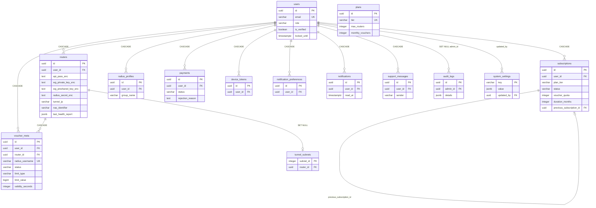
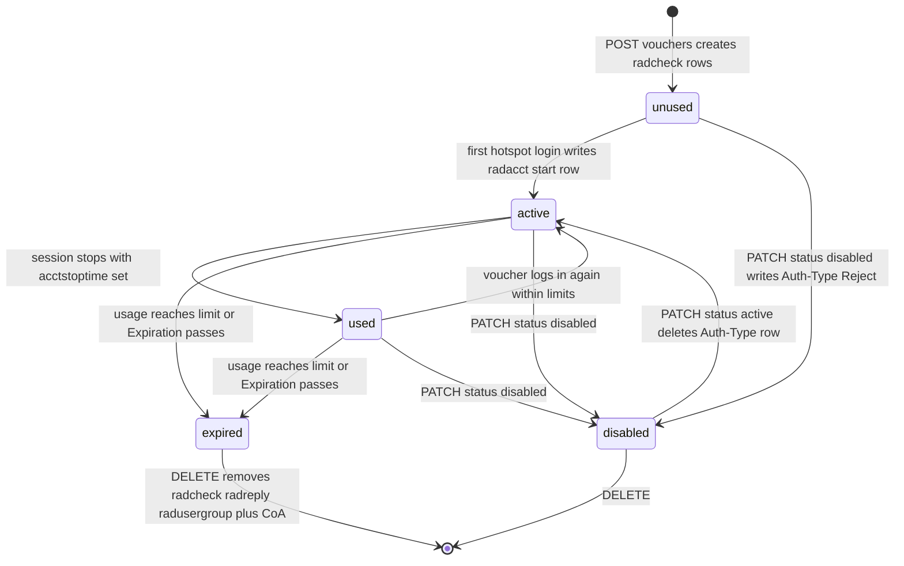
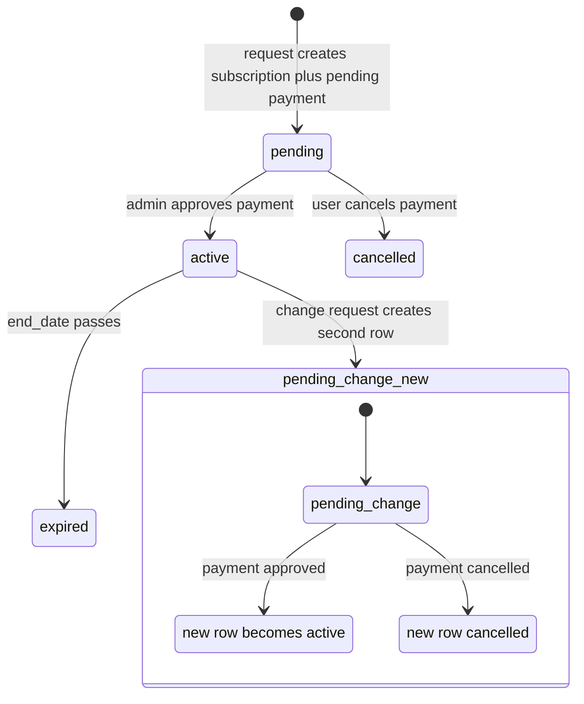
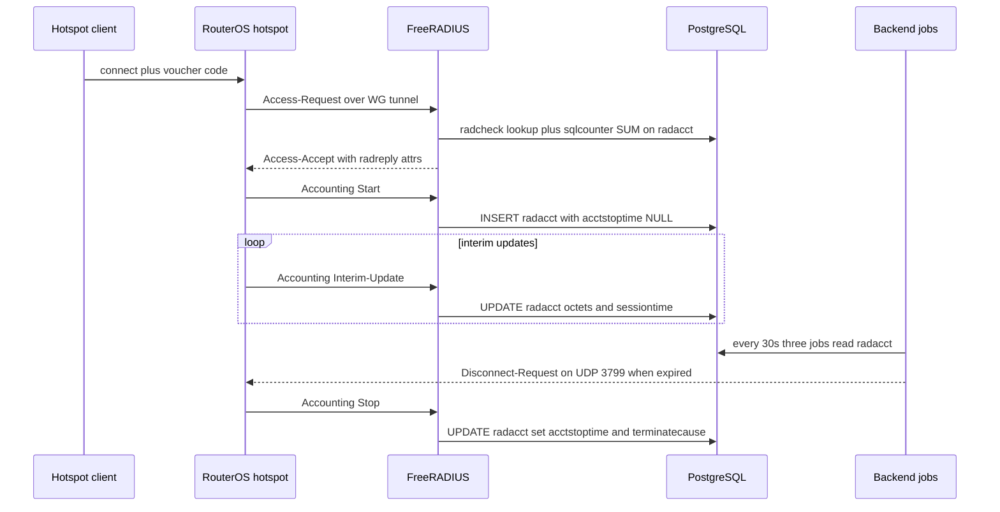

# Wasel — Backend Schema Reference

| | |
|---|---|
| **Version** | 1.0 |
| **Date** | 2026-06-12 |
| **Status** | Living document |
| **Audience** | Backend and database developers |
| **Related** | [TRD](TRD.md) · [App Flow](APP_FLOW.md) · [UI/UX Design Brief](UIUX_DESIGN_BRIEF.md) · [Implementation Plan](IMPLEMENTATION_PLAN.md) |

This is the authoritative data-layer reference for the Wasel Mikrotik Hotspot Voucher Manager. It covers the PostgreSQL application schema, the FreeRADIUS tables that live in the **same database**, the Redis keyspace, and the data lifecycles that bind them together. Every column, constraint, and key pattern below was transcribed from the migration SQL and service code — file paths are given so you can jump straight to the source.

## Table of Contents

1. [Overview & Conventions](#1-overview--conventions)
2. [Entity-Relationship Diagram](#2-entity-relationship-diagram)
3. [Application Tables](#3-application-tables)
4. [FreeRADIUS Tables](#4-freeradius-tables)
5. [Relationship & Cascade Map](#5-relationship--cascade-map)
6. [Redis Keyspace](#6-redis-keyspace)
7. [Data Lifecycles](#7-data-lifecycles)
8. [Index Strategy Notes](#8-index-strategy-notes)

---

## 1. Overview & Conventions

### 1.1 One database, two schemas-of-mind

A single PostgreSQL 16 database (`postgres:16-alpine` in `docker-compose.yml`) holds two families of tables:

| Family | Owner | Examples |
|---|---|---|
| **Application tables** | Wasel backend (`backend/src/`) | `users`, `routers`, `voucher_meta`, `subscriptions` |
| **FreeRADIUS tables** | FreeRADIUS `rlm_sql_postgresql` (`freeradius/raddb/mods-enabled/sql`) | `radcheck`, `radreply`, `radacct`, `nas` |

Both the Node.js backend and the FreeRADIUS container read/write the RADIUS tables. There are **no foreign keys** between the two families — linkage is by string: `voucher_meta.radius_username` ↔ `radcheck.username` ↔ `radacct.username`, and `routers.tunnel_ip` ↔ `nas.nasname` ↔ `radacct.nasipaddress`. See the ownership warning in [§4](#4-freeradius-tables).

### 1.2 Conventions

- **Primary keys:** application tables use `UUID PRIMARY KEY DEFAULT uuid_generate_v4()`. The `uuid-ossp` and `pgcrypto` extensions are enabled in `backend/src/migrations/sql/001_extensions.sql`. (FreeRADIUS tables use `SERIAL`/`BIGSERIAL` integer keys, matching the upstream FreeRADIUS schema.) `system_settings` and `tunnel_subnets` are the exceptions: they use a natural key (`key VARCHAR(100)`) and an integer block index (`subnet_id`) respectively.
- **Timestamps:** `TIMESTAMPTZ` everywhere; rows carry `created_at`/`updated_at` with `DEFAULT NOW()`.
- **`updated_at` triggers:** the plpgsql function `update_updated_at_column()` (defined in `003_application_tables.sql`) is attached as a `BEFORE UPDATE` trigger to `users`, `subscriptions`, `routers`, `radius_profiles`, `voucher_meta`, `payments` (003), `device_tokens`, `notification_preferences` (005), and `plans` (008).
- **Money:** `DECIMAL(10,2)`. Platform currency is **SDG** since migration `019_currency_sdg.sql` (column defaults changed and existing `USD` rows updated).
- **Encrypted-at-rest columns** carry the `_enc` suffix and hold AES-256-GCM ciphertext in `iv:tag:ciphertext` format, all hex-encoded (`backend/src/utils/encryption.ts`; 16-byte IV, 16-byte auth tag). The key is the `ENCRYPTION_KEY` env var, validated by Zod as exactly 64 hex chars / 32 bytes (`backend/src/config/index.ts`).

### 1.3 Migration runner

`backend/src/migrations/runner.ts` runs automatically on backend boot (`runMigrations()` is awaited in `startServer()` in `backend/src/server.ts` before the HTTP listener starts):

1. Ensures the bookkeeping table exists:
   ```sql
   CREATE TABLE IF NOT EXISTS schema_migrations (
     id SERIAL PRIMARY KEY,
     filename VARCHAR(255) UNIQUE NOT NULL,
     executed_at TIMESTAMPTZ NOT NULL DEFAULT NOW()
   )
   ```
2. Reads `backend/src/migrations/sql/*.sql`, sorts filenames lexically (hence the `001_`–`024_` numeric prefixes), and filters out filenames already present in `schema_migrations`.
3. Executes each pending file inside its own transaction (`BEGIN` → file SQL → `INSERT INTO schema_migrations` → `COMMIT`; `ROLLBACK` and re-throw on failure, which aborts boot).

There is no down-migration mechanism. Rollbacks are written as new forward migrations — e.g. `023_voucher_nas_scope_rollback.sql` undoes `022`, and `024_drop_router_provision_columns.sql` drops columns added by `021`.

### 1.4 Migration index

| File | What it does |
|---|---|
| `001_extensions.sql` | `uuid-ossp`, `pgcrypto` |
| `002_freeradius_tables.sql` | Standard FreeRADIUS 3.x schema: `radcheck`, `radreply`, `radgroupcheck`, `radgroupreply`, `radusergroup`, `radacct`, `nas`, `radpostauth` |
| `003_application_tables.sql` | `users`, `subscriptions`, `routers`, `radius_profiles`, `voucher_meta`, `payments`, `audit_logs` + `updated_at` trigger function |
| `004_seed_data.sql` | Seed admin user `admin@wa-sel.com` |
| `005_device_tokens.sql` | `device_tokens`, `notification_preferences` |
| `006_admin_role.sql` | `users.role` (`user`/`admin`) + index |
| `007_subscription_tiers.sql` | `subscriptions.duration_months`, `previous_subscription_id` self-FK, `pending_change` status |
| `008_plans_table.sql` | `plans` table + 3 seed rows; drops hardcoded `plan_tier` CHECKs |
| `009_router_preshared_key.sql` | `routers.wg_preshared_key_enc` |
| `010_voucher_wizard.sql` | `voucher_meta` limit/validity/price columns; `group_profile` nullable |
| `011_voucher_status_unused.sql` | Adds `unused` voucher status, makes it the default |
| `012_fix_radius_schema.sql` | FreeRADIUS 3.2 compatibility: `nasreload`, column widenings, `radacct.class`, NOT NULL drops |
| `013_payment_rejection_reason.sql` | `payments.rejection_reason`; `cancelled` payment status |
| `014_notifications_table.sql` | `notifications` inbox |
| `015_support_messages.sql` | `support_messages` thread |
| `016_system_settings.sql` | `system_settings` key/value + bank seed keys |
| `017_performance_indices.sql` | Composite/hot-path indexes |
| `018_tunnel_subnet_pool.sql` | `tunnel_subnets` /30 pool + back-fill |
| `019_currency_sdg.sql` | USD → SDG |
| `020_router_health.sql` | `routers.last_health_check_at`, `last_health_report` JSONB |
| `021_router_provision_status.sql` | Router auto-provision tracking columns *(later dropped by 024)* |
| `022_voucher_nas_scope_backfill.sql` | NAS-IP-Address scoping back-fill *(reverted by 023)* |
| `023_voucher_nas_scope_rollback.sql` | Deletes all `NAS-IP-Address ==` radcheck rows (RFC 2865 §5.4 — the AVP is NAS-self-reported, never matches the WG peer IP) |
| `024_drop_router_provision_columns.sql` | Drops the 6 provision columns from `021` |

---

## 2. Entity-Relationship Diagram

Application tables only; RADIUS tables are linked by convention (dashed semantics, shown as comments in §4). FK arrows annotate the delete behavior.



Note that `plans` is intentionally **not** FK-linked to `subscriptions.plan_tier` / `payments.plan_tier` — migration `008` dropped the CHECK constraints so new plans can be added without DDL; joins are done by the `tier` string at query time (`backend/src/services/subscription.service.ts`).

---

## 3. Application Tables

### 3.1 `users`

Created in `003_application_tables.sql`; `role` added in `006_admin_role.sql`. Seed admin (`admin@wa-sel.com`, role `admin`) inserted in `004_seed_data.sql`.

| Column | Type | Constraints | Notes |
|---|---|---|---|
| `id` | UUID | PK, default `uuid_generate_v4()` | |
| `name` | VARCHAR(100) | NOT NULL | |
| `email` | VARCHAR(255) | NOT NULL, UNIQUE | Login identifier |
| `phone` | VARCHAR(20) | nullable | |
| `password_hash` | VARCHAR(255) | NOT NULL | bcrypt, cost 12 (`BCRYPT_ROUNDS` in `backend/src/services/auth.service.ts`) |
| `business_name` | VARCHAR(200) | nullable | |
| `is_verified` | BOOLEAN | NOT NULL, default FALSE | Set TRUE after OTP email verification; unverified accounts purged after 72 h by `backend/src/jobs/purgeUnverified.ts` (hourly) |
| `is_active` | BOOLEAN | NOT NULL, default TRUE | FALSE = admin-suspended; login returns 403 |
| `failed_login_attempts` | INTEGER | NOT NULL, default 0 | Reset to 0 on successful login / password reset |
| `locked_until` | TIMESTAMPTZ | nullable | Set to `NOW() + 15 minutes` after 5 failed attempts (`MAX_LOGIN_ATTEMPTS`, `LOCKOUT_MINUTES`) |
| `role` | VARCHAR(20) | NOT NULL, default `'user'`, CHECK `('user','admin')` | Added 006 |
| `created_at` / `updated_at` | TIMESTAMPTZ | NOT NULL, default NOW() | trigger-maintained |

**Indexes:** PK; `email` unique; `idx_users_role` (006).

### 3.2 `subscriptions`

Created in 003; extended in `007_subscription_tiers.sql`; tier CHECK removed in 008.

| Column | Type | Constraints | Notes |
|---|---|---|---|
| `id` | UUID | PK | |
| `user_id` | UUID | NOT NULL, FK → `users(id)` **ON DELETE CASCADE** | |
| `plan_tier` | VARCHAR(20) | NOT NULL | Original CHECK `('starter','professional','enterprise')` dropped in 008 — validated against `plans.tier` in code |
| `start_date` | TIMESTAMPTZ | NOT NULL, default NOW() | Reset to `NOW()` on admin payment approval |
| `end_date` | TIMESTAMPTZ | NOT NULL | On approval set to `NOW() + duration_months * INTERVAL '30 days'` (`backend/src/services/admin.service.ts`) |
| `status` | VARCHAR(20) | NOT NULL, default `'pending'`, CHECK `('pending','active','expired','cancelled','pending_change')` | `pending_change` added in 007; state machine in [§7.2](#72-subscription-state-machine) |
| `voucher_quota` | INTEGER | NOT NULL | `plan.monthly_vouchers * duration_months`; **-1 = unlimited** (Enterprise) |
| `vouchers_used` | INTEGER | NOT NULL, default 0 | Incremented on voucher create, decremented (floored at 0) on bulk delete (`backend/src/services/voucher.service.ts`) |
| `duration_months` | INTEGER | NOT NULL, default 1 | Added 007; validated against `plans.allowed_durations` |
| `previous_subscription_id` | UUID | FK → `subscriptions(id)` (no cascade) | Added 007; on a `pending_change` row, points to the active subscription being replaced |
| `created_at` / `updated_at` | TIMESTAMPTZ | | trigger-maintained |

**Indexes:** `idx_subscriptions_user_id`, `idx_subscriptions_status`.

### 3.3 `routers`

Created in 003; `wg_preshared_key_enc` added in 009; health columns in 020; provision columns added in 021 and **dropped** in 024.

| Column | Type | Constraints | Notes |
|---|---|---|---|
| `id` | UUID | PK | |
| `user_id` | UUID | NOT NULL, FK → `users(id)` **ON DELETE CASCADE** | |
| `name` | VARCHAR(100) | NOT NULL | Renames are synced to `nas.shortname`/`description` |
| `model` | VARCHAR(100) | nullable | |
| `ros_version` | VARCHAR(20) | nullable | |
| `api_user` | VARCHAR(100) | nullable | RouterOS API username |
| `api_pass_enc` | TEXT | nullable | 🔐 **AES-256-GCM** — RouterOS API password |
| `wg_public_key` | VARCHAR(44) | nullable | Router-side WG public key (base64, plaintext — public by nature) |
| `wg_private_key_enc` | TEXT | nullable | 🔐 **AES-256-GCM** — router-side WG private key (needed to regenerate the paste-config) |
| `wg_preshared_key_enc` | TEXT | nullable | 🔐 **AES-256-GCM** — WG PSK, used to re-sync peers on restart (009) |
| `wg_endpoint` | VARCHAR(255) | nullable | |
| `tunnel_ip` | VARCHAR(15) | nullable | Router's /30 peer IP (e.g. `10.10.0.2`); **the join key to `nas.nasname` and `radacct.nasipaddress`**. NULL while provisioning |
| `radius_secret_enc` | TEXT | nullable | 🔐 **AES-256-GCM** — per-router RADIUS shared secret (32-char alphanumeric, `generateRadiusSecret()`); the same secret is stored **in plaintext** in `nas.secret` because FreeRADIUS requires it |
| `nas_identifier` | VARCHAR(128) | nullable | `<sanitized-name>_<first-8-of-uuid>` via `generateNasIdentifier()` (`backend/src/utils/encryption.ts`); mirrored to `nas.shortname` |
| `status` | VARCHAR(20) | NOT NULL, default `'offline'`, CHECK `('online','offline','degraded')` | Online = WG handshake ≤ 150 s (`HANDSHAKE_TIMEOUT_S` in `backend/src/services/wireguardMonitor.ts`) |
| `last_seen` | TIMESTAMPTZ | nullable | |
| `last_health_check_at` | TIMESTAMPTZ | nullable | 020 |
| `last_health_report` | JSONB | nullable | 020 — full structured `ProbeResult[]` from the last health-check run |
| `created_at` / `updated_at` | TIMESTAMPTZ | | trigger-maintained |

**Indexes:** `idx_routers_user_id`, `idx_routers_status`, `idx_routers_nas_identifier`.

> The four `*_enc` columns must only ever be read/written through `encrypt()`/`decrypt()` in `backend/src/utils/encryption.ts`. Rotating `ENCRYPTION_KEY` requires re-encrypting all four columns — there is no key-versioning scheme.

### 3.4 `radius_profiles`

Created in 003. Legacy bandwidth/limit profiles (the new voucher wizard is profile-less, see `voucher_meta`). Each row mirrors into `radgroupcheck`/`radgroupreply` rows keyed by `group_name` (`backend/src/services/profile.service.ts`).

| Column | Type | Constraints | Notes |
|---|---|---|---|
| `id` | UUID | PK | |
| `user_id` | UUID | NOT NULL, FK → `users(id)` **ON DELETE CASCADE** | |
| `group_name` | VARCHAR(64) | NOT NULL, UNIQUE `(user_id, group_name)` | The `radgroupcheck.groupname` / `radusergroup.groupname` key |
| `display_name` | VARCHAR(100) | NOT NULL | |
| `bandwidth_up` / `bandwidth_down` | VARCHAR(20) | nullable | e.g. `'2M'` / `'5M'` → `Mikrotik-Rate-Limit := "2M/5M"` radgroupreply |
| `session_timeout` | INTEGER | nullable | seconds → `Session-Timeout` radgroupreply |
| `total_time` | INTEGER | nullable | seconds → `Max-All-Session` radgroupcheck |
| `total_data` | BIGINT | nullable | bytes → `Max-Total-Octets` radgroupcheck |
| `created_at` / `updated_at` | TIMESTAMPTZ | | trigger-maintained |

**Indexes:** `idx_radius_profiles_user_id`; the composite UNIQUE. Profile updates **delete and re-insert** all group attributes; profile delete is blocked (409) while any `radusergroup` rows reference the group.

### 3.5 `voucher_meta`

Created in 003; wizard columns in `010_voucher_wizard.sql`; `unused` status in 011. App-side twin of the RADIUS user — credentials live in `radcheck`, usage in `radacct`.

| Column | Type | Constraints | Notes |
|---|---|---|---|
| `id` | UUID | PK | |
| `user_id` | UUID | NOT NULL, FK → `users(id)` **ON DELETE CASCADE** | |
| `router_id` | UUID | NOT NULL, FK → `routers(id)` **ON DELETE CASCADE** | Home router |
| `radius_username` | VARCHAR(64) | NOT NULL, **UNIQUE** | 8-digit numeric, server-generated; voucher password == username (`createVouchers` in `backend/src/services/voucher.service.ts`) |
| `group_profile` | VARCHAR(64) | nullable (since 010) | Legacy profile linkage; new wizard vouchers store `NULL` |
| `comment` | TEXT | nullable | |
| `status` | VARCHAR(20) | NOT NULL, default `'unused'` (011), CHECK `('unused','active','disabled','expired','used')` | **Stored** status only persists `unused`/`disabled`/`expired`; `active`/`used` are *computed at read time* — see [§7.1](#71-voucher-status-machine) |
| `limit_type` | VARCHAR(10) | CHECK `('time','data')` | 010 |
| `limit_value` | BIGINT | nullable | **Base units**: seconds when `limit_type='time'`, bytes when `'data'` — normalized at create time by `normalizeLimit()` (minutes×60, hours×3600, days×86400, MB×2²⁰, GB×2³⁰) |
| `limit_unit` | VARCHAR(10) | nullable | The unit the operator chose (`minutes`/`hours`/`days`/`MB`/`GB`) — **display only**, never used in math after creation |
| `validity_seconds` | INTEGER | nullable | Wall-clock validity window measured **from first login**, not creation; enforced via the radcheck `Expiration` row written by `validityExpiration` job |
| `price` | DECIMAL(10,2) | nullable | Operator-facing sale price, informational |
| `created_at` / `updated_at` | TIMESTAMPTZ | | trigger-maintained |

**Indexes:** `idx_voucher_meta_user_id`, `idx_voucher_meta_router_id`, `idx_voucher_meta_status`, `idx_voucher_meta_radius_username`, plus composite `idx_voucher_meta_user_router` (017).

### 3.6 `payments`

Created in 003; `rejection_reason` + `cancelled` status in `013_payment_rejection_reason.sql`; currency default SDG in 019; tier CHECK dropped in 008.

| Column | Type | Constraints | Notes |
|---|---|---|---|
| `id` | UUID | PK | |
| `user_id` | UUID | NOT NULL, FK → `users(id)` **ON DELETE CASCADE** | |
| `plan_tier` | VARCHAR(20) | NOT NULL | CHECK dropped in 008 |
| `amount` | DECIMAL(10,2) | NOT NULL | `plan.price * duration_months` |
| `currency` | VARCHAR(3) | NOT NULL, default `'SDG'` (019) | |
| `reference_code` | VARCHAR(100) | nullable | `WAS-` + 8 random alphanumeric chars (`generateReferenceCode()` in `subscription.service.ts`); the operator writes this on the bank transfer |
| `receipt_url` | TEXT | nullable | Uploaded receipt image; re-upload after rejection resets status to `pending` and clears `rejection_reason`/reviewer |
| `status` | VARCHAR(20) | NOT NULL, default `'pending'`, CHECK `('pending','approved','rejected','cancelled')` (013) | |
| `reviewed_by` | UUID | FK → `users(id)` (no cascade) | Admin who approved/rejected |
| `reviewed_at` | TIMESTAMPTZ | nullable | |
| `rejection_reason` | TEXT | nullable (013) | Set only on rejection; surfaced in mobile + admin UIs |
| `created_at` / `updated_at` | TIMESTAMPTZ | | trigger-maintained |

**Indexes:** `idx_payments_user_id`, `idx_payments_status`.

### 3.7 `plans`

Created and seeded in `008_plans_table.sql`. Replaced hardcoded plan constants so admins can edit pricing without a deploy.

| Column | Type | Constraints | Notes |
|---|---|---|---|
| `id` | UUID | PK | |
| `tier` | VARCHAR(50) | UNIQUE, NOT NULL | Join key from `subscriptions.plan_tier` / `payments.plan_tier` |
| `name` | VARCHAR(100) | NOT NULL | |
| `price` | DECIMAL(10,2) | NOT NULL | Per month |
| `currency` | VARCHAR(3) | NOT NULL, default `'SDG'` (019; seeded as USD, rows updated to SDG) | |
| `max_routers` | INTEGER | NOT NULL | Enforced via `getRouterLimit()` |
| `monthly_vouchers` | INTEGER | NOT NULL | **-1 = unlimited** |
| `session_monitoring` | VARCHAR(100) | nullable | Marketing copy string |
| `dashboard` | VARCHAR(100) | nullable | Marketing copy string |
| `features` | JSONB | NOT NULL, default `'[]'` | Bullet list for the plan picker |
| `allowed_durations` | JSONB | NOT NULL, default `'[1]'` | Months a subscription may be purchased for |
| `is_active` | BOOLEAN | NOT NULL, default true | Inactive plans hidden from `getPlans()` |
| `created_at` / `updated_at` | TIMESTAMPTZ | | trigger-maintained |

**Seed rows (exact values from 008):**

| tier | name | price | max_routers | monthly_vouchers | session_monitoring | dashboard | allowed_durations |
|---|---|---|---|---|---|---|---|
| `starter` | Starter | 5 | 1 | 500 | Active only | Basic stats | `[1]` |
| `professional` | Professional | 12 | 3 | 2000 | Active + history | Advanced analytics | `[1,2]` |
| `enterprise` | Enterprise | 25 | 10 | **-1** (unlimited) | Full + export | Full analytics + reports | `[1,2,6]` |

Tier gating in code: session history and reports/export require `requireTier('professional', 'enterprise')` (`backend/src/routes/session.routes.ts`, `backend/src/routes/report.routes.ts`).

### 3.8 `audit_logs`

Created in 003. Append-only admin action trail (no `updated_at`, no trigger).

| Column | Type | Constraints | Notes |
|---|---|---|---|
| `id` | UUID | PK | |
| `admin_id` | UUID | FK → `users(id)` **ON DELETE SET NULL** | Kept after admin account deletion |
| `action` | VARCHAR(100) | NOT NULL | |
| `target_entity` | VARCHAR(50) | NOT NULL | |
| `target_id` | VARCHAR(255) | nullable | |
| `details` | JSONB | nullable | |
| `ip_address` | VARCHAR(45) | nullable | IPv6-wide |
| `created_at` | TIMESTAMPTZ | NOT NULL, default NOW() | |

**Indexes:** `idx_audit_logs_admin_id`, `idx_audit_logs_target_entity`, `idx_audit_logs_created_at`.

### 3.9 `device_tokens`

Created in `005_device_tokens.sql`. FCM push registration.

| Column | Type | Constraints | Notes |
|---|---|---|---|
| `id` | UUID | PK | |
| `user_id` | UUID | NOT NULL, FK → `users(id)` **ON DELETE CASCADE** | |
| `token` | TEXT | NOT NULL, UNIQUE `(user_id, token)` | Stale tokens removed on FCM `registration-token-not-registered` errors (`notification.service.ts`) |
| `platform` | VARCHAR(10) | NOT NULL, CHECK `('android','ios')` | |
| `created_at` / `updated_at` | TIMESTAMPTZ | | trigger-maintained |

**Indexes:** `idx_device_tokens_user_id` + composite UNIQUE.

### 3.10 `notification_preferences`

Created in 005. **Opt-out model**: absence of a row means enabled.

| Column | Type | Constraints | Notes |
|---|---|---|---|
| `id` | UUID | PK | |
| `user_id` | UUID | NOT NULL, FK → `users(id)` **ON DELETE CASCADE** | |
| `category` | VARCHAR(40) | NOT NULL, UNIQUE `(user_id, category)` | Categories in use: `router_offline`, `router_online`, `subscription_expiring`, `subscription_expired`, `payment_confirmed`, `voucher_quota_low`, `bulk_creation_complete`, `support_reply` (`notification.service.ts`) |
| `enabled` | BOOLEAN | NOT NULL, default TRUE | |
| `created_at` / `updated_at` | TIMESTAMPTZ | | trigger-maintained |

### 3.11 `notifications`

Created in `014_notifications_table.sql`. Persistent in-app inbox — the source of truth independent of FCM delivery.

| Column | Type | Constraints | Notes |
|---|---|---|---|
| `id` | UUID | PK | |
| `user_id` | UUID | NOT NULL, FK → `users(id)` **ON DELETE CASCADE** | |
| `category` | VARCHAR(64) | NOT NULL | Same category vocabulary as preferences |
| `title` | VARCHAR(200) | NOT NULL | |
| `body` | TEXT | NOT NULL | |
| `data` | JSONB | nullable | Deep-link payload (e.g. `routerId`) |
| `read_at` | TIMESTAMPTZ | nullable | NULL = unread |
| `created_at` | TIMESTAMPTZ | NOT NULL, default NOW() | append-only, no trigger |

**Indexes:** `idx_notifications_user_id`; `idx_notifications_user_created (user_id, created_at DESC)`; **partial** `idx_notifications_user_unread (user_id) WHERE read_at IS NULL`.

### 3.12 `support_messages`

Created in `015_support_messages.sql`. One flat thread per user with admin support.

| Column | Type | Constraints | Notes |
|---|---|---|---|
| `id` | UUID | PK | |
| `user_id` | UUID | NOT NULL, FK → `users(id)` **ON DELETE CASCADE** | Thread owner (also for admin-sent messages) |
| `sender` | VARCHAR(10) | NOT NULL, CHECK `('user','admin')` | |
| `admin_id` | UUID | FK → `users(id)` (no cascade) | Which admin replied; NULL on user messages |
| `body` | TEXT | NOT NULL | |
| `read_at` | TIMESTAMPTZ | nullable | NULL = unread by the other side |
| `created_at` | TIMESTAMPTZ | NOT NULL, default NOW() | |

**Indexes:** `idx_support_messages_user_created (user_id, created_at DESC)`; **partial** `idx_support_messages_user_unread (user_id) WHERE read_at IS NULL`.

### 3.13 `system_settings`

Created in `016_system_settings.sql`. Platform-wide key/value store, admin-editable.

| Column | Type | Constraints | Notes |
|---|---|---|---|
| `key` | VARCHAR(100) | **PRIMARY KEY** (natural key, not UUID) | |
| `value` | JSONB | NOT NULL | |
| `updated_at` | TIMESTAMPTZ | NOT NULL, default NOW() | No trigger — maintained by application code |
| `updated_by` | UUID | FK → `users(id)` (no cascade) | |

**Seed keys** (all seeded to the JSON empty string `""`): `bank.name`, `bank.accountNumber`, `bank.accountHolder`, `bank.instructions` — the manual bank-transfer details shown to operators during payment.

### 3.14 `tunnel_subnets`

Created in `018_tunnel_subnet_pool.sql`. Pre-seeded pool of every /30 block in `10.10.0.0/16`, replacing the old linear-scan IP allocator to eliminate collisions under concurrent router creation.

| Column | Type | Constraints | Notes |
|---|---|---|---|
| `subnet_id` | INTEGER | **PRIMARY KEY** | Zero-based /30 block index, seeded `generate_series(0, 16383)` |
| `router_id` | UUID | UNIQUE, FK → `routers(id)` **ON DELETE SET NULL** | NULL = free; SET NULL automatically frees the block on router delete |
| `allocated_at` | TIMESTAMPTZ | default NOW() | |

**Pool math** (`backend/src/utils/ipAllocation.ts`):

- 16 384 blocks: `256 third-octets × 64 blocks each` (`BLOCKS_PER_THIRD_OCTET = 64`).
- `subnet_id → addresses`: `thirdOctet = floor(id / 64)`, `fourthOctetBase = (id % 64) * 4`; the block is `10.10.<third>.<base>/30` with **server = `.base+1`**, **router = `.base+2`**, mask `255.255.255.252`.
  - id 0 → `10.10.0.0/30` (server `.1`, router `.2`); id 1 → `10.10.0.4/30`; id 64 → `10.10.1.0/30`; id 16383 → `10.10.255.252/30`.
- Reverse: `subnet_id = thirdOctet * 64 + (fourthOctet - 2) / 4` (used by the 018 back-fill).
- Allocation is a single `UPDATE … WHERE subnet_id = (SELECT … WHERE router_id IS NULL ORDER BY subnet_id LIMIT 1 FOR UPDATE SKIP LOCKED) RETURNING subnet_id`, executed inside the router-create transaction (`allocateNextTunnelIp`), so two concurrent creates can never claim the same block.

---

## 4. FreeRADIUS Tables

> ⚠️ **Ownership warning.** The shape of these tables is dictated by the FreeRADIUS `rlm_sql` module (`freeradius/raddb/mods-enabled/sql`, `driver = "rlm_sql_postgresql"`) and the queries in its bundled `queries.conf`, plus the two `sqlcounter` instances in `freeradius/raddb/mods-enabled/sqlcounter`. **Do not rename columns, change types, or add NOT NULL constraints without coordinating with the FreeRADIUS container config** — `012_fix_radius_schema.sql` exists precisely because the original schema didn't match FreeRADIUS 3.2's queries (missing `nasreload`, too-narrow VARCHARs, NOT NULLs on columns FR sends as NULL). The FreeRADIUS image is built from `freeradius/freeradius-server:3.2.8` (`freeradius/Dockerfile`) and tagged locally as `wasel-freeradius:3.2.4` in `docker-compose.yml`.

All eight base tables are created in `002_freeradius_tables.sql`; `012_fix_radius_schema.sql` applies the 3.2 fixes. None have FKs to application tables — linkage is by `username` and `nasname`/`nasipaddress` strings.

### 4.1 Summary and Wasel usage

| Table | Standard purpose | How Wasel uses it |
|---|---|---|
| `radcheck` | Per-user check attributes | One row-set per voucher: `Cleartext-Password := <username>` (voucher code is both username and password), `Simultaneous-Use := 1`, the limit attribute (`Max-All-Session` or `Max-Total-Octets` [+ `-Gigawords`]), `Expiration` (written later by the validity job), and `Auth-Type := Reject` for disabled/expired vouchers |
| `radreply` | Per-user reply attributes | `Session-Timeout := validity_seconds` — caps the **first** session at the validity window before the `Expiration` row exists; on re-auth `rlm_expiration` overwrites it with the remaining wall-clock time (`insertRadiusEntriesV2` comment, `voucher.service.ts`) |
| `radgroupcheck` | Group check attributes | Legacy profile path: `Max-All-Session` (from `radius_profiles.total_time`), `Max-Total-Octets` (from `total_data`) |
| `radgroupreply` | Group reply attributes | Legacy profile path: `Mikrotik-Rate-Limit := "up/down"` (e.g. `2M/5M`), `Session-Timeout` |
| `radusergroup` | username → group mapping | Legacy profile vouchers only; wizard vouchers never get a row. Blocks profile deletion while populated |
| `radacct` | Accounting (Start/Interim/Stop) | **The session and usage source of truth.** Active session = `acctstoptime IS NULL`. Cumulative time = `SUM(acctsessiontime)`; cumulative data = `SUM(acctinputoctets + acctoutputoctets)`. Read by the voucher list/status computation, session endpoints, reports, the two `sqlcounter`s, and all three 30-second jobs |
| `nas` | RADIUS client registry | One row per router, inserted inside the router-create transaction (`router.service.ts`): `nasname = tunnel_ip`, `shortname = nas_identifier`, `type = 'other'`, `secret = <plaintext 32-char RADIUS secret>`, `description = <router name>`. Deleted by `tunnel_ip` on router delete. FreeRADIUS reads this table to accept the router as a client |
| `radpostauth` | Auth attempt log | Audit/debugging of Access-Accept/Reject outcomes |
| `nasreload` | FR 3.2 NAS reload tracking (012) | Required by FreeRADIUS 3.2 accounting queries; not read by Wasel code |

### 4.2 Column detail

**`radcheck` / `radreply`** (identical shape):

| Column | Type | Notes |
|---|---|---|
| `id` | SERIAL PK | |
| `username` | VARCHAR(64) NOT NULL default `''` | = `voucher_meta.radius_username` |
| `attribute` | VARCHAR(64) NOT NULL default `''` | |
| `op` | CHAR(2) NOT NULL default `':='` | Wasel writes `:=` everywhere |
| `value` | VARCHAR(253) NOT NULL default `''` | `Expiration` format: `Month DD YYYY HH24:MI:SS` in UTC, e.g. `January 01 2026 00:00:00` (`formatRadiusExpiration`) |

Indexes: `radcheck_username_idx`, `radreply_username_idx` (+ duplicate `idx_radcheck_username` from 017).

**`radgroupcheck` / `radgroupreply`**: same shape with `groupname VARCHAR(64)` instead of `username`; indexed on `groupname`.

**`radusergroup`**: `id SERIAL PK`, `username VARCHAR(64)`, `groupname VARCHAR(64)`, `priority INTEGER NOT NULL DEFAULT 1`; indexed on `username`.

**`radacct`** (shape after 012):

| Column | Type | Notes |
|---|---|---|
| `radacctid` | BIGSERIAL PK | |
| `acctsessionid` | VARCHAR(64) NOT NULL default `''` | Used in CoA Disconnect-Requests |
| `acctuniqueid` | VARCHAR(32) NOT NULL **UNIQUE** | FR-computed dedup key |
| `username` | VARCHAR(64) NOT NULL default `''` | |
| `realm` | VARCHAR(64) default `''` | |
| `nasipaddress` | VARCHAR(45) NOT NULL default `''` | Widened from 15 in 012; equals the router's `tunnel_ip` |
| `nasportid` / `nasporttype` | VARCHAR(32) | |
| `acctstarttime` / `acctupdatetime` / `acctstoptime` | TIMESTAMPTZ | `acctstoptime IS NULL` ⇒ session active |
| `acctinterval` / `acctsessiontime` | INTEGER | `acctsessiontime` = cumulative seconds for the row |
| `acctauthentic` | VARCHAR(32) | |
| `connectinfo_start` / `connectinfo_stop` | VARCHAR(128) | |
| `acctinputoctets` / `acctoutputoctets` | BIGINT | Data usage |
| `calledstationid` / `callingstationid` | VARCHAR(64), NULLs allowed (012) | `callingstationid` = client MAC |
| `acctterminatecause` | VARCHAR(32), NULL allowed (012) | |
| `servicetype` / `framedprotocol` | VARCHAR(32) | |
| `framedipaddress` | VARCHAR(45), NULL allowed (012) | Client IP; optional in Disconnect-Requests |
| `framedipv6address` / `framedipv6prefix` / `framedinterfaceid` / `delegatedipv6prefix` | VARCHAR(44–45), NULLs allowed (012) | |
| `class` | VARCHAR(64) (012) | Required by FR 3.2 queries |

Indexes: `username`, `acctsessionid`, `acctuniqueid`, `acctstarttime`, `acctstoptime`, `nasipaddress`, `framedipaddress` (002) + composite `idx_radacct_user_stop (username, acctstoptime)` (017).

**`nas`**: `id SERIAL PK`, `nasname VARCHAR(128) NOT NULL` (indexed), `shortname VARCHAR(32)`, `type VARCHAR(30) default 'other'`, `ports INTEGER`, `secret VARCHAR(60) NOT NULL default 'secret'`, `server VARCHAR(64)`, `community VARCHAR(50)`, `description VARCHAR(200) default 'RADIUS Client'`.

**`radpostauth`** (after 012): `id BIGSERIAL PK`, `username VARCHAR(64)`, `pass VARCHAR(64)`, `reply VARCHAR(32)`, `authdate TIMESTAMPTZ default NOW()`, `class VARCHAR(64)`, `calledstationid` / `callingstationid VARCHAR(64)` (012). Indexed on `username` and `class`.

**`nasreload`** (012): `nasipaddress VARCHAR(45) NOT NULL`, `reloadtime TIMESTAMPTZ NOT NULL`; indexed on `nasipaddress`.

### 4.3 Enforcement split: who enforces what

| Limit | Primary enforcer | Backup enforcer |
|---|---|---|
| Time limit (`Max-All-Session`) | FreeRADIUS `sqlcounter max_all_session` — rejects/clamps at auth time using `SUM(acctsessiontime)` and replies `Session-Timeout` with the remainder | `usageLimitEnforcement` job (30 s): writes `Auth-Type := Reject` + `voucher_meta.status = 'expired'` once cumulative usage ≥ limit |
| Data limit (`Max-Total-Octets`) | FreeRADIUS `sqlcounter max_total_octets` (same pattern; values > 4 294 967 295 bytes are split into `Max-Total-Octets` + `Max-Total-Octets-Gigawords` rows at create time) | same job |
| Validity window | FreeRADIUS `rlm_expiration` reading the `Expiration` radcheck row | `validityCoaDisconnect` job (30 s) kicks live sessions whose window elapsed; `Session-Timeout` radreply caps the first session |
| Concurrency | `Simultaneous-Use := 1` radcheck row | — |
| Disable | `Auth-Type := Reject` radcheck row (insert/remove via `PATCH` voucher endpoint) | — |

A historical caveat worth knowing: per-voucher `NAS-IP-Address ==` scoping was added and then **removed** (migrations 022/023) because RouterOS fills that AVP with the router's own LAN IP, not the WireGuard peer IP — the comparison structurally could not succeed. Vouchers therefore authenticate on any NAS that presents a valid shared secret; the random 8-digit usernames plus `Simultaneous-Use=1` make cross-router replay a negligible concern (see the comment block on `insertRadiusEntriesV2`).

---

## 5. Relationship & Cascade Map

### 5.1 Hard FK cascades

| Deleting… | CASCADE deletes | SET NULL on | No action (delete blocked / dangling-safe) |
|---|---|---|---|
| a `users` row | `subscriptions`, `routers` (→ which cascades further), `radius_profiles`, `voucher_meta`, `payments`, `device_tokens`, `notification_preferences`, `notifications`, `support_messages` | `audit_logs.admin_id` | `payments.reviewed_by`, `system_settings.updated_by`, `support_messages.admin_id`, `subscriptions.previous_subscription_id` — plain FKs; a delete that would dangle them is rejected by PostgreSQL (RESTRICT-like default) |
| a `routers` row | `voucher_meta` rows for that router | `tunnel_subnets.router_id` (frees the /30 block) | — |
| a `subscriptions` row | — | — | other subscriptions referencing it via `previous_subscription_id` block the delete |

### 5.2 String-linked cleanup (no FK — code is responsible)

| App event | Code path | RADIUS-side effect |
|---|---|---|
| Voucher delete | `deleteVoucher` / `bulkDeleteVouchers` (`voucher.service.ts`) | `DELETE FROM radcheck/radreply/radusergroup WHERE username = …`, then fire-and-forget CoA disconnect |
| Router delete | `deleteRouter` (`router.service.ts`) | `DELETE FROM nas WHERE nasname = tunnel_ip`; WG peer removed (non-fatal); `releaseTunnelSubnet()` |
| Router rename | `updateRouter` | `UPDATE nas SET shortname, description` |
| Profile delete | `deleteProfile` (`profile.service.ts`) | `DELETE FROM radgroupcheck/radgroupreply WHERE groupname = …` (blocked while `radusergroup` rows exist) |

> ⚠️ **Orphan caution.** Because the RADIUS tables are linked by username string rather than FK, deleting a **user** or **router** removes `voucher_meta` rows via CASCADE but does **not** touch the corresponding `radcheck`/`radreply`/`radacct` rows — only the explicit voucher-delete path cleans those. The deleted router's `nas` row removal makes those credentials unusable on that NAS, but stale `radcheck` rows can accumulate. Account/router deletion flows that bypass the voucher service should bulk-delete vouchers first.

---

## 6. Redis Keyspace

All keys live in the single Redis 7 instance (`backend/src/config/redis.ts`). TTLs are set at write time; nothing relies on eviction policy.

| Pattern | Value | TTL | Written by | Purpose |
|---|---|---|---|---|
| `refresh:{userId}:{jti}` | `'1'` | 7 days (`REFRESH_TTL_SECONDS`) | `backend/src/services/token.service.ts` | Refresh-token allow-list. Presence = valid; rotation deletes the old JTI and writes the new one; `revokeAllRefreshTokens` SCANs `refresh:{userId}:*` (logout-everywhere, password change/reset) |
| `otp:verify:{userId}` | 6-digit OTP string | 24 h (`OTP_VERIFY_TTL_SECONDS`) | `token.service.ts` | Email-verification code; deleted on successful validation |
| `otp:reset:{email}` | 6-digit OTP string | 15 min (`OTP_RESET_TTL_SECONDS`) | `token.service.ts` | Password-reset code; deleted on successful validation |
| `otp-attempts:{subject}:{flow}` | integer counter | 1 h, refreshed on **every** wrong attempt via atomic Lua `INCR`+`EXPIRE` | `token.service.ts` | Wrong-OTP counter; `subject` = userId (flow `verify`) or lowercased email (flow `reset`). At 5 attempts the OTP key itself is deleted and the caller throws 429 `OTP_LOCKED` |
| `notif:{userId}:{category}:{YYYY-MM-DD}` | `'1'` | 86 400 s | `backend/src/services/notification.service.ts` | Per-day dedup for recurring categories `subscription_expiring`, `subscription_expired`, `voucher_quota_low` |
| `rl:general:{client key}` | counter (managed by `rate-limit-redis`) | 60 s window | `backend/src/middleware/rateLimiter.ts` | General API limit: 100 req/min. Store errors **fail open** |
| `rl:auth:{client key}` | counter | 60 s window | `rateLimiter.ts` | Auth endpoints limit: 10 req/min |

---

## 7. Data Lifecycles

### 7.1 Voucher status machine

`voucher_meta.status` **stores** only `unused` (default), `disabled`, and `expired` (written by the enforcement job). `active` and `used` are **computed at read time** by `assembleVoucherInfo()` in `voucher.service.ts` from live `radcheck` + `radacct` state, in this priority order: disabled (stored) → expired (usage ≥ limit, or `Expiration` < now) → active (any `radacct` row with `acctstoptime IS NULL`) → used (any `radacct` row at all) → unused.



**Which actor causes each transition:**

| Transition | Actor | SQL touched |
|---|---|---|
| create → `unused` | `POST /routers/:id/vouchers` → `createVouchers` | INSERT `voucher_meta` + `radcheck` (`Cleartext-Password`, `Simultaneous-Use`, limit attr) + optional `radreply` `Session-Timeout`; `UPDATE subscriptions SET vouchers_used += n` |
| `unused` → `active` | The user logs in; FreeRADIUS writes the accounting Start | INSERT `radacct` (FR-owned). Within ≤30 s the `validityExpiration` job (`backend/src/jobs/validityExpiration.ts`) INSERTs the `Expiration` radcheck row = `MIN(acctstarttime) + validity_seconds` (race-guarded conditional INSERT with `::varchar` casts) |
| `active`/`used` → `expired` (usage) | `usageLimitEnforcement` job (30 s) | When `SUM(acctsessiontime)` or `SUM(acctinputoctets+acctoutputoctets)` ≥ `voucher_meta.limit_value`: DELETE+INSERT `Auth-Type := Reject` in `radcheck`, `UPDATE voucher_meta SET status='expired'` |
| `active` → kicked (validity) | `validityCoaDisconnect` job (30 s) | SELECT expired-Expiration + active-radacct + `nas.secret`, then RFC 5176 Disconnect-Request to `nasipaddress:3799` via `sendDisconnectRequest` (`backend/src/services/radclient.service.ts`) |
| → `disabled` / re-enable | `PATCH /routers/:id/vouchers/:vid` → `updateVoucher` | INSERT/DELETE `Auth-Type := Reject` radcheck row + `voucher_meta.status` |
| delete | `DELETE` single / `POST bulk-delete` | DELETE from `radcheck`, `radreply`, `radusergroup`, `voucher_meta`; bulk path also decrements `vouchers_used` (floored at 0); CoA disconnect per active session |

### 7.2 Subscription state machine



- `requestSubscription` (`subscription.service.ts`) inserts a `pending` subscription **and** a `pending` payment with a `WAS-XXXXXXXX` reference code in one transaction. Rejected if an `active` or `pending` subscription already exists.
- Admin approval (`admin.service.ts`) runs in a transaction with `SELECT … FOR UPDATE` on the subscription row to prevent double-activation. If a `pending_change` row exists it wins: the old active row (via `previous_subscription_id`) is set to `cancelled` and the new row becomes `active` with `start_date = NOW()`, `end_date = NOW() + duration_months * 30 days`. Otherwise the latest `pending` row is activated the same way.
- `changeSubscription` requires an existing active subscription, rejects same-tier changes and duplicate pending changes, and inserts the new row as `pending_change` with `previous_subscription_id` set.
- `cancelPayment` cancels the payment and any `pending`/`pending_change` subscription rows — **never** the active one, so a failed plan change leaves the original running.
- Expiry happens lazily in `getCurrentSubscription` (auto-`UPDATE` to `expired` when `end_date` has passed) and in batch via `updateExpiredSubscriptions()`. The daily 09:00 UTC `subscriptionNotifications` job sends expiring-in-7/3/1-days and just-expired pushes.

### 7.3 Session accounting flow



The three 30-second jobs (all `node-cron` `*/30 * * * * *`, started in `startServer()` in `backend/src/server.ts`) and exactly what they touch:

| Job | Reads | Writes |
|---|---|---|
| `validityExpiration.ts` | `voucher_meta` (validity set, not disabled, no `Expiration` yet) JOIN `radacct` for `MIN(acctstarttime)` | INSERT `radcheck` `Expiration := first_login + validity_seconds` (UTC, `Month DD YYYY HH24:MI:SS`) |
| `usageLimitEnforcement.ts` | `voucher_meta` JOIN `radacct` with `HAVING SUM(...) >= limit_value` (time and data variants) | DELETE+INSERT `radcheck` `Auth-Type := Reject`; `UPDATE voucher_meta SET status='expired'` |
| `validityCoaDisconnect.ts` | `voucher_meta` JOIN `radcheck`(Expiration past) JOIN `radacct`(active) JOIN `nas`(secret) | No SQL writes — sends Disconnect-Request packets; the router's resulting Accounting Stop closes the `radacct` row |

Other scheduled jobs for completeness: `subscriptionNotifications` (daily 09:00 UTC), `quotaMonitor` (every 6 h, notifies at ≥90 % of `voucher_quota`), `purgeUnverified` (hourly, deletes unverified users older than 72 h — which CASCADE-deletes all their data per §5).

---

## 8. Index Strategy Notes

- **Partial indexes for unread badges.** `idx_notifications_user_unread` and `idx_support_messages_user_unread` are `(user_id) WHERE read_at IS NULL`. Unread counts are the hottest inbox query and the unread subset is tiny relative to the table, so the partial index stays small and hot in cache.
- **Composite `(user_id, created_at DESC)`** on `notifications` and `support_messages` serves the paginated "latest first" thread/inbox queries without a sort node.
- **`idx_voucher_meta_user_router (user_id, router_id)`** (017) backs every voucher list/bulk-delete query, which always filters `vm.user_id = $1 AND vm.router_id = $2` (`buildFilterConditions` in `voucher.service.ts`).
- **radacct hot paths:** the FR-standard single-column indexes (`username`, `acctstoptime`, `nasipaddress`, …) come from 002; Wasel adds `idx_radacct_user_stop (username, acctstoptime)` (017) because nearly every backend query is either "active sessions for these usernames" (`username = ANY(...) AND acctstoptime IS NULL`) or "usage sums per username" — the composite covers both the filter and the grouped aggregate scans of `batchFetchRadacct`, the sqlcounters' shape of query, and all three 30-second jobs.
- **Known duplicate:** 017 also created `idx_radcheck_username` although `radcheck_username_idx` already existed from 002 — harmless (both are `(username)`) but one is redundant; drop whichever when convenient.
- **Status filters are computed, not indexed.** The `active`/`used`/`unused` voucher filters are `EXISTS`/`NOT EXISTS` subqueries against `radcheck`/`radacct` (see `buildFilterConditions`), so they lean on `radcheck_username_idx` and `idx_radacct_user_stop` rather than on `idx_voucher_meta_status` — the stored-status index only short-circuits the `disabled` filter and the jobs' `status NOT IN (...)` predicates.
- **Pool allocation** relies on the `tunnel_subnets` PK order (`ORDER BY subnet_id LIMIT 1 FOR UPDATE SKIP LOCKED`) — lowest free block wins, no extra index needed.
