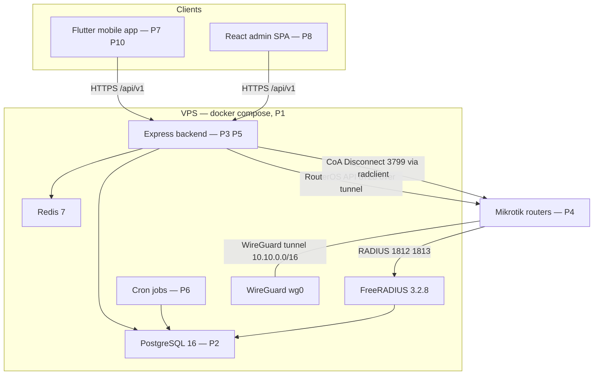
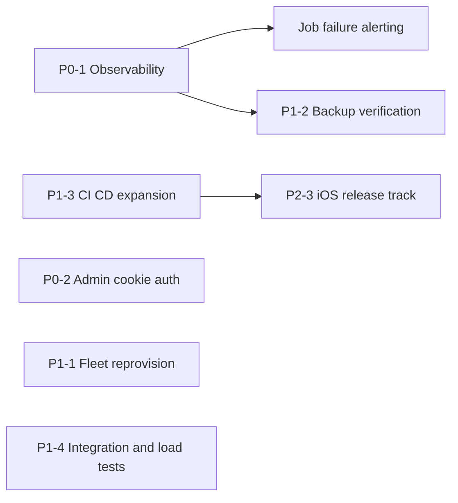

# Wasel — Implementation Plan

| | |
|---|---|
| **Version** | 1.0 |
| **Date** | 2026-06-12 |
| **Status** | Living document |
| **Audience** | Project owner + future contributors |
| **Related** | [TRD](TRD.md) · [App Flow](APP_FLOW.md) · [UI/UX Design Brief](UIUX_DESIGN_BRIEF.md) · [Backend Schema](BACKEND_SCHEMA.md) |

---

## Table of contents

1. [Purpose and scope](#1-purpose-and-scope)
2. [Current state at a glance](#2-current-state-at-a-glance)
3. [Phase P1 — Production infrastructure](#3-phase-p1--production-infrastructure)
4. [Phase P2 — Database schema and auto-migrations](#4-phase-p2--database-schema-and-auto-migrations)
5. [Phase P3 — Backend core](#5-phase-p3--backend-core)
6. [Phase P4 — Network provisioning layer](#6-phase-p4--network-provisioning-layer)
7. [Phase P5 — Feature APIs](#7-phase-p5--feature-apis)
8. [Phase P6 — Enforcement and lifecycle jobs](#8-phase-p6--enforcement-and-lifecycle-jobs)
9. [Phase P7 — Mobile app](#9-phase-p7--mobile-app)
10. [Phase P8 — Admin SPA](#10-phase-p8--admin-spa)
11. [Phase P9 — Notifications stack](#11-phase-p9--notifications-stack)
12. [Phase P10 — Design system](#12-phase-p10--design-system)
13. [Phase P11 — Local development stack](#13-phase-p11--local-development-stack)
14. [Forward roadmap](#14-forward-roadmap)
15. [Backlog triage — TASKS.md disposition](#15-backlog-triage--tasksmd-disposition)
16. [Maintaining this document](#16-maintaining-this-document)

---

## 1. Purpose and scope

This document is the honest map of **what has been built** (Part 1, sections 3–13) and **what should come next** (Part 2, section 14) for Wasel — the Mikrotik Hotspot Voucher Manager. It is written for the project owner and for any contributor landing in the repo cold.

It deliberately does **not** duplicate the other reference docs:

- System requirements and architecture rationale → [TRD](TRD.md)
- End-to-end user/data flows → [App Flow](APP_FLOW.md)
- Visual language and component specs → [UI/UX Design Brief](UIUX_DESIGN_BRIEF.md)
- Tables, columns, and RADIUS schema → [Backend Schema](BACKEND_SCHEMA.md)

Each phase below records: status, what it contains, key files, and the design decisions that a future maintainer would otherwise have to rediscover from git archaeology. Every file path is relative to the repo root. The historical task-level backlog lives in `TASKS.md`; its open/closed disposition is triaged in section 15.

---

## 2. Current state at a glance

All eleven build phases are shipped and running in production (VPS, `main` branch) with daily development on `dev` (see `CLAUDE.md` and `docs/LOCAL_DEV.md` for the branch/deploy model).

| Phase | Name | Status |
|---|---|---|
| P1 | Production infrastructure (Docker Compose, FreeRADIUS image, WireGuard host) | ✅ Shipped |
| P2 | Database schema + auto-migrations (24 SQL files) | ✅ Shipped |
| P3 | Backend core (Express 5 + TS, auth stack, crypto, config contract) | ✅ Shipped |
| P4 | Network provisioning layer (WG peers, RADIUS secrets, NAS, RouterOS) | ✅ Shipped |
| P5 | Feature APIs (87 route handlers across 13 route files) | ✅ Shipped |
| P6 | Enforcement + lifecycle jobs (6 cron jobs + WG monitor loop) | ✅ Shipped |
| P7 | Mobile app (29 Flutter screens, Riverpod, GoRouter, EN/AR) | ✅ Shipped |
| P8 | Admin SPA (React 19 + Vite + Tailwind, 12 pages) | ✅ Shipped |
| P9 | Notifications stack (FCM + inbox + prefs + email) | ✅ Shipped |
| P10 | Design system (slate-blue tokens, Cairo, component library) | ✅ Shipped (commit `26f5f45`) |
| P11 | Local development stack (WSL2-native loop, dev compose) | ✅ Shipped (commit `5d8f15c`) |

How the shipped pieces fit together:

---

## 3. Phase P1 — Production infrastructure

**Status: ✅ Shipped**

### What it contains

The production stack is one `docker-compose.yml` at the repo root with six services. Deployment is `git pull origin main && docker compose up -d --build` on the VPS (`deploy.md`).

| Service | Image / build | Network | Notes |
|---|---|---|---|
| `wireguard` | `lscr.io/linuxserver/wireguard` (digest-pinned) | host | `NET_ADMIN` + `SYS_MODULE`; mounts `/etc/wireguard` |
| `backend` | `build: ./backend` | host | `NET_ADMIN` (drives `wg` CLI); healthcheck on `/api/v1/health`; shares `freeradius_control` volume for read-only `radmin` probes |
| `postgres` | `postgres:16-alpine` (digest-pinned) | bridge, `127.0.0.1:5432` | password from compose env-file (`${POSTGRES_PASSWORD:?...}`) |
| `redis` | `redis:7-alpine` (digest-pinned) | bridge, `127.0.0.1:6379` | `requirepass` from compose env-file |
| `freeradius` | `build: ./freeradius` | host | DB creds injected as `RADIUS_DB_*` env vars |
| `admin` | `build: ./admin` | bridge, `127.0.0.1:5173` | reached through Caddy/Nginx on 443 (`deploy.md`) |

Every service has a healthcheck, `json-file` log rotation (10 MB × 3), memory/CPU limits, and `restart: unless-stopped`.

### Custom FreeRADIUS image — `freeradius/Dockerfile`

- Base: `freeradius/freeradius-server:3.2.8` (bumped from 3.2.4 in commit `8cecf56` for BlastRADIUS-era fixes; note the compose-side local tag `wasel-freeradius:3.2.4` is stale cosmetics — the real pin is the Dockerfile `FROM` line, as the compose comment itself says).
- Adds `freeradius-postgresql` driver; enables `sql`, `expiration`, and `sqlcounter` modules.
- Removes the base image's `inner-tunnel` site and the `eap` module — Wasel is voucher-PAP-only over WireGuard, and on FR 3.2.8 the default `eap` module fails to instantiate without an `Auth-Type EAP` section.
- Ships Wasel's `raddb/radiusd.conf` (BlastRADIUS mitigation knobs `require_message_authenticator = no`, `limit_proxy_state = no` live in the `security{}` block so SQL-loaded NAS clients inherit them) and `raddb/sites-enabled/` (`default`, `coa`, `control-socket`, `dynamic-clients`).
- **NAS onboarding is restart-free**: dynamic clients are resolved from the `nas` table via the SQL-backed `dynamic-clients` virtual server (120 s client lifetime, `read_clients` off — commits `796f661`, `f54e1dd`). Adding a router never requires a FreeRADIUS restart.
- `/var/run/freeradius` (radmin control socket) is created mode `0770` and shared with the backend via the `freeradius_control` named volume.
- Mikrotik vendor dictionary copied in; exposes `1812/udp`, `1813/udp`, `3799/udp`.

### WireGuard host + firewall

The `wireguard` container claims `wg0` on the host kernel; the backend manipulates peers directly against `/etc/wireguard`. `deploy.md` defines the canonical UFW rule set: default-deny inbound, 80/443/51820 public, SSH rate-limited, and **RADIUS ports 1812/1813/3799 scoped to `10.10.0.0/16` only** — they must never be publicly reachable.

### Notable design decisions

- Host networking for `wireguard`, `backend`, and `freeradius` so all three see the real `wg0` interface and tunnel IPs without NAT indirection.
- Compose secrets come from an env-file outside the repo (`/etc/wasel/compose.env`) after the plaintext-passwords-in-git incident documented in `RUNBOOKS.md` §1.
- All third-party images are digest-pinned for supply-chain stability.

---

## 4. Phase P2 — Database schema and auto-migrations

**Status: ✅ Shipped**

### What it contains

Twenty-four sequential SQL migrations in `backend/src/migrations/sql/`, executed automatically at backend boot by `backend/src/migrations/runner.ts` (called from `startServer()` in `backend/src/server.ts`). Deployments never run migrations by hand — `docker compose up -d --build backend` is sufficient.

| # | File | # | File |
|---|---|---|---|
| 001 | `001_extensions.sql` | 013 | `013_payment_rejection_reason.sql` |
| 002 | `002_freeradius_tables.sql` | 014 | `014_notifications_table.sql` |
| 003 | `003_application_tables.sql` | 015 | `015_support_messages.sql` |
| 004 | `004_seed_data.sql` | 016 | `016_system_settings.sql` |
| 005 | `005_device_tokens.sql` | 017 | `017_performance_indices.sql` |
| 006 | `006_admin_role.sql` | 018 | `018_tunnel_subnet_pool.sql` |
| 007 | `007_subscription_tiers.sql` | 019 | `019_currency_sdg.sql` |
| 008 | `008_plans_table.sql` | 020 | `020_router_health.sql` |
| 009 | `009_router_preshared_key.sql` | 021 | `021_router_provision_status.sql` |
| 010 | `010_voucher_wizard.sql` | 022 | `022_voucher_nas_scope_backfill.sql` |
| 011 | `011_voucher_status_unused.sql` | 023 | `023_voucher_nas_scope_rollback.sql` |
| 012 | `012_fix_radius_schema.sql` | 024 | `024_drop_router_provision_columns.sql` |

Full table/column reference is in the [Backend Schema](BACKEND_SCHEMA.md) doc. Two migrations worth singling out here:

**`008_plans_table.sql`** moved subscription plans from hardcoded constants to a `plans` table and seeds the three tiers (currency later switched from USD to SDG by `019_currency_sdg.sql`):

| Tier | Price | Max routers | Vouchers/month | Allowed durations (months) | Feature gates |
|---|---|---|---|---|---|
| `starter` | 5 SDG | 1 | 500 | 1 | Active session monitoring, basic dashboard |
| `professional` | 12 SDG | 3 | 2,000 | 1, 2 | + Session history, advanced analytics |
| `enterprise` | 25 SDG | 10 | unlimited (`-1`) | 1, 2, 6 | + Full history with export, full reports |

**`018_tunnel_subnet_pool.sql`** created the `tunnel_subnets` table backing /30 allocation (see P4).

### Notable design decisions

- Vouchers are **RADIUS users**, not Mikrotik local hotspot users: the standard FreeRADIUS schema (`radcheck`, `radreply`, `radusergroup`, `radgroupcheck`, `radgroupreply`, `radacct`, `nas`) lives in the same PostgreSQL database as the application tables, with `voucher_meta` as the ownership bridge between the two worlds.
- Migrations are forward-only and idempotent where re-runnable (`IF NOT EXISTS`, `ON CONFLICT DO NOTHING` in seeds); rollback for risky data migrations is shipped as a sibling migration (022/023 pair for voucher NAS-scoping).

---

## 5. Phase P3 — Backend core

**Status: ✅ Shipped**

### What it contains

Node.js + **Express `^5.2.1`** + TypeScript `^6`, Zod `^4` validation, `pg` pool, `ioredis`, `node-cron`.

**Config/env contract** — `backend/src/config/index.ts`: every connection string, secret, and URL is parsed from the environment through a Zod schema at boot; the process refuses to start on a missing/invalid value. Loads `backend/.env.local` first, then `.env` — production ships no `.env.local`, so the chain is a silent no-op there (the keystone of the dev/prod split, see P11).

**Auth stack** (verified values in code):

| Mechanism | Value | Where |
|---|---|---|
| Password hashing | bcrypt, cost 12 (`BCRYPT_ROUNDS = 12`) | `backend/src/services/auth.service.ts` |
| Access token | JWT, 15 min | `backend/src/services/token.service.ts`, `config` |
| Refresh token | JWT, 7 days, **rotated on every refresh**; JTI allowlisted in Redis as `refresh:{userId}:{jti}` | `backend/src/services/token.service.ts` |
| Login lockout | 5 failed attempts → 15 min lock (`LOCKOUT_MINUTES = 15`) | `backend/src/services/auth.service.ts` |
| Email-verify OTP | 6-digit, 24 h TTL (`OTP_VERIFY_TTL_SECONDS`) | `backend/src/services/token.service.ts` |
| Password-reset OTP | 15 min TTL (`OTP_RESET_TTL_SECONDS`) | `backend/src/services/token.service.ts` |
| OTP brute-force guard | 5 wrong attempts → OTP destroyed (atomic Lua INCR+EXPIRE) | `backend/src/services/token.service.ts` |
| Rate limits | 100 req/min general, 10 req/min on auth routes (Redis-backed) | `backend/src/middleware/rateLimiter.ts` |

**Encryption at rest** — `backend/src/utils/encryption.ts`: AES-256-GCM, output format `iv:tag:ciphertext` (hex), key from the 64-hex `ENCRYPTION_KEY` env var. Used for `routers.api_pass_enc`, `wg_private_key_enc`, `wg_preshared_key_enc`, `radius_secret_enc`.

**Middleware chain** — `backend/src/middleware/`: `requestId`, `requestLogger`, `rateLimiter`, `authenticate` (Bearer JWT), `requireAdmin`, `requireSubscription`, `requireTier`, `checkQuota`, `validate` (Zod), `upload`, `errorHandler` (consistent JSON error envelope).

**Process hygiene** — `backend/src/server.ts`: crash handlers that exit cleanly so Docker restarts the container, graceful shutdown (HTTP drain → Redis disconnect → pool close, 30 s hard kill), explicit `0.0.0.0` IPv4 bind (WSL2 `wslrelay` compatibility, harmless in prod). Health endpoints `GET /api/v1/health` and `/readyz` check DB + Redis with 2 s timeouts (`backend/src/routes/index.ts`).

**Tests**: Vitest suites under `backend/src/tests/` (auth, router, voucher incl. N+1 regression, session, subscription, profile, dashboard, health, OTP race), `backend/src/services/__tests__/`, `backend/src/jobs/__tests__/` — 173 passing as of commit `01377d0`.

---

## 6. Phase P4 — Network provisioning layer

**Status: ✅ Shipped**

### What it contains

Everything between "operator taps Add Router" and "voucher login authenticates over the tunnel".

| Concern | Key files |
|---|---|
| /30 subnet pool from `10.10.0.0/16` (16,384 blocks; server = first host, router = second) | `backend/src/utils/ipAllocation.ts`, migration `018_tunnel_subnet_pool.sql` |
| WG peer lifecycle (add/remove/list, sync from DB at boot) | `backend/src/services/wireguardPeer.ts`, `backend/src/utils/wireguard.ts` |
| Config + setup-script generation | `backend/src/services/wireguardConfig.ts` — `generateServerPeerBlock`, `generateBootstrapServerConfig`, `generateSafeServerConfig`, `generateMikrotikConfig`, `generateMikrotikConfigText`, `generateSetupSteps` |
| RADIUS secrets + NAS registration | `backend/src/services/router.service.ts`, `freeradius.service.ts` (per-router shared secret encrypted at rest, row in `nas`) |
| RouterOS API client (TCP **8728** over the tunnel) | `backend/src/services/routerOs.service.ts` |
| Router health probes | `backend/src/services/routerHealth.service.ts` |
| radclient wrapper (Access-Request probes + RFC 5176 Disconnect-Request to `<router>:3799`) | `backend/src/services/radclient.service.ts` |
| Handshake monitoring + status transitions | `backend/src/services/wireguardMonitor.ts` (60 s loop) |

### Notable design decisions

- **Paste-script onboarding** replaced the earlier API auto-provision wizard (commit `c170786`): adding a router returns a self-contained ~13-command RouterOS paste script (WireGuard interface + peer, RADIUS client config, hotspot profile defaults). It works on first paste with no inbound connection to the router required.
- The script sets `add-mac-cookie=no mac-cookie-timeout=0s` on the hotspot user profile (commit `01377d0`) so RouterOS cannot auto-resume returning clients from a MAC cookie — every reconnect must hit FreeRADIUS, where `rlm_expiration` enforces validity.
- Router status model: `online` (recent handshake + API responds), `degraded`, `offline` — written by the monitor loop, with offline/online push notifications after a grace period.
- Vouchers are NAS-scoped (migrations 022/023) so a voucher only authenticates on the router it was created for.

---

## 7. Phase P5 — Feature APIs

**Status: ✅ Shipped**

### What it contains

**87 route handlers across 13 route files** (plus `GET /health` and `GET /readyz` in `backend/src/routes/index.ts`), all mounted under `/api/v1`:

| Mounted prefix | File | Handlers | Notes |
|---|---|---|---|
| `/auth` | `auth.routes.ts` | 11 | register, login, refresh rotation, logout, OTP verify/resend, forgot/reset, password change |
| `/subscription` | `subscription.routes.ts` | 8 | plans, current status, request, receipt upload |
| `/routers` | `router.routes.ts` | 8 | CRUD + status + setup guide |
| `/routers/:id/vouchers` | `voucher.routes.ts` | 6 | single + bulk create, list/detail, enable/disable/extend, delete with CoA |
| `/routers/:id/sessions` | `session.routes.ts` | 3 | active sessions, disconnect, **history gated `requireTier('professional','enterprise')`** |
| `/profiles` | `profile.routes.ts` | 5 | RADIUS group profile CRUD |
| `/dashboard` | `dashboard.routes.ts` | 1 | single aggregated endpoint |
| `/reports` | `report.routes.ts` | 2 | both gated Professional+; CSV export works, **PDF returns 501** (`report.controller.ts:54`) |
| `/notifications` | `notification.routes.ts` | 8 | device tokens, preferences, inbox |
| `/support` | `support.routes.ts` | 3 | operator ↔ admin messaging |
| `/admin` | `admin.routes.ts` | 32 | `requireAdmin`; users, subscriptions, payments, routers, stats, audit logs, plans, settings, messages |
| `/public/routers` | `publicRouter.routes.ts` | 0 | currently an empty placeholder router (see roadmap, cleanup) |

Voucher lifecycle semantics (the core product): create inserts `radcheck` rows (`Cleartext-Password`, `Simultaneous-Use`, plus a `Session-Timeout` radreply cap when validity is set), `radusergroup`, and `voucher_meta`; **disable** = `Auth-Type := Reject` in `radcheck`; **delete** = remove rows + CoA Disconnect if a session is live. `Expiration` is deliberately *not* set at creation — see P6. Key file: `backend/src/services/voucher.service.ts`.

### Notable design decisions

- Quota and tier enforcement are middleware concerns (`checkQuota`, `requireSubscription`, `requireTier`), not per-controller checks.
- Bulk voucher creation (up to 100) is a single DB transaction — all-or-nothing.
- Every admin mutation writes to `audit_logs` via `backend/src/services/audit.service.ts`.

---

## 8. Phase P6 — Enforcement and lifecycle jobs

**Status: ✅ Shipped**

Six cron jobs in `backend/src/jobs/` plus the WireGuard monitor loop, all started in `startServer()` (`backend/src/server.ts:100-106`). Schedules verified in code:

| Job | File | Cadence | What it does |
|---|---|---|---|
| Purge unverified | `purgeUnverified.ts` | hourly (`0 * * * *`) | deletes accounts unverified for > 72 h |
| Subscription notifications | `subscriptionNotifications.ts` | daily 09:00 (`0 9 * * *`, container TZ = UTC) | 7/3/1-day expiry warnings + expired notices |
| Quota monitor | `quotaMonitor.ts` | every 6 h (`0 */6 * * *`) | voucher-quota ≥ 90 % warnings |
| Validity expiration | `validityExpiration.ts` | every 30 s (`*/30 * * * * *`) | detects first login in `radacct`, writes the `Expiration` radcheck row = first-use + validity window |
| Validity CoA disconnect | `validityCoaDisconnect.ts` | every 30 s | RFC 5176 Disconnect-Request for sessions still up past validity |
| Usage limit enforcement | `usageLimitEnforcement.ts` | every 30 s | cumulative `radacct` usage ≥ limit → `Auth-Type := Reject` + mark voucher expired |
| WireGuard monitor | `services/wireguardMonitor.ts` | every 60 s (`setInterval`) | handshake check, status transitions, offline/online notifications with re-notify suppression |

### Notable design decisions

- **Validity-from-first-use** is a three-piece mechanism: an upper-bound `Session-Timeout` radreply caps the very first session; `validityExpiration` writes the wall-clock `Expiration` after the first login lands in `radacct`; `validityCoaDisconnect` kicks any session that outlives it. This split exists because `rlm_expiration` only evaluates on Access-Request — it cannot terminate an already-running session (commit `01377d0` documents the full root-cause analysis).
- Every job wraps its body in try/catch and **only logs** failures — the process never dies because a tick failed. The flip side: failures are silent unless someone reads the logs. This is the single biggest operational gap (see roadmap P0-1).

---

## 9. Phase P7 — Mobile app

**Status: ✅ Shipped**

### What it contains

Flutter app, **29 screens** under `mobile/lib/screens/`, navigated by GoRouter with a `ShellRoute` hosting four bottom tabs (Dashboard / Routers / Vouchers / Settings):

| Area | Screens (29 total) |
|---|---|
| Auth (5) | login, register, verify_email, forgot_password, reset_password |
| Dashboard (1) | dashboard |
| Routers (5) | router_list, add_router, setup_guide, router_detail, edit_router |
| Vouchers (5) | vouchers (tab host), voucher_list, create_voucher_wizard, voucher_detail, voucher_print |
| Sessions (2) | active_sessions, session_history |
| Subscription (2) | subscription_status, payment |
| Reports (2) | reports, report_export |
| Notifications (2) | notifications, notification_preferences |
| Settings (5) | settings, edit_profile, change_password, payments, contact |

Stack (versions from `mobile/pubspec.yaml`): `flutter_riverpod ^2.6.1`, `go_router ^14.8.1`, `dio ^5.7.0`, `flutter_secure_storage ^9.2.4`, `firebase_messaging ^15.2.4`, `pdf ^3.11.2` + `printing ^5.13.5`.

Key plumbing in `mobile/lib/services/`: `api_client.dart` (Dio with JWT interceptor, single-flight 401 refresh, certificate pinning gated by `kReleaseMode`), `secure_storage.dart`, `print_service.dart` (thermal 58 mm and A4 2×4-grid voucher PDFs with Arabic shaping via bundled Cairo-Regular), plus one service per API group.

**i18n** is a hand-rolled localization layer — `mobile/lib/i18n/app_localizations.dart` — with every UI string externalized in **English and Arabic** (full RTL support), and a persisted locale selector in Settings (System Default / EN / AR).

### Notable design decisions

- API base URL is a `--dart-define` (`API_BASE_URL`); release builds default to `https://api.wa-sel.com/api/v1` — no env-specific values in code.
- Tokens live in platform secure storage (Keychain / EncryptedSharedPreferences), never in shared prefs.
- User-scoped providers are eager-loaded at auth restore/login so tabs render populated on first frame (commit `b6a2536`).
- Voucher printing uses the OS-native print dialog; direct Bluetooth/USB thermal-printer pairing was explicitly deferred (TASKS.md Epic 12).

---

## 10. Phase P8 — Admin SPA

**Status: ✅ Shipped**

### What it contains

React `^19.2.4` + Vite `^8` + Tailwind CSS v4 (`@tailwindcss/vite ^4.2.2`) + TanStack Query `^5.95.2`, served by the `admin` compose service on `127.0.0.1:5173` behind Caddy.

**12 pages** in `admin/src/pages/`: `LoginPage`, `DashboardPage`, `UsersPage`, `UserDetailPage`, `SubscriptionsPage`, `PlansPage`, `PaymentsPage`, `RoutersPage`, `MessagesPage`, `ConversationPage`, `AuditLogsPage`, `SettingsPage`.

Shared infrastructure:

- `admin/src/lib/api.ts` — axios instance with a **single-flight token refresh** interceptor (mirrors the mobile Dio pattern: one refresh in flight, queued retries, redirect to login on failure) and an asset-URL resolver that allowlists the API host to block attacker-supplied external URLs.
- `admin/src/lib/datetime.ts` — all timestamps pinned to a fixed business timezone (`VITE_ADMIN_TIMEZONE`, default `Africa/Khartoum`) via prebuilt `Intl.DateTimeFormat` instances, so every admin sees the same wall-clock regardless of browser TZ (commit `92878e2`). Backend stays UTC.
- `admin/src/lib/auth.ts` — token storage. **Tokens currently live in `localStorage`**, with an explicit security note at `admin/src/lib/auth.ts:8` acknowledging XSS exposure — hardening is a P0 roadmap item.
- `admin/src/components/` — `DataTable`, `StatCard`, `StatusBadge`, `ErrorBoundary`, `ErrorPanel`, `BrandMark`, `layout/`.

### Notable design decisions

- Login is role-gated: the backend threads `role` through the JWT (migration `006_admin_role.sql`), and `requireAdmin` protects every `/admin` route; the SPA additionally rejects non-admin logins client-side.
- The admin panel is the single shared surface where all viewers must agree on times — hence build-time TZ pinning rather than browser-local rendering.

---

## 11. Phase P9 — Notifications stack

**Status: ✅ Shipped**

### What it contains

| Piece | Key files |
|---|---|
| FCM push via `firebase-admin ^13.7.0` (graceful no-op when credentials are absent) | `backend/src/services/notification.service.ts` |
| Device token register/unregister + stale-token cleanup | `backend/src/services/deviceToken.service.ts`, migration `005_device_tokens.sql` |
| Per-category preferences (7 categories) | `backend/src/services/notificationPrefs.service.ts` |
| In-app inbox | `backend/src/services/inbox.service.ts`, migration `014_notifications_table.sql` |
| API surface (8 handlers) | `backend/src/routes/notification.routes.ts` |
| Email (nodemailer SMTP) | `backend/src/services/email.service.ts` — MailHog in dev (compose ports 1025/8025), Resend in prod (`SMTP_PASS` = Resend API key per `RUNBOOKS.md`) |
| Mobile receiver + prefs UI | `mobile/lib/services/push_notification_service.dart`, `notification_preferences_screen.dart` |

Triggers wired end-to-end: subscription expiring/expired, payment confirmed, router offline (3-min grace) / back online, voucher quota ≥ 90 %, bulk creation complete. A Redis-backed 24 h dedup prevents repeat sends (TASKS.md Epic 11).

---

## 12. Phase P10 — Design system

**Status: ✅ Shipped** (commit `26f5f45`)

### What it contains

A full re-skin of the mobile app driven by three locked decisions: **light theme only**, refined slate-blue palette (primary `#2563EB`, fill-only CTA accent `#F97316`, slate neutrals `#F8FAFC` / `#1E293B`), and **Cairo** as the app-wide Arabic+Latin typeface.

- **Token layer** — `mobile/lib/theme/`: `app_colors.dart` (palette + semantic status helpers), `app_typography.dart` (Cairo scale with clamped line heights, mono tokens for voucher codes/MACs/IPs), `app_shadows.dart` (slate-tinted soft shadows), `app_motion.dart` (150/250/350 ms, easeOutCubic), `app_spacing.dart`, `app_theme.dart` (explicit `ColorScheme` + full component themes).
- **Component library** — `mobile/lib/widgets/` (11 components + barrel `widgets.dart`): `AppCard`, `StatusBadge`, `StatusDot`, `EmptyState`, `ErrorState`, `InlineErrorBanner`, `Skeleton`/`SkeletonCard`/`SkeletonList`, `AppSnackbar`, `showConfirmDialog` (destructive variant), `SectionHeader`, `StatCard`. All presentational-only, RTL-safe (`EdgeInsetsDirectional`).
- **Migration**: all 29 screens converted; every hardcoded `Colors.*` eliminated except `Colors.transparent`; duplicated private widgets deleted in favour of the library. `flutter test` 107/107 green (94 existing + 13 new widget smoke tests).

### Known intentional leftovers (recorded in the commit, tracked in the roadmap)

- Dark mode deliberately out of scope; tokens are semantic so adding it later is additive.
- Reports screen keeps one non-semantic purple data-series color (`0xFF5856D6`).
- Report type ChoiceChips now use the unified theme selection color instead of per-type colors — restoring per-type colors is a pending product decision.

---

## 13. Phase P11 — Local development stack

**Status: ✅ Shipped** (commit `5d8f15c`)

### What it contains

A parallel dev stack so daily work runs natively (WSL2 or any POSIX shell) with hot reload, while only infra runs in containers. Full walkthrough: `docs/LOCAL_DEV.md`; end-to-end testing loop: `TESTING.md`.

- `docker-compose.dev.yml` — postgres (`127.0.0.1:5436`), redis (`127.0.0.1:6380`), freeradius (bridge-published `127.0.0.1:1812-1813/udp`), MailHog (`:1025` SMTP / `:8025` UI), and a WireGuard sidecar gated behind `--profile router-test` for real-router pairing. Non-default host ports avoid collisions with other projects.
- Backend and admin run as `npm run dev` (nodemon/ts-node on `:3000`, Vite HMR on `:5173`); mobile runs with `--dart-define=API_BASE_URL=http://10.0.2.2:3000/api/v1`.
- **Env-file convention**: root `.env` (compose interpolation) and `backend/.env.local` (dev secrets) are gitignored and never pushed; `.example` siblings are committed. The backend's `.env.local`-first load order makes prod behaviour unchanged.
- Branch model: all commits land on `dev`; promotion is `git merge dev --ff-only` into `main`; the VPS only ever pulls `main` and only ever uses the prod compose file.

### Notable design decisions

- The code rule that makes the split safe: every connection string / secret / URL is read from `config` — nothing env-specific is hardcoded (enforced by the Zod boot contract, P3).
- FreeRADIUS uses bridge networking in dev (Docker Desktop's "host" is the VM, not the WSL2 distro) but host networking in prod — same image, different compose wiring.

---

## 14. Forward roadmap

Items are bucketed by priority: **P0** correctness/security, **P1** operational maturity, **P2** product growth, **P3** nice-to-have. Sizes are rough effort classes (S < 1 day-ish, M = days, L = week+ for one contributor). **No dates are committed here** — ordering and dependency edges are the contract.

### P0 — Correctness and security

| # | Item | What / Why | Size | Dependencies |
|---|---|---|---|---|
| P0-1 | **Monitoring / metrics / alerting** | Prometheus metrics + Grafana dashboards have been on the backlog since the MVP plan (`TASKS.md` Epic 9, still open) and are called for by the PRD (`project.pdf` §2.2.2). Nothing is implemented — there is **no `/metrics` endpoint anywhere in `backend/src`** (verified by grep). The sharpest risk: the three 30-second RADIUS enforcement loops (P6) and the WireGuard monitor catch-and-log all errors — if `validityCoaDisconnect` or `usageLimitEnforcement` starts failing every tick, expired vouchers keep working and **nobody is told**. Minimum viable scope: a `prom-client` `/metrics` endpoint (job tick success/failure counters, last-success timestamps, HTTP latencies, radclient outcome counts), a Grafana dashboard, and an alert on `time-since-last-successful-tick` per job. | M | None hard. `devops-infra` + `backend-api` layers. Unblocks P1-2 alerting. |
| P0-2 | **Admin SPA token hardening** | Access + refresh tokens live in `localStorage` (`admin/src/lib/auth.ts` — the file's own security note at line 8 acknowledges any XSS can exfiltrate them; `admin/src/lib/api.ts` persists refreshed pairs the same way). Move to HttpOnly, Secure, SameSite cookies issued by the backend for the admin origin, with a CSRF strategy and CORS adjustments. The single-flight refresh logic survives mostly intact. | M | Backend cookie issuance endpoint(s); Caddy origin config. `backend-api` + `security-auditor` review. |
| P0-3 | **Close out the legacy secret-rotation runbook** | `RUNBOOKS.md` §1 is marked *URGENT — first-time*: pre-refactor plaintext Postgres/Redis passwords are recoverable from git history until rotated **and** purged with `git filter-repo` + force-push. Whether the VPS-side rotation has already been executed cannot be verified from the repo — confirm, execute any remaining steps (history purge + GitHub cache expiry), then mark the runbook section done. | S (operational) | Maintenance window; coordination with anyone holding a clone. |

### P1 — Operational maturity

| # | Item | What / Why | Size | Dependencies |
|---|---|---|---|---|
| P1-1 | **Fleet reprovision endpoint** | The mac-cookie RouterOS fix (commit `01377d0`) changed the generated setup script, but already-deployed routers need the one-line `add-mac-cookie=no` fix **pasted manually per router** — the commit explicitly deferred a reprovision-via-RouterOS-API endpoint as out of scope. Build `POST /routers/:id/reprovision` (and a fleet-wide admin variant) that pushes idempotent profile/config corrections over the tunnel via `routerOs.service.ts`. Any future script change has the same shape, so this is infrastructure, not a one-off. | M | RouterOS API path already exists (P4). `radius-networking` before `backend-api` wiring. |
| P1-2 | **Backup automation + restore verification** | `deploy.md` documents daily encrypted `pg_dump` + WireGuard-config backup **cron lines to be installed by hand on the VPS**, and `RUNBOOKS.md` §2 has the restore procedure (RTO 2 h / RPO 24 h). Gaps: nothing in the repo installs or verifies the cron; a silently failing backup job is invisible; restores have never been drilled against a scratch VM. Add backup-success metrics/alerts (depends on P0-1), off-host copy automation, and a periodic restore drill checklist appended to `RUNBOOKS.md`. | S–M | P0-1 for alerting. `devops-infra`. |
| P1-3 | **CI/CD expansion** | What exists (`.github/workflows/`): `backend.yml` (lint + vitest + docker build, on push/PR to `main` touching `backend/**`) and `mobile.yml` (analyze + flutter test + **debug** APK). Missing: any admin SPA workflow (no tsc/build check), a signed **release** APK pipeline, coverage on the `dev` branch (where all daily commits actually land — CI currently only fires on `main`), and deploy automation to the VPS (today: manual `git pull && docker compose up -d --build`). | M | None. `devops-infra`. Prerequisite for P2-3 (iOS lane). |
| P1-4 | **Integration + load test suites** | Still open from `TASKS.md` Epic 9: full voucher-create → RADIUS auth → accounting integration test, router-add → tunnel → status-monitoring integration test, RADIUS load (200+ concurrent auths), API load (500+ concurrent users). The dev compose stack (P11) makes the integration tests feasible in CI with real FreeRADIUS + Postgres containers. | L | P11 (exists). `test-writer`. |

### P2 — Product growth

| # | Item | What / Why | Size | Dependencies |
|---|---|---|---|---|
| P2-1 | **Full session history (Epic 16)** | The basic endpoint exists and is already tier-gated (`session.routes.ts:12`, Professional+). Open from `TASKS.md` Epic 16: enforced 90-day retention on `radacct`, advanced filters (termination cause, router), a session detail view exposing all `radacct` fields, and CSV/PDF export of history. | M | Export plumbing shared with P2-2. `backend-api` + `flutter-mobile`. |
| P2-2 | **Report PDF export** | `GET /reports/export?format=pdf` returns a deliberate 501 (`backend/src/controllers/report.controller.ts:54` — "PDF export is not yet available. Please use CSV format."). CSV works; pick a server-side PDF approach and close the gap. | S–M | None. |
| P2-3 | **iOS release track** | The PRD targets iOS + Android; today only Android is exercised. `mobile/ios/` has the standard Runner scaffold (Runner.xcodeproj / xcworkspace / RunnerTests) but there is **no iOS CI lane** (`mobile.yml` builds an Android debug APK only), no APNs wiring validation for `firebase_messaging`, no signing or TestFlight/App Store pipeline. Certificate pinning (`api_client.dart`) and the print flow also need device verification on iOS. | L | Apple developer account; macOS CI runner; P1-3. |
| P2-4 | **Biometric login (Epic 17)** | Entirely open in `TASKS.md`: fingerprint/Face ID after initial email/password auth, token in biometric-protected storage, settings toggle. | M | `flutter-mobile` only. |
| P2-5 | **Localization growth (Epic 13 deferrals)** | French, Portuguese, and Swahili translations deferred; backend `Accept-Language` localized error messages deferred. The string layer (`mobile/lib/i18n/app_localizations.dart`) already externalizes everything, so each language is mechanical translation + review. | S–M per language | None. |
| P2-6 | **Direct thermal-printer connectivity (Epic 12 deferral)** | Voucher printing currently goes through the OS print dialog (`printing` package). Direct Bluetooth/USB ESC/POS pairing was deferred; revisit if operators report friction with 58 mm thermal printers. | M | `flutter-mobile`. |

### P3 — Nice-to-have

| # | Item | What / Why | Size | Dependencies |
|---|---|---|---|---|
| P3-1 | **Dark mode** | Explicitly deferred by a locked decision in the design-system pass (commit `26f5f45`: "light theme only"). Because all 29 screens now consume semantic tokens from `mobile/lib/theme/`, dark mode is an additive second token set + `ThemeData`, not another migration. | M | P10 (done). [UI/UX Design Brief](UIUX_DESIGN_BRIEF.md). |
| P3-2 | **Report chip per-type colors** | The design system unified report-type ChoiceChips onto one selection color; the commit records restoring per-type colors as a pending product decision. Decide, then it is a token-level change. | S | Product decision. |
| P3-3 | **Dead-route cleanup** | `backend/src/routes/publicRouter.routes.ts` exports an empty `Router` still mounted at `/public/routers` (`routes/index.ts:78`) — leftover from the removed router-callback onboarding flow. Either repurpose for future public endpoints or delete the mount + file. | S | None. |

---

## 15. Backlog triage — TASKS.md disposition

`TASKS.md` is the historical phase/epic backlog. Triage against the code as of this writing:

| Epic | Status |
|---|---|
| 1 Setup & infra, 2 Auth, 3 Subscriptions, 4 Routers, 5 Profiles, 7 Sessions (basic), 8 Dashboard | ✅ Done (verified against P1–P5 above) |
| 6 Vouchers | ✅ Done — the one open checkbox ("unit tests for voucher creation / quota / bulk atomicity") is **stale**: `backend/src/tests/voucher.test.ts` and `voucherN1.test.ts` exist and pass |
| 9 Testing & deployment | ⚠️ Partially done. Done in practice: VPS deploy (`deploy.md`), TLS via Caddy, backup procedure documented, CI exists for backend + Android. Open: integration tests, load tests (→ P1-4), Prometheus/Grafana (→ P0-1), iOS device track + store submission (→ P2-3) |
| 10 Reports & export | ✅ Done except PDF generation (501 placeholder → P2-2) |
| 11 Push notifications | ✅ Done (P9) |
| 12 Bulk printing | ✅ Done except direct thermal-printer pairing (→ P2-6) |
| 13 Multi-language | ✅ EN/AR done; FR/PT/SW + backend `Accept-Language` deferred (→ P2-5) |
| 14 Admin panel | ✅ Done and since extended (Plans, Messages/Conversation, UserDetail, Settings pages beyond the original epic scope) |
| 15 Pro & Enterprise tiers | ✅ Done (migrations 007/008, `requireTier`, mobile plan selection) |
| 16 Session history (full) | ❌ Open (→ P2-1) |
| 17 Biometric login | ❌ Open (→ P2-4) |

When an epic above is finished, update both `TASKS.md` checkboxes and the roadmap table in section 14.

---

## 16. Maintaining this document

- **When a phase's contents change materially** (new route group, new job, new screen), update the matching Part 1 section and the counts in section 2.
- **When a roadmap item ships**, move its substance into the relevant Part 1 phase and delete the row — do not let Part 2 accumulate done items.
- **Never add dates or deadlines here**; sizes and dependency edges only. Sequencing decisions belong to the orchestrator workflow in `CLAUDE.md` (sub-agent routing + parallel dispatch rules).
- Verify counts the same way this document was built: route handlers via `router.<method>(` grep over `backend/src/routes/`, jobs via `cron.schedule` grep over `backend/src/jobs/`, screens via the file list under `mobile/lib/screens/`, migrations via `backend/src/migrations/sql/`.
