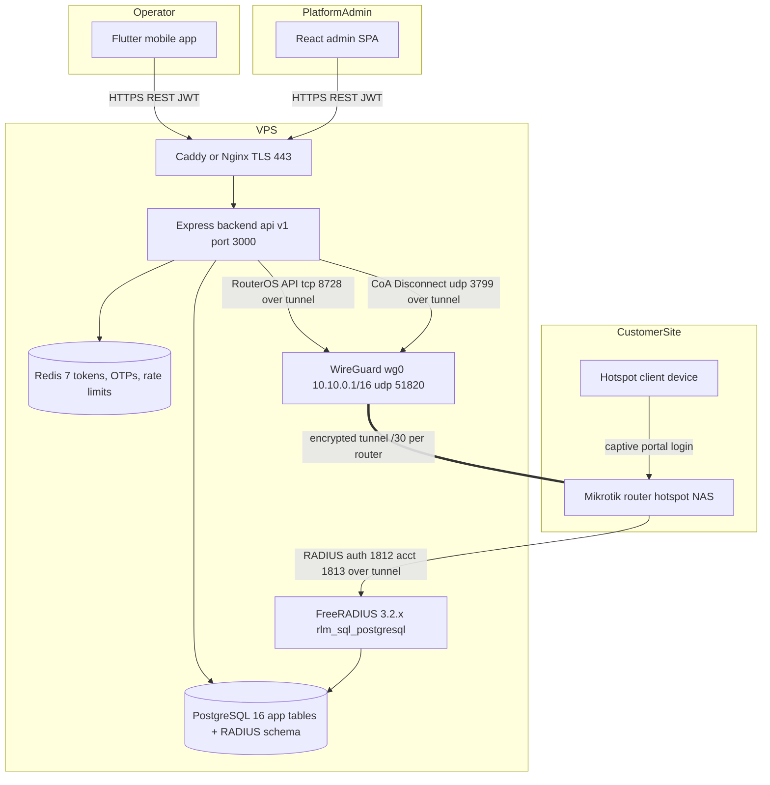

# Wasel — Technical Requirements Document

| | |
|---|---|
| **Version** | 1.0 |
| **Date** | 2026-06-12 |
| **Status** | Living document |
| **Audience** | Engineers (backend, mobile, admin, infra) and technical stakeholders |
| **Related** | [App Flow](APP_FLOW.md) · [UI/UX Design Brief](UIUX_DESIGN_BRIEF.md) · [Backend Schema](BACKEND_SCHEMA.md) · [Implementation Plan](IMPLEMENTATION_PLAN.md) |

## Table of Contents

1. [Purpose, Scope, Audience](#1-purpose-scope-audience)
2. [Product Overview](#2-product-overview)
3. [System Architecture](#3-system-architecture)
4. [Functional Requirements](#4-functional-requirements)
   - [4.1 Authentication and User Management](#41-authentication-and-user-management)
   - [4.2 Router Management](#42-router-management)
   - [4.3 Vouchers](#43-vouchers)
   - [4.4 RADIUS Profiles](#44-radius-profiles)
   - [4.5 Session Monitoring](#45-session-monitoring)
   - [4.6 Subscriptions and Payments](#46-subscriptions-and-payments)
   - [4.7 Dashboard and Reports](#47-dashboard-and-reports)
   - [4.8 Notifications](#48-notifications)
   - [4.9 Support Chat](#49-support-chat)
   - [4.10 Admin Panel](#410-admin-panel)
5. [Non-Functional Requirements](#5-non-functional-requirements)
6. [Subscription Tiers](#6-subscription-tiers)
7. [External Integrations](#7-external-integrations)
8. [Deployment Requirements](#8-deployment-requirements)
9. [Constraints, Assumptions, Out of Scope](#9-constraints-assumptions-out-of-scope)

---

## 1. Purpose, Scope, Audience

This document is the master technical reference for **Wasel**, the Mikrotik Hotspot Voucher Manager. It states what the system must do (functional requirements, written as numbered `TRD-*` items mapped to the API endpoints that satisfy them), how it is constrained (non-functional requirements), and what it runs on (deployment requirements).

**Scope.** The full production system: the Flutter mobile app, the Node.js/Express backend, the FreeRADIUS AAA server, the WireGuard tunnel layer, the React admin SPA, and the Docker Compose deployment on a single VPS.

**Out of scope for this document.** Screen-by-screen UX flows ([App Flow](APP_FLOW.md)), visual design ([UI/UX Design Brief](UIUX_DESIGN_BRIEF.md)), table-level schema detail ([Backend Schema](BACKEND_SCHEMA.md)), and delivery sequencing ([Implementation Plan](IMPLEMENTATION_PLAN.md)).

**Sources.** Product requirements derive from the PRD (`project.pdf`, v1.0, 2026-03-28). Every technical fact in this document (endpoints, ports, limits, schedules, column names) has been verified against the repository code as of the date above; file paths are given throughout so readers can jump to the implementation.

---

## 2. Product Overview

### 2.1 Problem statement

Internet cafe owners and small hotspot operators who sell Wi-Fi access through Mikrotik routers face an operational bottleneck: creating and managing hotspot vouchers traditionally requires physical access to the router or a technician visit. Each voucher run-out disrupts business — customers wait, revenue is lost, travel costs accrue. There is no affordable, mobile-first product that lets these operators manage routers and vouchers remotely (`project.pdf`, §1.1).

### 2.2 Solution

Wasel is a mobile application (Android/iOS) backed by a centralized VPS. Operators add their Mikrotik routers once — the system generates a WireGuard tunnel and RADIUS client configuration per router — and from then on create, sell, monitor, and revoke vouchers entirely from their phone. Vouchers live centrally in a FreeRADIUS SQL database, not as local users on each router, so they are instantly available across all of an operator's routers and keep working even when a router was offline at creation time (`project.pdf`, §1.2).

### 2.3 Target users

- Internet cafe owners and small hotspot businesses selling Wi-Fi access via voucher codes
- Network administrators managing multiple Mikrotik deployments across sites
- Technicians and service providers supporting multiple client routers from one place

### 2.4 Business objectives (PRD §1.4)

- Eliminate physical technician visits for voucher tasks (target: 90% reduction)
- Recurring revenue through tiered subscriptions (see [§6](#6-subscription-tiers)); target 100 active paying subscribers within 3 months of launch
- Voucher creation in under 1 minute end-to-end from the mobile device
- Backend uptime of 99.5%

---

## 3. System Architecture

### 3.1 Components

The system has five primary components plus the admin SPA:

| # | Component | Technology | Role |
|---|-----------|-----------|------|
| 1 | Mobile app | Flutter/Dart — Riverpod (`flutter_riverpod` 2.6.x), GoRouter 14.x, Dio 5.x, `flutter_secure_storage` (`mobile/pubspec.yaml`) | Operator interface. Talks to the backend over HTTPS REST only; never connects to a router directly |
| 2 | VPS backend | Node.js + Express + TypeScript, PostgreSQL 16, Redis 7, Zod validation (`backend/src/`) | REST API (`/api/v1/`), business logic, JWT auth, tier/quota enforcement, WireGuard peer management, background jobs |
| 3 | FreeRADIUS | FreeRADIUS 3.2.x (`freeradius/Dockerfile`, base image `freeradius/freeradius-server:3.2.8`; compose tag `wasel-freeradius:3.2.4`) with `rlm_sql_postgresql` | AAA engine. Authenticates hotspot users against `radcheck`/`radreply` rows and writes accounting to `radacct` |
| 4 | WireGuard | `lscr.io/linuxserver/wireguard` container, host networking (`docker-compose.yml`) | Persistent encrypted tunnels VPS ↔ routers. Each router gets a /30 subnet from `10.10.0.0/16`, allocated atomically from the `tunnel_subnets` pool table (16,384 blocks — `backend/src/migrations/sql/018_tunnel_subnet_pool.sql`) |
| 5 | RouterOS API | `routeros-client` over TCP 8728, tunnel-only (`backend/src/services/routeros.service.ts`) | Router configuration checks, system info, live hotspot session listing |
| 6 | Admin SPA | React 19, Vite, Tailwind CSS 4, TanStack Query, react-router-dom 7 (`admin/package.json`) | Platform-operator panel: users, subscriptions, payments, plans, routers, support, audit logs, settings |

### 3.2 Key decision: vouchers are RADIUS users

Vouchers are **not** Mikrotik local hotspot users. Each voucher is a set of rows in the standard FreeRADIUS SQL schema — credentials and check attributes in `radcheck`, reply attributes in `radreply` (and optionally group membership in `radusergroup` — the current voucher-creation path does not assign groups; see [Backend Schema](BACKEND_SCHEMA.md)) — plus an application-side metadata row in `voucher_meta` linking the voucher to its owning user and router. Routers are registered as RADIUS clients (`nas` table) and delegate all hotspot authentication and accounting to FreeRADIUS over the WireGuard tunnel.

Why (PRD §2.1, §3.4):

- **Centralized control** — disable, extend, or delete a voucher in one place; effective on every router instantly.
- **Consistent accounting** — all session data (start/stop, bytes, duration, terminate cause) flows into one `radacct` table regardless of which router served the session.
- **Multi-router from one database** — a voucher can be valid across an operator's whole fleet; the target router does not need to be online at creation time.
- **Router independence** — RouterOS API changes can't break voucher logic; the API is used only for monitoring and configuration.

Consequences implemented in code:

- Disable = `Auth-Type := Reject` row in `radcheck`; enable = remove it (`backend/src/services/voucher.service.ts`).
- Delete = remove `radcheck`/`radreply`/`radusergroup` rows + RADIUS CoA `Disconnect-Request` (RFC 5176) to the router on UDP 3799 if a session is live (`backend/src/services/radclient.service.ts`, `sendDisconnectRequest`).
- Usage limits are enforced by attributes (`Max-All-Session` for time, `Max-Total-Octets` / `Max-Total-Octets-Gigawords` for data, `Session-Timeout`, per-user `Expiration`) plus backend sweeper jobs (see [§4.3](#43-vouchers)).

### 3.3 Data flow — voucher creation and use (PRD §2.3)

1. Operator authenticates in the app (JWT) and submits voucher parameters.
2. Backend validates JWT → subscription → quota (`authenticate` → `requireSubscription` → `checkQuota` middleware chain, `backend/src/routes/voucher.routes.ts`).
3. Backend inserts `radcheck`/`radreply` rows and a `voucher_meta` row in a transaction.
4. App displays credentials with share/print options.
5. A customer connects to the hotspot; the Mikrotik sends a RADIUS `Access-Request` over the tunnel; FreeRADIUS validates against PostgreSQL and replies `Access-Accept` with limit attributes.
6. The router streams accounting packets (Start / Interim-Update / Stop) into `radacct`; backend jobs and dashboards read usage from there.

---

## 4. Functional Requirements

All endpoints are prefixed `/api/v1` (`backend/src/routes/index.ts`). Auth legend: **Public** (none), **JWT** (`authenticate`), **+Sub** (`requireSubscription` — active subscription; expired subscriptions get a read-only grace where only `GET` is allowed, `backend/src/middleware/requireSubscription.ts`), **+Tier(P/E)** (`requireTier('professional','enterprise')`), **+Quota** (`checkQuota`), **Admin** (`authenticate` + `requireAdmin`).

`GET /health` and `GET /readyz` are public and probe DB + Redis with a 2 s timeout, returning 503 on degradation (`backend/src/routes/index.ts`).

### 4.1 Authentication and User Management

| ID | Requirement |
|----|-------------|
| TRD-AUTH-01 | Users register with name, email, phone, and password; passwords are hashed with bcrypt cost 12 (`BCRYPT_ROUNDS = 12`, `backend/src/services/auth.service.ts`). |
| TRD-AUTH-02 | Registration sends a 6-digit OTP by email; the OTP is stored in Redis with a 24 h TTL (`OTP_VERIFY_TTL_SECONDS`, `backend/src/services/token.service.ts`). Unverified accounts are purged by an hourly job (`backend/src/jobs/purgeUnverified.ts`). |
| TRD-AUTH-03 | Login issues a JWT access token (15 min) and refresh token (7 days) with rotation; each refresh token carries a JTI stored in Redis under `refresh:{userId}:{jti}` and is revoked on rotation/logout (`backend/src/services/token.service.ts`). |
| TRD-AUTH-04 | Account lockout after 5 consecutive failed logins, 15-minute cooldown (`MAX_LOGIN_ATTEMPTS = 5`, `LOCKOUT_MINUTES = 15`, `auth.service.ts`). |
| TRD-AUTH-05 | Password reset uses a 15-minute OTP (`OTP_RESET_TTL_SECONDS`); both OTP flows lock after 5 wrong attempts within 1 h, invalidating the code (`OTP_MAX_ATTEMPTS`, `token.service.ts`). |
| TRD-AUTH-06 | All auth endpoints are rate-limited to 10 req/min (Redis-backed `authLimiter`, `backend/src/middleware/rateLimiter.ts`). |
| TRD-AUTH-07 | Authenticated users can read/update their profile and change their password in-app. |
| TRD-AUTH-08 | Tokens are stored on-device in platform secure storage (`flutter_secure_storage`). |

| Method | Path | Auth | Purpose |
|--------|------|------|---------|
| POST | `/auth/register` | Public (rate-limited) | Create account, send verification OTP |
| POST | `/auth/login` | Public (rate-limited) | Authenticate, issue JWT pair |
| POST | `/auth/refresh` | Public (rate-limited) | Rotate refresh token, new access token |
| POST | `/auth/verify-email` | Public (rate-limited) | Verify 6-digit OTP |
| POST | `/auth/resend-verification` | Public (rate-limited) | Re-send verification OTP |
| POST | `/auth/forgot-password` | Public (rate-limited) | Send password-reset OTP |
| POST | `/auth/reset-password` | Public (rate-limited) | Set new password with OTP |
| POST | `/auth/logout` | Public (body-validated) | Revoke refresh token |
| GET | `/auth/me` | JWT | Current user profile |
| PUT | `/auth/profile` | JWT | Update profile fields |
| POST | `/auth/change-password` | JWT | Change password (re-auth) |

Source: `backend/src/routes/auth.routes.ts`.

### 4.2 Router Management

| ID | Requirement |
|----|-------------|
| TRD-RTR-01 | Adding a router allocates a /30 tunnel subnet from the `tunnel_subnets` pool (atomic, collision-free under concurrency — migration 018), generates a WireGuard keypair + preshared key, a per-router RADIUS shared secret (32-char alphanumeric, `generateRadiusSecret`, `backend/src/utils/encryption.ts`), and a NAS identifier (`<sanitized-name>_<uuid8>`, `generateNasIdentifier`). |
| TRD-RTR-02 | Secrets at rest — `api_pass_enc`, `wg_private_key_enc`, `wg_preshared_key_enc`, `radius_secret_enc` — are encrypted with AES-256-GCM (see TRD-SEC-02). |
| TRD-RTR-03 | The setup guide returns a **13-command RouterOS paste script** covering: WireGuard interface + peer (endpoint, `allowed-address=10.10.0.0/16`, `persistent-keepalive=25s`, PSK), tunnel IP (/30) + route, auto-provision API user + enabling the API service, RADIUS client (`/radius add service=hotspot,login ... src-address=<tunnelIp>`), CoA listener (`/radius incoming set accept=yes port=3799`), hotspot profile `use-radius=yes`, hotspot user-profile defaults (`idle-timeout=5m keepalive-timeout=2m add-mac-cookie=no mac-cookie-timeout=0s` — MAC-cookie auto-login disabled so FreeRADIUS sees every re-auth), and three firewall accepts (UDP 1812 + 3799 from the VPS tunnel IP, UDP 51820) (`backend/src/services/wireguardConfig.ts`). |
| TRD-RTR-04 | Router status model: `online` (WireGuard handshake within 150 s — `HANDSHAKE_TIMEOUT_S = 150`), `offline` (no recent handshake), `degraded` (tunnel up, API unresponsive). The background monitor runs every 60 s (`CHECK_INTERVAL_MS = 60_000`) and, being a passive handshake check, assigns only online/offline; degraded detection requires the active per-router health probe (`GET /routers/:id/health`). (`backend/src/services/wireguardMonitor.ts`) |
| TRD-RTR-05 | A push notification fires when a router stays offline beyond a 3-minute grace period (`OFFLINE_GRACE_PERIOD_MS = 180_000`), once per offline episode; a "back online" push fires on recovery only if the offline push fired. |
| TRD-RTR-06 | Routers can be renamed, have API credentials updated, and be deleted; deletion removes the WireGuard peer and NAS registration. |
| TRD-RTR-07 | On backend boot, WireGuard peers are re-synced from the database before monitoring starts (`syncPeersFromDatabase`, `backend/src/server.ts`). |

| Method | Path | Auth | Purpose |
|--------|------|------|---------|
| POST | `/routers` | JWT +Sub | Register router; generate tunnel + RADIUS config (tier router-limit enforced) |
| GET | `/routers` | JWT +Sub | List operator's routers with status |
| GET | `/routers/:id` | JWT +Sub | Router detail |
| PUT | `/routers/:id` | JWT +Sub | Update name / API credentials |
| DELETE | `/routers/:id` | JWT +Sub | Remove router, tunnel, NAS entry |
| GET | `/routers/:id/status` | JWT +Sub | Real-time status + system info |
| GET | `/routers/:id/setup-guide` | JWT +Sub | 13-step RouterOS setup script |
| GET | `/routers/:id/health` | JWT +Sub | Active health probe (tunnel + API + RADIUS) |

Source: `backend/src/routes/router.routes.ts`. (`backend/src/routes/publicRouter.routes.ts` is mounted at `/public/routers` but is currently an empty stub with no endpoints.)

### 4.3 Vouchers

| ID | Requirement |
|----|-------------|
| TRD-VCH-01 | Voucher creation is a single unified endpoint for single and bulk: `count >= 1`, each voucher has a `limitType` of `time` or `data`, a positive `limitValue` with unit `minutes/hours/days` or `MB/GB`, an optional `validitySeconds` (wall-clock validity from first use), and a `price >= 0` for revenue estimation (`backend/src/validators/voucher.validators.ts`). |
| TRD-VCH-02 | Quota is checked before creation against the subscription's remaining monthly allowance (`checkQuota(req => req.body.count ?? 1)`); exceeding it returns 403 `QUOTA_EXCEEDED`. |
| TRD-VCH-03 | Time-limited vouchers write `Max-All-Session := <seconds>` to `radcheck`; data-limited vouchers write `Max-Total-Octets` (with `Max-Total-Octets-Gigawords` for values > 4 GiB) (`backend/src/services/voucher.service.ts`). |
| TRD-VCH-04 | Validity from first use: when a voucher with `validity_seconds` first appears in `radacct`, the `validityExpiration` job (every 30 s) writes a per-user `Expiration` attribute to `radcheck`; `Session-Timeout := validitySeconds` is written at creation to cap the first session before the cron lands (`backend/src/jobs/validityExpiration.ts`, `voucher.service.ts`). |
| TRD-VCH-05 | Enforcement sweepers: `usageLimitEnforcement` (every 30 s) compares cumulative `radacct` usage to the limit and inserts `Auth-Type := Reject` + marks the voucher `expired`; `validityCoaDisconnect` (every 30 s) sends CoA `Disconnect-Request` (RFC 5176, UDP 3799) to terminate live sessions whose validity has elapsed (`backend/src/jobs/usageLimitEnforcement.ts`, `backend/src/jobs/validityCoaDisconnect.ts`, `backend/src/services/radclient.service.ts`). |
| TRD-VCH-06 | Voucher lifecycle statuses: `unused`, `active`, `used`, `expired`, `disabled`. Update supports enable/disable (`Auth-Type := Reject` toggle), changing `expiration` (ISO 8601), and a comment (≤ 255 chars). |
| TRD-VCH-07 | Delete removes all RADIUS rows and sends CoA disconnect for any active session. Bulk delete accepts up to 500 explicit IDs or a filter (status / limitType / search / all). |
| TRD-VCH-08 | Listing is paginated (default 20, max 500 per page) with status, limit-type, and search filters. |
| TRD-VCH-09 | The mobile app provides share (OS share sheet) and print (printable voucher cards — `mobile/lib/screens/vouchers/voucher_print_screen.dart`) for created vouchers. |

| Method | Path | Auth | Purpose |
|--------|------|------|---------|
| POST | `/routers/:id/vouchers` | JWT +Sub +Quota | Create 1..n vouchers (transactional) |
| GET | `/routers/:id/vouchers` | JWT +Sub | List vouchers (paginated, filterable) |
| POST | `/routers/:id/vouchers/bulk-delete` | JWT +Sub | Bulk delete by IDs or filter |
| GET | `/routers/:id/vouchers/:vid` | JWT +Sub | Voucher detail + usage from `radacct` |
| PUT | `/routers/:id/vouchers/:vid` | JWT +Sub | Enable / disable / extend / comment |
| DELETE | `/routers/:id/vouchers/:vid` | JWT +Sub | Delete + CoA disconnect |

Source: `backend/src/routes/voucher.routes.ts`.

> Note: the PRD (§3.4.4) specifies a 100-voucher batch ceiling; the implemented validator enforces `count >= 1` with the effective ceiling coming from the subscription quota check rather than a hard 100 cap.

### 4.4 RADIUS Profiles

| ID | Requirement |
|----|-------------|
| TRD-PRF-01 | Operators define reusable service plans (bandwidth up/down, session timeout, total time/data) stored in `radius_profiles` and materialized as `radgroupcheck`/`radgroupreply` rows; bandwidth becomes a `Mikrotik-Rate-Limit` reply attribute (`backend/src/services/profile.service.ts`). |
| TRD-PRF-02 | Profile updates replace the group attribute rows; deletion is blocked while vouchers reference the profile (PRD §4.4). |

| Method | Path | Auth | Purpose |
|--------|------|------|---------|
| POST | `/profiles` | JWT +Sub | Create group profile |
| GET | `/profiles` | JWT +Sub | List profiles |
| GET | `/profiles/:pid` | JWT +Sub | Profile detail + attributes |
| PUT | `/profiles/:pid` | JWT +Sub | Update attributes |
| DELETE | `/profiles/:pid` | JWT +Sub | Delete profile |

Source: `backend/src/routes/profile.routes.ts`.

### 4.5 Session Monitoring

| ID | Requirement |
|----|-------------|
| TRD-SES-01 | Active sessions are read live from the router via RouterOS API over the tunnel (TCP 8728) (`backend/src/services/routeros.service.ts`). |
| TRD-SES-02 | Any active session can be disconnected from the app; disconnection uses RADIUS CoA / hotspot kick and triggers an accounting Stop. |
| TRD-SES-03 | Session history is read from `radacct` (paginated, filterable) and is **tier-gated to Professional and Enterprise** (`requireTier('professional','enterprise')`, `backend/src/routes/session.routes.ts`). |

| Method | Path | Auth | Purpose |
|--------|------|------|---------|
| GET | `/routers/:id/sessions` | JWT +Sub | Live sessions via RouterOS API |
| GET | `/routers/:id/sessions/history` | JWT +Sub +Tier(P/E) | History from `radacct` |
| DELETE | `/routers/:id/sessions/:sid` | JWT +Sub | Disconnect a session |

### 4.6 Subscriptions and Payments

| ID | Requirement |
|----|-------------|
| TRD-SUB-01 | Three tiers (see [§6](#6-subscription-tiers)) are seeded in the `plans` table (migration `008_plans_table.sql`) and editable by admins at runtime — plans are data, not code. |
| TRD-SUB-02 | Payment is **manual bank transfer**: operator requests a subscription, gets bank details + reference code, uploads a receipt image, and an admin approves or rejects. Payment statuses: `pending`, `approved`, `rejected`; subscription statuses: `pending`, `active`, `expired`, `cancelled` (`backend/src/migrations/sql/003_application_tables.sql`). |
| TRD-SUB-03 | Receipt upload: max 5 MB; JPEG/PNG/WebP only; the client-declared MIME and extension are checked, then the stored file's **magic bytes are sniffed** and the file deleted on mismatch (`backend/src/middleware/upload.ts`). Receipts are served from `/uploads` with `Content-Disposition: attachment` and `X-Content-Type-Options: nosniff` so uploads can never render inline (`backend/src/app.ts`). |
| TRD-SUB-04 | Expired subscriptions get a read-only grace: `requireSubscription` allows only `GET` once status is `expired` (PRD §3.2.3 specifies 7 days before suspension). |
| TRD-SUB-05 | Expiry warnings are pushed at thresholds by the daily notification job (09:00 UTC, `backend/src/jobs/subscriptionNotifications.ts`); quota usage is monitored every 6 h (`backend/src/jobs/quotaMonitor.ts`). |
| TRD-SUB-06 | Allowed subscription durations per tier are stored per plan (`allowed_durations`): Starter `[1]`, Professional `[1,2]`, Enterprise `[1,2,6]` months. |

| Method | Path | Auth | Purpose |
|--------|------|------|---------|
| GET | `/subscription/plans` | Public | List plans + pricing |
| GET | `/subscription` | JWT | Current subscription + quota |
| GET | `/subscription/bank-info` | JWT | Bank transfer details |
| GET | `/subscription/payments` | JWT | Own payment history |
| POST | `/subscription/request` | JWT | Request subscription/renewal |
| POST | `/subscription/change` | JWT | Upgrade/downgrade request |
| POST | `/subscription/receipt` | JWT | Upload payment receipt (multipart) |
| DELETE | `/subscription/payments/:id` | JWT | Cancel a pending payment |

Source: `backend/src/routes/subscription.routes.ts`.

### 4.7 Dashboard and Reports

| ID | Requirement |
|----|-------------|
| TRD-DSH-01 | A single dashboard endpoint aggregates operator KPIs (active sessions, vouchers created, usage, router status, subscription state) (`backend/src/routes/dashboard.routes.ts`, `backend/src/controllers/dashboard.controller.ts`). |
| TRD-RPT-01 | Four report types — `voucher-sales`, `sessions`, `revenue`, `router-uptime` — over a custom ISO date range, optionally per router (`backend/src/validators/report.validators.ts`). |
| TRD-RPT-02 | Reports and export are tier-gated to Professional/Enterprise; export formats are `csv` (default) and `pdf` (`backend/src/routes/report.routes.ts`). |

| Method | Path | Auth | Purpose |
|--------|------|------|---------|
| GET | `/dashboard` | JWT | Aggregated dashboard data |
| GET | `/reports` | JWT +Sub +Tier(P/E) | Generate report (JSON) |
| GET | `/reports/export` | JWT +Sub +Tier(P/E) | Export report as CSV/PDF |

### 4.8 Notifications

| ID | Requirement |
|----|-------------|
| TRD-NTF-01 | Push delivery via Firebase Cloud Messaging (`firebase-admin`); if `FIREBASE_SERVICE_ACCOUNT_PATH` is unset the service degrades to a logged no-op rather than failing boot (`backend/src/services/notification.service.ts`). |
| TRD-NTF-02 | Device tokens are registered per platform (`android`/`ios`) and pruned on send failure (migration `005_device_tokens.sql`). |
| TRD-NTF-03 | Eight per-category user preferences: `subscription_expiring`, `subscription_expired`, `payment_confirmed`, `router_offline`, `router_online`, `voucher_quota_low`, `bulk_creation_complete`, `support_reply` (`backend/src/validators/notification.validators.ts`). |
| TRD-NTF-04 | Every push is mirrored to an in-app inbox (migration `014_notifications_table.sql`) with paginated listing, per-item and bulk mark-as-read, and deletion. |

| Method | Path | Auth | Purpose |
|--------|------|------|---------|
| POST | `/notifications/device-token` | JWT | Register FCM token |
| DELETE | `/notifications/device-token` | JWT | Unregister token |
| GET | `/notifications/preferences` | JWT | Get category preferences |
| PUT | `/notifications/preferences` | JWT | Update preferences |
| GET | `/notifications` | JWT | Inbox (paginated) |
| POST | `/notifications/read-all` | JWT | Mark all read |
| POST | `/notifications/:id/read` | JWT | Mark one read |
| DELETE | `/notifications/:id` | JWT | Delete inbox item |

Source: `backend/src/routes/notification.routes.ts`.

### 4.9 Support Chat

| ID | Requirement |
|----|-------------|
| TRD-SUP-01 | Operators have a single support conversation thread with platform admins (migration `015_support_messages.sql`); messages are paginated and unread state is tracked both ways. |
| TRD-SUP-02 | Admin replies trigger a `support_reply` push to the operator. |

| Method | Path | Auth | Purpose |
|--------|------|------|---------|
| GET | `/support/messages` | JWT | List own conversation |
| POST | `/support/messages` | JWT | Send message |
| POST | `/support/messages/read-all` | JWT | Mark admin replies read |

Source: `backend/src/routes/support.routes.ts`. Admin-side endpoints are under `/admin/support/*` (next section).

### 4.10 Admin Panel

All `/admin/*` routes require `authenticate` + `requireAdmin` (role claim `admin` — `backend/src/middleware/requireAdmin.ts`); the router applies both globally via `router.use(authenticate, requireAdmin)` (`backend/src/routes/admin.routes.ts`). The SPA (`admin/src/pages/`) ships 12 pages: Login, Dashboard, Users, UserDetail, Subscriptions, Plans, Payments, Routers, Messages, Conversation, AuditLogs, Settings. Admin timestamps are pinned to a build-time business timezone (default `Africa/Khartoum`, `VITE_ADMIN_TIMEZONE` — `admin/src/lib/datetime.ts`).

| ID | Requirement |
|----|-------------|
| TRD-ADM-01 | User management: list/search, detail, edit, delete; create a router on a user's behalf. |
| TRD-ADM-02 | Subscription management: list, edit (activate/extend/change tier), delete. |
| TRD-ADM-03 | Plan management: CRUD over the `plans` table (pricing/limits changeable without deploys). |
| TRD-ADM-04 | Payment verification queue: list pending receipts, approve/reject with rejection reason (migration `013_payment_rejection_reason.sql`); approval activates the subscription and pushes `payment_confirmed`. |
| TRD-ADM-05 | Platform visibility: stats, all-routers list with per-router setup guide, audit logs of admin actions, system status, and a FreeRADIUS diagnostics endpoint (read-only `radmin` probe over the shared control socket — see `docker-compose.yml` `freeradius_control` volume). |
| TRD-ADM-06 | Settings: bank transfer details; admin account management (create, activate/deactivate, password reset, delete). |
| TRD-ADM-07 | Support inbox: conversation list, unread count, per-user thread, reply, mark read. |

| Method | Path | Purpose |
|--------|------|---------|
| GET | `/admin/users` | List/search users |
| GET | `/admin/users/:id` | User detail |
| PUT | `/admin/users/:id` | Update user |
| DELETE | `/admin/users/:id` | Delete user |
| POST | `/admin/users/:id/routers` | Create router for user |
| GET | `/admin/subscriptions` | List subscriptions |
| PUT | `/admin/subscriptions/:id` | Update subscription |
| DELETE | `/admin/subscriptions/:id` | Delete subscription |
| GET | `/admin/plans` | List plans |
| POST | `/admin/plans` | Create plan |
| PUT | `/admin/plans/:id` | Update plan |
| DELETE | `/admin/plans/:id` | Delete plan |
| GET | `/admin/payments` | Payment queue |
| PUT | `/admin/payments/:id` | Approve/reject payment |
| GET | `/admin/stats` | Platform statistics |
| GET | `/admin/routers` | All routers |
| GET | `/admin/routers/:id/setup-guide` | Setup guide for any router |
| GET | `/admin/audit-logs` | Audit trail |
| GET | `/admin/settings/bank` | Bank settings |
| PUT | `/admin/settings/bank` | Update bank settings |
| GET | `/admin/admins` | List admin accounts |
| POST | `/admin/admins` | Create admin |
| PUT | `/admin/admins/:id/active` | Activate/deactivate admin |
| PUT | `/admin/admins/:id/password` | Reset admin password |
| DELETE | `/admin/admins/:id` | Delete admin |
| GET | `/admin/system-status` | Infra health summary |
| GET | `/admin/freeradius/status` | FreeRADIUS radmin diagnostics |
| GET | `/admin/support/unread-count` | Unread support count |
| GET | `/admin/support/conversations` | Conversation list |
| GET | `/admin/support/conversations/:userId` | Thread messages |
| POST | `/admin/support/conversations/:userId/messages` | Reply |
| POST | `/admin/support/conversations/:userId/read` | Mark read |

In total the API surface is ~89 endpoints across 13 route files plus the two health probes.

---

## 5. Non-Functional Requirements

### 5.1 Security

| ID | Requirement | Implementation |
|----|-------------|----------------|
| TRD-SEC-01 | TLS for all client traffic; HSTS 1 year incl. subdomains + preload | Reverse proxy (Caddy/Nginx) terminates TLS on 443; `helmet()` + `helmet.hsts(...)` (`backend/src/app.ts`) |
| TRD-SEC-02 | AES-256-GCM at rest for router secrets, stored as `iv:tag:ciphertext` (hex, 16-byte IV, 16-byte auth tag); key is the 64-hex-char `ENCRYPTION_KEY` env var | `backend/src/utils/encryption.ts`; columns `api_pass_enc`, `wg_private_key_enc`, `wg_preshared_key_enc`, `radius_secret_enc` |
| TRD-SEC-03 | JWT: 15 min access / 7 day refresh with rotation and Redis-tracked JTIs; bcrypt cost 12; lockout 5 fails / 15 min | `token.service.ts`, `auth.service.ts` |
| TRD-SEC-04 | Rate limiting: 100 req/min general on `/api/`, 10 req/min on auth; Redis store (shared across restarts), fail-open on store error, disabled under `NODE_ENV=test` | `backend/src/middleware/rateLimiter.ts` |
| TRD-SEC-05 | CORS: explicit comma-separated allowlist; wildcard `*` is rejected at boot with `process.exit(1)` | `backend/src/config/index.ts`, `app.ts` |
| TRD-SEC-06 | HTTP parameter pollution prevention (`hpp`), JSON body cap 10 MB, Zod validation on body/params/query of every mutating endpoint | `app.ts`, `backend/src/middleware/validate.ts`, `backend/src/validators/` |
| TRD-SEC-07 | Upload hardening: 5 MB cap, MIME allowlist, magic-byte verification with delete-on-mismatch, forced-download static serving | `backend/src/middleware/upload.ts`, `app.ts` |
| TRD-SEC-08 | RADIUS ports (1812/1813/3799 UDP) reachable **only** from the WireGuard subnet `10.10.0.0/16`; never public | UFW rules in `deploy.md` §1.3 |
| TRD-SEC-09 | BlastRADIUS (CVE-2024-3596) mitigation: FreeRADIUS requires `Message-Authenticator` from all non-localhost clients | `deploy.md` (clients.conf `default_wg_routers`); RouterOS 6.x needs `message-authenticator-required=yes` |
| TRD-SEC-10 | Per-router unique RADIUS shared secret, transmitted only inside the tunnel; RouterOS API access restricted to tunnel IPs | `encryption.ts` (`generateRadiusSecret`), setup script firewall rules |
| TRD-SEC-11 | Backups encrypted at rest (AES-256-CBC via openssl with a dedicated key file) | `deploy.md` Backups section |

### 5.2 Availability and reliability

- **Uptime target: 99.5%** (PRD §5.3 — ≈3.65 h downtime/month).
- Every compose service has a healthcheck and `restart: unless-stopped`; `backend` waits for healthy `postgres`, `redis`, and `wireguard` (`docker-compose.yml`).
- Graceful shutdown on SIGTERM/SIGINT: stop accepting connections → drain in-flight → close Redis → close DB pool, with a 30 s hard-kill timer; uncaught exceptions/rejections exit so Docker restarts the container (`backend/src/server.ts`).
- Cold-boot autostart via a `Type=oneshot` systemd unit (`scripts/wasel.service`, installed per `deploy.md` §2.7).
- Migrations run automatically on backend boot (`runMigrations()` in `server.ts`).
- Backups: daily encrypted PostgreSQL dump + WireGuard config at 03:00 (cron), 30-day local retention, 90-day off-host retention, monthly `radacct` archival; RPO 24 h, RTO 2 h (`deploy.md`).

### 5.3 Performance

- PostgreSQL connection pool: min 2 / max 10 (`DB_POOL_MIN`/`DB_POOL_MAX` defaults, `backend/src/config/index.ts`); performance indices in migration `017_performance_indices.sql`.
- Rate limits double as load protection (100/min/user general).
- PRD targets (§5.1, not yet load-test-verified): single voucher < 2 s end-to-end, bulk 100 < 15 s, RADIUS auth < 200 ms, API p95 < 500 ms, 200+ concurrent RADIUS auths, 500+ concurrent app users.
- Container resource caps per service (see [§8](#8-deployment-requirements)) keep one runaway service from starving the rest of the 2 GB VPS.

### 5.4 Observability

- Structured logging via winston with timestamps and stack traces (`backend/src/config/logger.ts`); every request gets an ID (`backend/src/middleware/requestId.ts`) and is access-logged (`requestLogger.ts`).
- Liveness/readiness: `GET /api/v1/health` and `/readyz` probe DB + Redis with 2 s timeouts and report per-check status.
- Admin-facing `GET /admin/system-status` and `GET /admin/freeradius/status` expose infra health in the panel.
- Container logs: json-file driver, 10 MB × 3 rotation per service; `deploy.md` documents off-host log shipping options (rsyslog forward or logging-driver to Loki/Datadog — operator decision pending).
- **Gap:** the PRD (§2.2.2) promises Prometheus metrics + Grafana dashboards. **Not implemented** — no `prom-client` or metrics endpoint exists in the backend. Treat as a known deviation until scheduled.

### 5.5 Compatibility and localization

- Mikrotik RouterOS 6.48+ and 7.x (PRD §5.4); RouterOS 6 RADIUS clients need the Message-Authenticator flag (TRD-SEC-09).
- Mobile: Flutter targeting Android and iOS; 29 screens; custom i18n with English and Arabic (`mobile/lib/i18n/app_localizations.dart`) — Arabic ahead of the PRD's phase-2 plan, French/Portuguese/Swahili not implemented.
- Mobile release builds default to `https://api.wa-sel.com/api/v1`; dev overrides via `--dart-define=API_BASE_URL` (`CLAUDE.md`).

---

## 6. Subscription Tiers

Seeded by `backend/src/migrations/sql/008_plans_table.sql`; currency switched platform-wide from USD to **SDG** by `019_currency_sdg.sql`. `-1` = unlimited. Admins can edit these at runtime via `/admin/plans`.

| Feature | Starter | Professional | Enterprise |
|---|---|---|---|
| Monthly price | 5 SDG | 12 SDG | 25 SDG |
| Max routers | 1 | 3 | 10 |
| Monthly voucher quota | 500 | 2,000 | Unlimited (`-1`) |
| Session monitoring | Active only | Active + history | Full + export |
| Dashboard | Basic stats | Advanced analytics | Full analytics + reports |
| Allowed durations (months) | 1 | 1, 2 | 1, 2, 6 |

Tier gates in code: session history (`/routers/:id/sessions/history`) and reports/export (`/reports`, `/reports/export`) require `professional` or `enterprise` via `requireTier` (`backend/src/middleware/requireTier.ts`). Router count and voucher quota are enforced at creation time per plan row.

---

## 7. External Integrations

| Integration | Protocol / Library | Direction | Notes |
|---|---|---|---|
| FreeRADIUS 3.2.x | RADIUS UDP 1812 (auth), 1813 (acct); shared PostgreSQL via `rlm_sql_postgresql`; `radmin` control socket | Routers → FR; backend reads/writes RADIUS tables directly | Custom image `freeradius/Dockerfile` (base `freeradius-server:3.2.8`); dynamic NAS clients loaded from SQL at startup — no restart needed for new routers |
| WireGuard | UDP 51820; `wg`/peer management from the backend (NET_ADMIN) | VPS ↔ routers | `/30` per router from `10.10.0.0/16`; 25 s persistent keepalive; peers restored from DB on boot |
| RouterOS API | TCP 8728 via `routeros-client`, tunnel-only | Backend → router | Monitoring, system info, hotspot session list/kick (`backend/src/services/routeros.service.ts`) |
| RADIUS CoA | UDP 3799, `radclient` Disconnect-Request (RFC 5176) | Backend → router | `sendDisconnectRequest` in `backend/src/services/radclient.service.ts` |
| Firebase FCM | `firebase-admin` SDK, service-account JSON at `FIREBASE_SERVICE_ACCOUNT_PATH` | Backend → devices | Graceful no-op when unconfigured |
| Email (Resend) | SMTP via nodemailer; production points at `smtp.resend.com` (`backend/.env.example`) | Backend → users | OTP verification + password reset emails (`backend/src/services/email.service.ts`) |

---

## 8. Deployment Requirements

### 8.1 Target platform

Single Ubuntu 22.04 LTS VPS (min 2 GB RAM / 20 GB disk), Docker Compose, domain with TLS via reverse proxy (Caddy or Nginx + Let's Encrypt) fronting the backend on 443 — port 3000 is never exposed publicly (`deploy.md`).

### 8.2 Containers (`docker-compose.yml`)

| Service | Image / build | Network & ports | Memory | CPUs | Healthcheck |
|---|---|---|---|---|---|
| `wireguard` | `lscr.io/linuxserver/wireguard` (digest-pinned) | host; UDP 51820 | 256 MB | 0.5 | `wg show wg0` |
| `backend` | `./backend` (build) | host; :3000 (proxied) | 1 GB | 1.0 | `wget /api/v1/health` |
| `postgres` | `postgres:16-alpine` (digest-pinned) | `127.0.0.1:5432` | 1 GB | 1.0 | `pg_isready` |
| `redis` | `redis:7-alpine` (digest-pinned, `requirepass`) | `127.0.0.1:6379` | 256 MB | 0.5 | `redis-cli ping` |
| `freeradius` | `./freeradius` (build; tag `wasel-freeradius:3.2.4`, base 3.2.8) | host; UDP 1812/1813/3799 | 512 MB | 1.0 | `pgrep freeradius` |
| `admin` | `./admin` (build) | `127.0.0.1:5173` (behind proxy) | 128 MB | 0.25 | `wget 127.0.0.1:5173` |

Named volumes: `postgres_data`, `redis_data`, `backend_uploads`, `freeradius_control` (shared socket dir for backend `radmin` probes). All services: json-file logging 10 MB × 3, `restart: unless-stopped`. `wireguard`, `backend`, and `freeradius` run with host networking; `backend` and `freeradius` reach PostgreSQL on `127.0.0.1:5432`.

### 8.3 Firewall (UFW — `deploy.md` §1.3)

| Rule | Port/Proto | Source | Purpose |
|---|---|---|---|
| limit | 22/tcp | any | SSH, rate-limited |
| allow | 80/tcp | any | HTTP (ACME) |
| allow | 443/tcp | any | HTTPS |
| allow | 51820/udp | any | WireGuard |
| limit | 1812,1813/udp | `10.10.0.0/16` only | RADIUS auth + acct |
| allow | 3799/udp | `10.10.0.0/16` only | RADIUS CoA |
| default | deny incoming / allow outgoing | — | Baseline |

### 8.4 Environment contract (`backend/src/config/index.ts`)

Zod-validated at boot; invalid config exits the process. `.env.local` (dev only, gitignored) loads before `.env`.

| Group | Variables | Constraints |
|---|---|---|
| Core | `NODE_ENV`, `PORT` (3000) | enum / number |
| PostgreSQL | `DB_HOST`, `DB_PORT`, `DB_NAME`, `DB_USER`, `DB_PASSWORD`, `DB_POOL_MIN` (2), `DB_POOL_MAX` (10) | `DB_PASSWORD` required |
| Redis | `REDIS_HOST`, `REDIS_PORT`, `REDIS_PASSWORD` | password optional in schema, set in prod |
| JWT | `JWT_ACCESS_SECRET`, `JWT_REFRESH_SECRET`, `JWT_ACCESS_EXPIRES_IN` (15m), `JWT_REFRESH_EXPIRES_IN` (7d) | secrets ≥ 32 chars |
| Crypto | `ENCRYPTION_KEY` | exactly 64 hex chars (32 bytes) |
| CORS | `CORS_ORIGIN` | comma list; `*` rejected at boot |
| WireGuard | `WG_SERVER_PRIVATE_KEY`, `WG_SERVER_PUBLIC_KEY`, `WG_SERVER_ENDPOINT`, `WG_SERVER_PORT` (51820) | all required |
| SMTP | `SMTP_HOST`, `SMTP_PORT` (587), `SMTP_USER`, `SMTP_PASS`, `SMTP_FROM` | Resend in prod |
| RADIUS | `RADIUS_HOST`, `RADIUS_AUTH_PORT` (1812), `RADIUS_ACCT_PORT` (1813), `RADIUS_COA_PORT` (3799) | defaults shown |
| Push | `FIREBASE_SERVICE_ACCOUNT_PATH` | optional |
| Misc | `PUBLIC_BASE_URL` | URL; used in router setup scripts |

Compose-level secrets (`POSTGRES_PASSWORD`, `REDIS_PASSWORD`) live in `/etc/wasel/compose.env` (chmod 600) and are passed via `--env-file`.

### 8.5 Background jobs (started in `backend/src/server.ts`)

| Job | File (`backend/src/jobs/`) | Schedule | Function |
|---|---|---|---|
| Purge unverified accounts | `purgeUnverified.ts` | hourly (`0 * * * *`) | Delete accounts that never verified |
| Subscription notifications | `subscriptionNotifications.ts` | daily 09:00 UTC | Expiry warnings + expired notices |
| Quota monitor | `quotaMonitor.ts` | every 6 h | `voucher_quota_low` alerts |
| Usage limit enforcement | `usageLimitEnforcement.ts` | every 30 s | `Auth-Type := Reject` when time/data limit exhausted |
| Validity expiration | `validityExpiration.ts` | every 30 s | Write `Expiration` on first use |
| Validity CoA disconnect | `validityCoaDisconnect.ts` | every 30 s | Disconnect live sessions past validity |
| WireGuard monitor | `services/wireguardMonitor.ts` | every 60 s (interval, not cron) | Status transitions + offline/online pushes |

### 8.6 Release flow

Work lands on `dev`; promotion is `git checkout main && git merge dev --ff-only && git push`; VPS deploy is `git pull origin main && docker compose up -d --build` (prod compose only — `docker-compose.dev.yml` is never invoked on the VPS). Migrations auto-run on backend boot (`CLAUDE.md`, Local Development).

---

## 9. Constraints, Assumptions, Out of Scope

### 9.1 Constraints

- Single shared PostgreSQL database serves both the application and FreeRADIUS (`rlm_sql_postgresql`) — RADIUS schema tables are co-located with app tables and must follow the standard FreeRADIUS schema (`backend/src/migrations/sql/002_freeradius_tables.sql`, `012_fix_radius_schema.sql`).
- Routers must run RouterOS with WireGuard support and be configured via the 13-command paste script; the system cannot push config to a router that has never been provisioned.
- The tunnel address plan caps the fleet at 16,384 routers (/30 blocks in `10.10.0.0/16`).
- Payments are manual; subscription activation latency is bounded by admin responsiveness, not code.
- Single-VPS topology: no horizontal scaling, no DB replication (PRD lists replication as a mitigation; current deployment relies on encrypted backups).

### 9.2 Assumptions

- Operators can paste CLI commands into a Mikrotik terminal (the app's setup guide is written for that skill level).
- The VPS endpoint (`WG_SERVER_ENDPOINT`) is a stable public IP/hostname reachable on UDP 51820 from customer networks behind NAT.
- Email deliverability via Resend is sufficient for OTP flows; SMS is not used.
- The business timezone for the admin panel is a single fixed zone (default `Africa/Khartoum`), baked at build time.

### 9.3 Out of scope (PRD §9)

- Automated payment processing (cards, mobile money, gateways)
- Non-Mikrotik routers (Ubiquiti, Cisco, TP-Link, …)
- End-user self-service voucher purchase app
- QoS beyond RADIUS group profiles / `Mikrotik-Rate-Limit`
- White-label / reseller branding
- Third-party accounting/invoicing integration
- SMS-based voucher delivery

### 9.4 Known gaps vs PRD (tracked deviations)

| Gap | PRD reference | Status |
|---|---|---|
| Prometheus metrics + Grafana dashboards | §2.2.2 | Not implemented; no metrics endpoint exists |
| Hard 100-voucher batch ceiling | §3.4.4 | Validator enforces `count >= 1`; ceiling is the subscription quota |
| Biometric login | §3.1.2 | Not implemented in mobile app |
| French/Portuguese/Swahili localization | §5.5 | Only EN + AR shipped |
| Background "degraded" status detection | §3.3.2 | Passive monitor distinguishes online/offline only; degraded requires the active `/routers/:id/health` probe |
