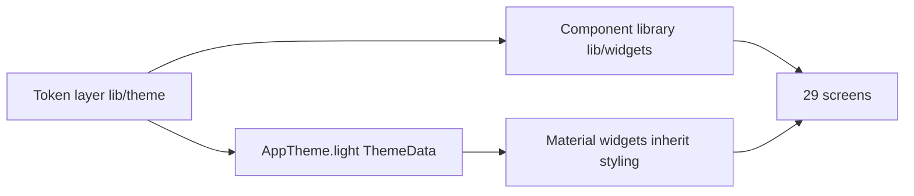

# Wasel — UI/UX Design Brief

| | |
|---|---|
| **Version** | 1.0 |
| **Date** | 2026-06-12 |
| **Status** | Living document |
| **Audience** | Designers and mobile developers working on the Wasel Flutter app (and, peripherally, the React admin SPA) |
| **Related** | [TRD](TRD.md) · [App Flow](APP_FLOW.md) · [Backend Schema](BACKEND_SCHEMA.md) · [Implementation Plan](IMPLEMENTATION_PLAN.md) |

This document is the single source of truth for the Wasel design system shipped in commit `26f5f45` ("Full mobile design-system overhaul: slate-blue palette, Cairo typography, soft-shadow components, all 29 screens migrated"). Every token value below is transcribed from the code in `mobile/lib/theme/` and `mobile/lib/widgets/` — when in doubt, the code wins, and this document should be updated to match.

## Table of contents

1. [Design direction — Soft UI Evolution](#1-design-direction--soft-ui-evolution)
2. [Brand](#2-brand)
3. [Color system](#3-color-system)
4. [Typography](#4-typography)
5. [Layout tokens — spacing, radius, shadows, motion](#5-layout-tokens--spacing-radius-shadows-motion)
6. [Component catalog](#6-component-catalog)
7. [ThemeData coverage](#7-themedata-coverage)
8. [UX patterns](#8-ux-patterns)
9. [Accessibility and RTL](#9-accessibility-and-rtl)
10. [Anti-patterns](#10-anti-patterns)
11. [Admin SPA note](#11-admin-spa-note)

---

## 1. Design direction — Soft UI Evolution

Wasel is a professional operator tool: hotspot operators manage routers, generate voucher batches, and monitor sessions, often on mid-range Android phones, often in Arabic. The interface must be **data-dense but scannable** — lots of status, counters, and machine strings (voucher codes, MACs, IPs) without visual noise.

The chosen direction is **"Soft UI Evolution"**: cards float on a slate-tinted background using soft, layered, slate-tinted shadows instead of 1px-border flat cards. Shadows are tinted with slate-900 (`#0F172A`) rather than pure black so they read as ambient depth on the slate background rather than dirt (see the doc comment in `mobile/lib/theme/app_shadows.dart`).

Three locked decisions drive everything:

| Decision | Value | Rationale |
|---|---|---|
| Theme | **Light theme only** — dark mode is explicitly deferred | One polished theme beats two half-done ones; the app is used in bright field conditions. `MaterialApp.router` in `mobile/lib/app.dart` sets only `theme: AppTheme.light` (no `darkTheme`). An i18n key `settings.darkMode` exists for a future toggle, but no dark `ThemeData` ships. |
| Palette | Refined slate-blue (primary `#2563EB`, slate neutrals) with a single orange CTA accent `#F97316` used as **fill only** | Calm, professional, high-trust; the orange accent makes the one primary action per screen (FAB) unmistakable. |
| Typeface | **Cairo** app-wide, Arabic + Latin | Single face for the bilingual EN/AR UI; matches printed vouchers (see §4). |
| Motion | 150–350 ms, one shared curve | Fast enough to feel responsive, slow enough to read; see §5. |
| Accessibility | WCAG AA for text | Verified contrast pairs in §9; the badge formula in §3 exists specifically to hit AA at 12px. |

How the layers fit together:



The token layer (`mobile/lib/theme/`, barrel `mobile/lib/theme/theme.dart`) holds all raw values. `AppTheme.light` (`mobile/lib/theme/app_theme.dart`) maps tokens onto Material widgets so plain `FilledButton`/`TextField`/`SnackBar` usages inherit the system. The component library (`mobile/lib/widgets/`, barrel `mobile/lib/widgets/widgets.dart`) covers the patterns Material doesn't express (soft-shadow cards, status badges, skeletons, state screens). Screens compose both and contain no styling decisions of their own.

A note on the naming contract (from `app_colors.dart`): **constant names are semantic and stable; values may evolve.** A future re-skin should change hex values in one file, never rename tokens across ~434 call sites.

---

## 2. Brand

- **Logo:** the Wasel wifi-monogram, shipped in-app as `mobile/assets/logo/01-wifi-monogram-256.png` (the only logo asset bundled with the app; `pubspec.yaml` registers the whole `assets/logo/` folder).
- **Primary usage:** the login screen (`mobile/lib/screens/auth/login_screen.dart`) renders it at **80×80** logical pixels, followed by the app name in `AppTypography.largeTitle` and the tagline in `subhead` + `textSecondary`:

  ```dart
  Image.asset('assets/logo/01-wifi-monogram-256.png', height: 80, width: 80),
  ```

- **Identity:** slate-blue. The monogram sits on the `#F8FAFC` background without a container; do not put it in a colored chip or add a drop shadow.
- The app name string comes from i18n (`common.appName`), never hardcoded, so the Arabic UI shows the Arabic brand name.

---

## 3. Color system

Source of truth: `mobile/lib/theme/app_colors.dart`. All colors are exposed as `AppColors.*` constants — screens never declare raw `Color(...)` values (one documented exception, see §10).

### 3.1 Core palette

| Token | Hex | Role | Usage rules |
|---|---|---|---|
| `primary` | `#2563EB` | Brand blue | Buttons, links, selected nav, "unused" voucher state, default `StatCard` accent. AA on white at normal text size (5.17:1). |
| `primaryDark` | `#1D4ED8` | Dark shade | Text/icons on `primaryLight` tints (selected nav icon, chip checkmark, segmented-button selected fg). |
| `primaryLight` | `#DBEAFE` | Light tint | Tint backgrounds: nav indicator, selected chips/segments, primary badges. |
| `secondary` | `#F97316` | CTA accent (orange) | **FILL ONLY** — see the critical rule below. FAB background, key-action fills. |
| `secondaryDark` | `#EA580C` | Dark shade | Text on `secondaryLight` tint (badge fallback pair). |
| `secondaryLight` | `#FFEDD5` | Light tint | Tint background for secondary badges/chips. |

> **CRITICAL — the fill-only rule for `secondary`.** Orange `#F97316` measures ≈ **2.80:1** against white — well below the WCAG AA 4.5:1 minimum for normal text and below 3:1 for large text/icons. It is therefore restricted to *fills* (the FAB, filled key-action surfaces) where white iconography sits on a large orange area acting as a graphical object, never used as a text or small-icon color on light backgrounds. This rule is written into the class doc comment in `app_colors.dart` and enforced in review.

### 3.2 Status families

Each status family ships three shades: the **base** (fills, dots, large icons), a **Light tint** (badge/banner backgrounds), and a **Dark shade** (text on the tint).

| Family | Base | Light | Dark |
|---|---|---|---|
| Success | `#16A34A` | `#DCFCE7` | `#166534` |
| Warning | `#D97706` | `#FEF3C7` | `#92400E` |
| Error | `#DC2626` | `#FEE2E2` | `#991B1B` |
| Info | `#0284C7` | `#E0F2FE` | `#075985` |

> **The badge formula:** Light-tint background + Dark-shade text. Base status colors at 12px on white do not reliably clear AA (success on white is 3.30:1, warning 3.19:1), so badges never put base color text on light backgrounds. The Light/Dark pairs all clear 4.5:1 (success 6.49, warning 6.37, error 6.80, info 6.59 — see §9), which is why `StatusBadge` exists and hand-rolled badges are banned.

### 3.3 Neutrals, surfaces, text

| Token | Hex | Role |
|---|---|---|
| `background` | `#F8FAFC` | Scaffold background (slate-50). AppBar uses the same color so it blends. |
| `surface` | `#FFFFFF` | Cards, sheets, dialogs, inputs. |
| `surfaceMuted` | `#F1F5F9` | Muted fills: skeletons, empty-state circles, chip backgrounds, disabled button fill. |
| `border` | `#E2E8F0` | Input borders, segmented-button sides, drag handle. |
| `divider` | `#E2E8F0` | Divider lines (same value as `border`, separate token by intent). |
| `scrim` | `#0F172A` @ 40% (`0x660F172A`) | Modal barrier / overlay scrim (slate-900 at 40%). |
| `textPrimary` | `#1E293B` | Headings and body (slate-800). Also the default/info snackbar background. |
| `textSecondary` | `#64748B` | Secondary copy, unselected nav, list icons (slate-500). |
| `textTertiary` | `#94A3B8` | Hints, placeholder, caption2, empty-state icons (slate-400). Decorative/large only — 2.56:1 on white. |
| `textInverse` | `#FFFFFF` | Text/icons on dark or colored fills. |

### 3.4 Semantic helpers

Screens never write status→color switch statements; they call the two helpers in `app_colors.dart`:

```dart
AppColors.voucherStatus(String status)  // 'unused' | 'active' | 'used' | 'expired' | 'disabled'
AppColors.routerStatus(String status)   // 'online' | 'degraded' | 'offline'
```

Exact mappings (transcribed from the switch bodies):

| Helper | Input | Returns |
|---|---|---|
| `voucherStatus` | `'unused'` | `primary` |
| `voucherStatus` | `'active'` | `voucherActive` → `success` |
| `voucherStatus` | `'used'` | `voucherUsed` → `warning` |
| `voucherStatus` | `'expired'` | `voucherExpired` → `error` |
| `voucherStatus` | `'disabled'` | `voucherDisabled` → `textSecondary` |
| `voucherStatus` | anything else | `textSecondary` |
| `routerStatus` | `'online'` | `online` → `success` |
| `routerStatus` | `'degraded'` | `degraded` → `warning` |
| `routerStatus` | `'offline'` | `offline` → `error` |
| `routerStatus` | anything else | `textSecondary` |

### 3.5 Status color semantics (full map)

| Domain | State | Color | Where defined |
|---|---|---|---|
| Router | online | `success` | `AppColors.routerStatus` |
| Router | degraded | `warning` | `AppColors.routerStatus` |
| Router | offline | `error` | `AppColors.routerStatus` |
| Voucher | unused | `primary` | `AppColors.voucherStatus` |
| Voucher | active | `success` | `AppColors.voucherStatus` |
| Voucher | used | `warning` | `AppColors.voucherStatus` |
| Voucher | expired | `error` | `AppColors.voucherStatus` |
| Voucher | disabled | `textSecondary` | `AppColors.voucherStatus` |
| Payment | approved | `success` | `mobile/lib/screens/settings/payments_screen.dart` |
| Payment | rejected | `error` | same |
| Payment | cancelled | `textSecondary` | same |
| Payment | pending (default) | `warning` | same |
| Subscription | active | `success` | `mobile/lib/screens/subscription/subscription_status_screen.dart` |
| Subscription | pending / pending_change | `warning` | same |
| Subscription | expired | `error` | same |
| Session terminate cause | `User-Request` | `info` | `mobile/lib/screens/sessions/session_history_screen.dart` (`_causeColor`) |
| Session terminate cause | `Session-Timeout` | `warning` | same |
| Session terminate cause | `Idle-Timeout` | `warning` | same |
| Session terminate cause | `Admin-Reset` | `error` | same |
| Session terminate cause | `NAS-Reboot` | `info` | same |
| Session terminate cause | anything else | `textSecondary` | same |

The semantic logic: blue = informational/neutral lifecycle, green = healthy/working, amber = consumed/expiring/awaiting action, red = failed/blocked/forced, slate = inert. Color is always paired with a text label (see §8 — never status by color alone).

---

## 4. Typography

Source of truth: `mobile/lib/theme/app_typography.dart`. Font registration: `mobile/pubspec.yaml`.

### 4.1 Why Cairo

- **One face for Arabic and Latin.** The app is fully bilingual (EN/AR, see §9); Cairo renders both scripts natively, so mixed-direction strings (an Arabic label next to a Latin voucher code) keep a single visual voice.
- **Matches printed vouchers.** `PrintService` (`mobile/lib/services/print_service.dart`) loads `assets/fonts/Cairo-Regular.ttf` bytes directly for PDF generation — what the operator prints is the same face the app shows.
- **Brand voice.** Cairo's geometric-humanist tone reads modern and utilitarian, fitting an operator tool.

### 4.2 The scale

Transcribed exactly from `app_typography.dart`. `fontFamily` is `'Cairo'` for every style except the two mono tokens.

| Style | Size | Weight | Height | Color |
|---|---|---|---|---|
| `largeTitle` | 28 | w700 | 1.3 | `textPrimary` |
| `title1` | 22 | w700 | 1.3 | `textPrimary` |
| `title2` | 18 | w700 | 1.35 | `textPrimary` |
| `title3` | 16 | w600 | 1.35 | `textPrimary` |
| `headline` | 15 | w600 | 1.4 | `textPrimary` |
| `body` | 15 | w400 | 1.45 | `textPrimary` |
| `callout` | 14 | w500 | 1.4 | `textPrimary` |
| `subhead` | 14 | w400 | 1.4 | `textPrimary` |
| `footnote` | 13 | w400 | 1.4 | `textSecondary` |
| `caption1` | 12 | w400 | 1.35 | `textSecondary` |
| `caption2` | 11 | w500 | 1.3 | `textTertiary` |
| `mono` | 14 | w500 | 1.4 | `textPrimary` (family `monospace`) |
| `monoSmall` | 12 | w400 | 1.4 | `textPrimary` (family `monospace`) |

Component roles baked into the doc comment: **card title = `title3`**, **card subtitle = `footnote`**, **badge text = `caption1` at w600**, **machine strings = `mono`/`monoSmall`**.

### 4.3 Why `letterSpacing: 0` and explicit heights everywhere

The previous scale was tuned for SF Pro; its letter-spacing values look wrong under Cairo, so every style pins `letterSpacing: 0`. Cairo's default line box is very tall — it reserves vertical room to clear Arabic diacritics/marks — so every style sets an **explicit `height`** (1.3–1.45) to clamp the line box; without it, lists and buttons get uneven vertical rhythm. Sizes were also stepped down 1–2px from the old scale to compensate for Cairo's larger x-height.

### 4.4 The mono rule

Machine strings stay monospace **by design**: voucher codes, MAC addresses, IP addresses, and RouterOS commands always render in `AppTypography.mono` or `monoSmall`. Two reasons (from the token file comment): unambiguous `O`/`0` for codes that operators read aloud or copy by hand, and a deliberate "this is data" affordance that separates machine strings from prose. Never write `fontFamily: 'monospace'` inline — the two tokens are the only sanctioned path (§10).

### 4.5 Font bundling

Four static TTF weights are bundled under `mobile/assets/fonts/` and registered as one family in `mobile/pubspec.yaml`:

| Asset | Weight |
|---|---|
| `assets/fonts/Cairo-Regular.ttf` | 400 |
| `assets/fonts/Cairo-Medium.ttf` | 500 |
| `assets/fonts/Cairo-SemiBold.ttf` | 600 |
| `assets/fonts/Cairo-Bold.ttf` | 700 |

Static weights (not the variable font) keep rendering identical across Flutter versions and keep the PDF path (`Cairo-Regular.ttf` loaded by asset path) independent of family registration.

---

## 5. Layout tokens — spacing, radius, shadows, motion

### 5.1 Spacing — `mobile/lib/theme/app_spacing.dart`

| Token | Value (dp) |
|---|---|
| `xs` | 4 |
| `sm` | 8 |
| `md` | 12 |
| `lg` | 16 |
| `xl` | 20 |
| `xxl` | 24 |
| `xxxl` | 32 |
| `xxxxl` | 48 |

### 5.2 Border radius — same file

| Token | Value | Typical use |
|---|---|---|
| `radiusSm` | 4 | Checkboxes |
| `radiusMd` | 8 | Skeleton boxes, StatCard icon chips |
| `radiusLg` | 12 | Buttons, inputs, snackbars, banners |
| `radiusXl` | 16 | Cards, FAB |
| `radiusXxl` | 20 | Dialogs, bottom-sheet top corners |
| `radiusFull` | 9999 | Pills (badges), linear progress |

### 5.3 Touch targets

`AppSpacing.touchTargetMin = 48` — minimum 48×48 dp interactive targets (Material guidance; exceeds Apple HIG's 44). Raised from 44 in the design-system overhaul.

### 5.4 Shadows — `mobile/lib/theme/app_shadows.dart`

All shadow colors are slate-900 (`#0F172A`) at low alpha — never pure black.

| Token | Layers (color, blur, offset) | Alpha | Use |
|---|---|---|---|
| `xs` | `0x0A0F172A`, blur 2, offset (0, 1) | ≈4% | Hairline lift |
| `sm` | `0x0D0F172A`, blur 8, offset (0, 2) **+** `0x080F172A`, blur 2, offset (0, 1) | ≈5% + 3% | Default card shadow (`AppCard`) |
| `md` | `0x140F172A`, blur 16, offset (0, 4) | ≈8% | Raised/hover emphasis |
| `lg` | `0x1A0F172A`, blur 28, offset (0, 8) | ≈10% | Overlays, prominent floats |

### 5.5 Motion — `mobile/lib/theme/app_motion.dart`

| Token | Value |
|---|---|
| `AppMotion.fast` | 150 ms |
| `AppMotion.base` | 250 ms |
| `AppMotion.slow` | 350 ms |
| `AppMotion.curve` | `Curves.easeOutCubic` |

One rhythm for all transitions: micro feedback at `fast`, standard appears/changes at `base`, large layout shifts at `slow`, always `easeOutCubic`. Don't invent ad-hoc durations or curves.

---

## 6. Component catalog

All shared widgets live in `mobile/lib/widgets/` (11 files + the `widgets.dart` barrel) and are exported via `import '../widgets/widgets.dart'`. They are **presentational only** — no state management, no i18n lookups (translated strings are passed in from call sites), and they use `EdgeInsetsDirectional` where sidedness matters so RTL mirrors for free. 13 smoke tests cover them in `mobile/test/widgets/components_test.dart`.

### 6.1 AppCard — `app_card.dart`

```dart
AppCard({ required Widget child,
  EdgeInsetsGeometry padding = EdgeInsets.all(AppSpacing.lg),
  VoidCallback? onTap, VoidCallback? onLongPress,
  List<BoxShadow> shadows = AppShadows.sm,
  Color color = AppColors.surface,
  BorderRadius? borderRadius, EdgeInsetsGeometry? margin })
```

The canonical Wasel card: white surface, radius 16 (`radiusXl`), `AppShadows.sm` layered soft shadow, 16dp padding. When `onTap`/`onLongPress` is set the card wraps its content in a `Material` + `InkWell` so it ripples correctly.
**Use for:** every card-shaped container — list items, detail panels, form sections.
**Don't:** use raw `Card` (its `CardThemeData` fallback can't express the layered shadow) or hand-decorate a `Container` with `BoxDecoration` for card purposes.

### 6.2 StatusBadge — `status_badge.dart`

```dart
StatusBadge({ required String label, required Color color, bool dot = false })
```

The unified pill badge implementing the §3 badge formula: pass the **base semantic color** (e.g. `AppColors.voucherStatus(status)`) and the widget resolves the Light-tint background + Dark-shade text pair via its internal `_tintsFor` map (success/warning/error/info/primary/secondary families, plus `textSecondary` → `surfaceMuted` background). Anything unmapped falls back to a 12%-alpha tint of the color with the color itself as text. Label renders in `caption1` at w600; `dot: true` adds a 6px leading dot in the base color; pill shape via `radiusFull`.
**Use for:** every status label — voucher/router/subscription/payment/termination-cause states.
**Don't:** build tinted `Container` + `Text` pills by hand, pass pre-tinted colors, or override the text style (the Dark-shade text is what keeps 12px text at AA).

### 6.3 StatusDot — `status_dot.dart`

```dart
StatusDot(Color color, { double size = 10 })
```

Single-size (10px default) circular status indicator — introduced to kill the 8/10/12px drift that existed before.
**Use for:** compact inline status next to a label that carries the meaning.
**Don't:** use a bare dot as the only status signal (see §8), or pick custom sizes without reason.

### 6.4 EmptyState — `empty_state.dart`

```dart
EmptyState({ required IconData icon, required String title, String? message, Widget? action })
```

The single empty-list/empty-screen pattern: centered 96px `surfaceMuted` circle containing a 56px `textTertiary` icon, `title3` title, optional `footnote` message, optional action widget (typically a `FilledButton`).
**Use for:** any list or screen with no data.
**Don't:** hand-roll per-screen empty layouts or use illustrations/colors that compete with real content.

### 6.5 ErrorState — `error_state.dart`

```dart
ErrorState({ required String message, VoidCallback? onRetry, String? retryLabel })
```

Full-page load-failure state: 80px `errorLight` circle with a 48px `error` `Icons.error_outline`, `body` message, and (when `onRetry` is provided) a `FilledButton.icon` retry with refresh icon. `retryLabel` should be a translated string from the call site (defaults to `'Retry'`).
**Use for:** a screen whose initial fetch failed.
**Don't:** use it for inline/form errors (that's `InlineErrorBanner`) or show it while cached data is still displayable.

### 6.6 InlineErrorBanner — `inline_error_banner.dart`

```dart
InlineErrorBanner({ required String message })
```

Inline form/auth error banner: full-width `errorLight` container, radius 12, `error_outline` icon at 20px, message in `footnote` + `errorDark`, bottom margin 16. Wrapped in `AnimatedSize` (`AppMotion.base` / `AppMotion.curve`) so appearing/changing messages animate.
**Use for:** submit failures on forms and auth screens, above the fields.
**Don't:** hand-roll red containers (this widget replaced 5+ of them), or use it for full-page failures.

### 6.7 Skeleton / SkeletonCard / SkeletonList — `skeleton_loader.dart`

```dart
Skeleton({ double? width, double height = 16, double radius = AppSpacing.radiusMd })
SkeletonCard({ double height = 100 })          // full-width, radiusXl
SkeletonList({ int itemCount = 6, double itemHeight = 88 })
```

Pulsing placeholders — opacity 1.0 → 0.5 over 1100 ms, `easeInOut`, auto-reversing — in `surfaceMuted`. No shimmer package dependency. `SkeletonList` lays out card skeletons with 16dp padding, 12dp separators, and `NeverScrollableScrollPhysics`.
**Use for:** all initial-load states; shape the skeleton roughly like the content it replaces.
**Don't:** use centered `CircularProgressIndicator` for screen-level loading (§8), or animate skeletons with custom timings.

### 6.8 AppSnackbar — `app_snackbar.dart`

```dart
AppSnackbar.success(context, message)  // success bg,  Icons.check_circle_outline
AppSnackbar.error(context, message)    // error bg,    Icons.error_outline
AppSnackbar.info(context, message)     // textPrimary bg, Icons.info_outline
```

The only sanctioned way to show snackbars — colored and iconed per variant so success and error are distinguishable at a glance. 3-second duration, hides any current snackbar first, white icon (20px) + `subhead` white text; floating behavior/radius come from the theme (§7).
**Use:** `success` after a completed mutation, `error` after a failed one, `info` for neutral notices.
**Don't:** call `ScaffoldMessenger.showSnackBar` directly or invent new variants.

### 6.9 showConfirmDialog — `confirm_dialog.dart`

```dart
Future<bool> showConfirmDialog(context, { required String title, String? message,
  required String confirmLabel, required String cancelLabel, bool destructive = false })
```

Standard confirmation dialog. Returns `false` on cancel **or barrier dismiss** (never null). Cancel is a `TextButton` in `textSecondary`; confirm is a `FilledButton` — with `destructive: true` it becomes **error-filled red** with white text.
**Use for:** every confirmation; `destructive: true` for router delete, voucher delete/disable, session disconnect, logout, payment cancel.
**Don't:** build `AlertDialog`s inline, or style destructive confirms as red `TextButton`s (the inconsistency this function ended).

### 6.10 SectionHeader — `section_header.dart`

```dart
SectionHeader({ required String title, Widget? action })
```

Section title in `title3` with an optional trailing action (e.g. a "View all" `TextButton`), standardized vertical rhythm (8 top / 12 bottom, `EdgeInsetsDirectional`).
**Use for:** every titled content section on dashboard/detail screens.
**Don't:** hand-place `Text` + `Spacer` rows with ad-hoc padding.

### 6.11 StatCard — `stat_card.dart`

```dart
StatCard({ required String label, required String value,
  IconData? icon, Color color = AppColors.primary, VoidCallback? onTap })
```

Dashboard/reports metric tile built on `AppCard`: tinted icon chip (12%-alpha tint of `color`, radius 8, 20px icon), prominent `title1` value, `footnote` label. The value is wrapped in a `FittedBox(fit: BoxFit.scaleDown)` so long numbers — and Cairo's wider digits — scale down instead of overflowing; the label ellipsizes at one line.
**Use for:** any numeric KPI tile.
**Don't:** rebuild metric tiles with raw `AppCard` + `Column`, or omit the `FittedBox` pattern when displaying large numbers elsewhere.

---

## 7. ThemeData coverage

`AppTheme.light` (`mobile/lib/theme/app_theme.dart`) is a Material 3 `ThemeData` built from an **explicit** `ColorScheme` (seeded from `primary`, then every slot overridden with literal palette values so M3 widgets render exact tokens, not derived tones). The full `TextTheme` is mapped from `AppTypography` (`displaySmall`→`largeTitle` … `labelSmall`→`caption2`), so `Theme.of(context).textTheme` is on-system. What plain Material widgets inherit:

| Widget | Themed behavior |
|---|---|
| Scaffold | Background `AppColors.background` (`#F8FAFC`). |
| AppBar | Background = `background` (blends with scaffold — no seam), `textPrimary` foreground, elevation 0, `scrolledUnderElevation` 0, transparent surface tint, centered `title3` title. |
| NavigationBar | `surface` background, `primaryLight` indicator, height 64, labels 12/w600 (`primary` selected, `textSecondary` unselected), icons `primaryDark` selected / `textSecondary` unselected. |
| Card (fallback) | `surface`, elevation 1 with shadow color `0x140F172A`, radius 16, zero margin. Fallback only — `AppCard` is canonical because `CardThemeData` cannot express layered `BoxShadow`s. |
| TextField / inputs | Filled `surface`; radius-12 outline borders: `border` enabled, `primary` 2px focused, `error` / `error` 2px for error states; label `subhead`+`textSecondary`, hint `subhead`+`textTertiary`; content padding 16h/14v. |
| ElevatedButton | `primary` fill, white text, **full-width × 52px**, radius 12, elevation 0, 15/w600; disabled = `surfaceMuted` fill + `textTertiary` text. |
| FilledButton | `primary` fill, min 64×48, radius 12, 14/w600. |
| OutlinedButton | `primary` text, `#CBD5E1` side, full-width × 52px, radius 12, 15/w600. |
| TextButton | `primary` text, 14/w600. |
| FloatingActionButton | **`secondary` orange fill** (the one sanctioned orange surface), white foreground, elevation 0, radius 16, extended label 15/w700. |
| SnackBar | Floating, background `textPrimary` (`#1E293B`, slate-800), white 14px text, radius 12, elevation 0. |
| Dialog | `surface`, radius 20, transparent tint, title `title3`, content `body`+`textSecondary`. |
| BottomSheet | `surface`, `showDragHandle: true` with `border`-colored handle, top radius 20, transparent tint. |
| Chip | `surfaceMuted` background, selected `primaryLight`, checkmark `primaryDark`, 13px labels, `StadiumBorder`, no border side. |
| ProgressIndicator | `primary` color, `surfaceMuted` linear track, linear min-height 6, fully rounded. |
| SegmentedButton | Selected `primaryLight` bg + `primaryDark` fg; unselected `surface` + `textSecondary`; `border` side; 13/w600. |
| ListTile | `textSecondary` icons, `body` title, `footnote` subtitle. |
| Checkbox | `primary` fill when selected, `#CBD5E1` 2px side, radius 4. |
| Switch | `primary` track selected / `border` unselected, white thumb, transparent track outline. |
| Radio | `primary` selected / `#CBD5E1` unselected. |
| Divider | `divider` color, 1px. |

Practical consequence: screens use plain Material buttons/inputs/sheets with **zero inline styling**, and global restyles (e.g. changing the FAB accent) are one-line theme edits.

---

## 8. UX patterns

These are the interaction conventions every screen follows. They exist so 29 screens feel like one app.

1. **Loading = skeleton, not spinner.** Screen-level and list-level loading always renders `Skeleton`/`SkeletonCard`/`SkeletonList` shaped like the incoming content. Spinners are reserved for in-button progress on submit (where the layout cannot shift).
2. **One empty pattern, one error pattern.** No data → `EmptyState` with a relevant icon, a translated title, and (usually) the primary action to create the missing thing. Failed initial load → `ErrorState` with retry. Form-level failures → `InlineErrorBanner` above the fields. Never mix these roles.
3. **Destructive actions always confirm, and the confirm is always red-filled.** Every irreversible action (router delete, voucher delete/disable, session disconnect, logout, payment cancel) goes through `showConfirmDialog(destructive: true)` — red `FilledButton` confirm, slate `TextButton` cancel. The user's muscle memory is "red filled button = point of no return."
4. **Snackbar variants carry semantics.** `AppSnackbar.success` (green + check) confirms completed mutations; `.error` (red + alert) reports failed ones; `.info` (slate + info) for neutral notices. Because color + icon differ, outcome is glanceable even mid-motion.
5. **Status is never communicated by color alone.** Status surfaces use `StatusBadge` which always carries a text label; `StatusDot` only ever appears adjacent to text that states the status. This is both an accessibility rule (color-blind operators) and a print rule (voucher PDFs may be monochrome).
6. **One orange per screen.** The `secondary` accent appears at most once per screen — the FAB or the single key action. If two things are orange, neither is the call to action.
7. **Numbers don't overflow.** Large metrics go through `StatCard`'s `FittedBox` pattern; Cairo's wide digits make this mandatory, not cosmetic.
8. **Machine strings look like machine strings.** Voucher codes, MACs, IPs, RouterOS commands → `mono`/`monoSmall`, typically with a copy affordance.

---

## 9. Accessibility and RTL

### 9.1 Contrast (WCAG 2.x, computed from the palette)

| Pair | Ratio | Verdict |
|---|---|---|
| `textPrimary` `#1E293B` on `surface` white | 14.63:1 | AAA |
| `textPrimary` on `background` `#F8FAFC` | 13.98:1 | AAA |
| `textSecondary` `#64748B` on white | 4.76:1 | AA (normal text) |
| `primary` `#2563EB` on white / white on `primary` | 5.17:1 | AA (normal text) — button text passes |
| `successDark` on `successLight` | 6.49:1 | AA at 12px badge text |
| `warningDark` on `warningLight` | 6.37:1 | AA |
| `errorDark` on `errorLight` | 6.80:1 | AA |
| `infoDark` on `infoLight` | 6.59:1 | AA |
| `primaryDark` on `primaryLight` | 5.49:1 | AA |
| `secondary` `#F97316` on white | **2.80:1** | **Fails** — hence the fill-only rule (§3) |
| `secondaryDark` on `secondaryLight` | 3.11:1 | Below 4.5:1 — avoid secondary-family badges for text-critical status; prefer the semantic families |
| `textTertiary` `#94A3B8` on white | 2.56:1 | Decorative/placeholder/large-icon use only, never essential copy |

(Ratios computed with the standard WCAG relative-luminance formula from the exact token hex values.)

### 9.2 Touch targets

Minimum 48×48 dp (`AppSpacing.touchTargetMin`); themed buttons are 48–52 px tall, the nav bar is 64 px.

### 9.3 RTL — full Arabic mirroring

- The app ships **English and Arabic** via a custom lightweight i18n system, `mobile/lib/i18n/app_localizations.dart`: in-memory maps keyed by dot-notation strings (`context.tr('vouchers.createTitle')`), with positional `{0}`/`{1}` argument substitution. Each language map currently holds **~565 keys** (1,132 entries across the `_en` and `_ar` maps). `supportedLocales` = `[Locale('en'), Locale('ar')]`.
- Component library widgets use `EdgeInsetsDirectional` / start-end geometry where sidedness matters (`StatusBadge`, `SectionHeader`), and screens follow the same rule, so switching to Arabic mirrors the entire layout for free under Flutter's `Directionality`.
- Cairo covers Arabic natively, including in printed voucher PDFs (Arabic shaping verified as part of the design-system QA checklist).
- Translated strings always come from call sites — shared widgets never embed English defaults except `ErrorState`'s last-resort `'Retry'`.

### 9.4 Light-theme-only note

Because dark mode is deferred, do not "future-proof" by branching on `Theme.of(context).brightness` — it adds dead paths. When dark mode lands it will arrive as a second token set in `lib/theme/`, not per-screen conditionals.

---

## 10. Anti-patterns

These are enforced in code review (and were verified by grep audit when the system shipped — the codebase is currently clean):

| Anti-pattern | Rule | Instead |
|---|---|---|
| Raw `Colors.*` | Banned everywhere in `mobile/lib/` **except `Colors.transparent`** | `AppColors.*` tokens or the semantic helpers |
| Raw `Color(0x...)` literals in screens | Banned | Add a token to `app_colors.dart` if genuinely new |
| Inline `fontFamily: 'monospace'` | Banned | `AppTypography.mono` / `monoSmall` |
| Hand-rolled snackbars | Banned (`ScaffoldMessenger.showSnackBar` direct calls) | `AppSnackbar.success/error/info` |
| Hand-rolled confirm dialogs | Banned | `showConfirmDialog` (with `destructive: true` where applicable) |
| Hand-rolled badges / tinted pills | Banned | `StatusBadge` |
| Hand-rolled empty/error layouts | Banned | `EmptyState` / `ErrorState` / `InlineErrorBanner` |
| `secondary` as text or small-icon color | Banned (2.80:1 on white) | `secondary` fills only; text on it is white on large fills (FAB) |
| Ad-hoc motion durations/curves | Banned | `AppMotion.fast/base/slow` + `AppMotion.curve` |
| Raw `Card` / decorated `Container` cards | Avoid | `AppCard` |

**Documented intentional exception:** `mobile/lib/screens/reports/reports_screen.dart` keeps `const Color(0xFF5856D6)` — a non-semantic purple used purely as a data-series color in charts (router-uptime series / data-out tile). It is not a status color and has no token by design; do not copy it elsewhere.

---

## 11. Admin SPA note

The admin panel is a **separate surface** — React 19 + Vite + Tailwind CSS 4 (`admin/`, pages in `admin/src/pages/`: Login, Dashboard, Users, UserDetail, Subscriptions, Plans, Payments, Routers, Messages, Conversation, AuditLogs, Settings). It does not consume the Flutter token files, but it is **palette-aligned**: Tailwind's slate scale for neutrals and blue for primary actions, matching the mobile slate-blue identity.

One design-relevant backend-of-house rule lives there: **all timestamps are pinned to the business timezone**, not the browser's. `admin/src/lib/datetime.ts` exports `formatDate(input)` and `formatDateTime(input)` (accepting `string | Date | number | null | undefined`, returning `—` for empty/invalid input), built on two pre-constructed `Intl.DateTimeFormat` instances — `en-GB` locale for unambiguous `DD/MM/YYYY` ordering and `hour12: false` for 24-hour time — keyed off `ADMIN_TIMEZONE = import.meta.env.VITE_ADMIN_TIMEZONE ?? 'Africa/Khartoum'` (Sudan, UTC+2, no DST). Every admin page formats dates through these helpers; never reintroduce `toLocaleString()` (it silently re-localizes to the viewer's machine, which is exactly the bug this fixed). Operators in other regions override at build time with `VITE_ADMIN_TIMEZONE` (e.g. `Asia/Riyadh`, `Asia/Dubai`, `UTC`).

The mobile app intentionally does **not** pin a timezone — individual operators on their own phones see device-local times, which is correct for a personal device; the admin panel is the shared surface where everyone must agree on the same wall-clock.
